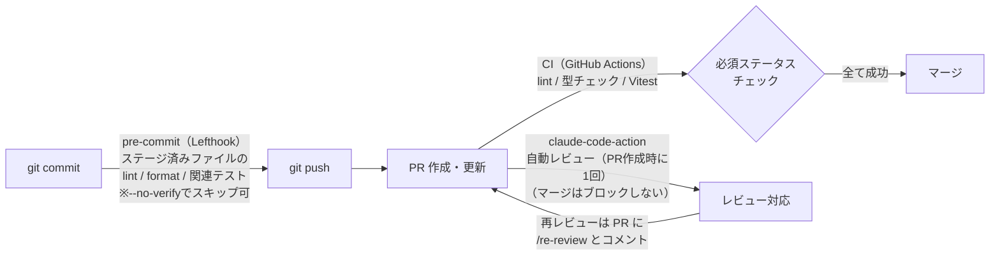

# my-kakeibo-app

AI による支出分析・レシート読み取りを備えた、個人・家族向け家計簿 Web アプリケーション。

## 技術スタック

| カテゴリ                          | 技術                    |
| --------------------------------- | ----------------------- |
| モノレポ管理                      | Turborepo               |
| ランタイム / パッケージマネージャ | Bun                     |
| フレームワーク                    | Next.js 16 (App Router) |
| 言語                              | TypeScript              |
| 認証                              | Clerk                   |
| API                               | Hono + Zod OpenAPI      |
| ORM                               | Drizzle ORM             |
| DB                                | Turso (分散 SQLite)     |
| スタイリング                      | Tailwind CSS v4         |
| UI コンポーネント                 | shadcn/ui + Base UI     |
| フォーム                          | React Hook Form + Zod   |

## ワークスペース構成

```
my-kakeibo-app/
├── apps/
│   └── web/              # Next.js Web アプリ（ポート 3001）
└── packages/
    ├── db/               # Drizzle スキーマ・マイグレーション
    ├── common/           # 共通定数・コード値定義
    ├── ui/               # 共有 UI コンポーネント
    ├── tailwind-config/  # Tailwind 共通設定
    ├── eslint-config/    # ESLint 共通設定
    └── typescript-config/ # TypeScript 共通設定
```

## ローカル起動

### 前提条件

- Bun >= 1.3.13
- Node.js >= 18

### 環境変数

ルート直下と `apps/web/` に `.env.local` を作成し、以下を設定する。

```env
# Clerk
NEXT_PUBLIC_CLERK_PUBLISHABLE_KEY=
CLERK_SECRET_KEY=

# Turso
TURSO_CONNECTION_URL=
TURSO_AUTH_TOKEN=
```

`apps/web/.env.local` にはさらに以下を設定する（ローカル開発時のDB接続先。`TURSO_CONNECTION_URL` と同じ値を設定すると従来どおり Turso に接続する。未設定だと `file:./local.db` に接続される。テスト実行時はこの値に関係なくインメモリDBが使われる。背景は [testing-strategy.md](docs/architecture/decisions/testing-strategy.md#結合テスト用dbの構成2026-07-20実装) を参照）。

```env
DATABASE_URL=
```

### インストール・起動

```bash
# 依存関係インストール
bun install

# 開発サーバー起動（全ワークスペース）
bun dev
```

Web アプリは http://localhost:3001 で起動します。

E2E テスト（Playwright）を実行する場合は、ブラウザを別途インストールする。

```bash
bunx playwright install
```

`bun install` 時に Lefthook が pre-commit フックを自動設定する。以降、コミット時にステージ済みファイルを対象とした lint・format・関連テストが実行され、エラーがあるとコミットは失敗する（型チェックとリポジトリ全体の検査は CI で実行される）。役割分担の詳細は [dev-workflow.md](docs/architecture/decisions/dev-workflow.md) を参照。

### DB マイグレーション

`packages/db/` で実行する（`drizzle.config.ts` がそこにあるため）。

```bash
cd packages/db
bunx drizzle-kit migrate
```

## コマンド一覧

ルートで実行する（Turborepo 経由で全ワークスペースに適用される）。

| コマンド              | 内容                         |
| --------------------- | ---------------------------- |
| `bun dev`             | 開発サーバー起動             |
| `bun run build`       | ビルド                       |
| `bun run lint`        | ESLint 実行                  |
| `bun run format`      | Prettier で整形（ts/tsx/md） |
| `bun run check-types` | TypeScript 型チェック        |
| `bun run test`        | Vitest 実行                  |

E2E テストのみ `apps/web/` で実行する。

| コマンド           | 内容                             |
| ------------------ | -------------------------------- |
| `bun run test:e2e` | Playwright 実行（要devサーバー） |

## 開発フロー

各段階でどのチェックが実行されるかの全体像。



- pre-commit は**ステージ済みファイルのみ**が対象（lint・format・`vitest related` による関連テスト）。型チェックは部分実行が原理的にできないため pre-commit には含めない
- CI（`.github/workflows/ci.yml`）は**リポジトリ全体**が対象。lint → 型チェック → Vitest 全テストを速い順に実行する
- 自動レビュー（`.github/workflows/claude-review.yml`）は **PR 作成時に1回**実行される。修正を push しただけでは再実行されず、PR に `/re-review` を含むコメントを書いたときのみ再レビューされる（実行回数を制御する設計。理由は [dev-workflow.md](docs/architecture/decisions/dev-workflow.md) 参照）。指摘には重要度ラベル `[must]`（修正必須）/`[want]`（推奨）/`[nits]`（軽微）/`[ask]`（質問）が付く
- `docs/`・`.claude/`・Markdown のみの変更では CI・自動レビューとも起動しない（`paths-ignore`）
- Playwright E2E のステップは E2E テスト作成まで `ci.yml` 内でコメントアウト中（再有効化の条件は [dev-workflow.md](docs/architecture/decisions/dev-workflow.md) を参照）

### ブランチ運用

| ブランチ    | 役割                                                                                  |
| ----------- | ------------------------------------------------------------------------------------- |
| `main`      | リリース（本番）。直接 push 不可（Ruleset で保護）。`develop → main` の PR でリリース |
| `develop`   | 日常の開発統合先（デフォルトブランチ）                                                |
| `feature/*` | 機能単位の作業ブランチ。`develop` へ PR                                               |

保護ルールの詳細・理由は [dev-workflow.md](docs/architecture/decisions/dev-workflow.md) を参照。

### PR 作成

PR は Claude Code の `/create-pr` スキルで作成できる。

- ブランチ名からマージ先を自動判定する（`feature/*` → `develop`、`develop` → `main` のリリース PR）
- コミット履歴・差分からタイトルと本文の案を生成し、**ユーザーが承認してから** push → PR 作成まで実行する
- PR 本文は [.github/PULL_REQUEST_TEMPLATE.md](.github/PULL_REQUEST_TEMPLATE.md)（概要・変更内容・確認方法・関連）に沿う。手動で PR を作成する場合も GitHub がこのテンプレートを自動適用する

導入の背景は [dev-workflow.md](docs/architecture/decisions/dev-workflow.md) を参照。

## Claude Code スキル・エージェント一覧

定義ファイル（`.claude/skills/`・`.claude/agents/`）はトークン効率のため英語で記述している（レビューコメント・PR本文・レポート等の成果物は日本語で出力される）。役割の一覧はここで管理する。

### スキル（`/コマンド` で呼び出す定型作業）

| スキル                  | 役割                                                                                              |
| ----------------------- | ------------------------------------------------------------------------------------------------- |
| `/create-pr`            | 現在のブランチを push し、コミット履歴から PR 本文案を生成 → 承認後に PR 作成。マージ先は自動判定 |
| `/update-docs`          | 会話で確定した仕様・設計・意思決定を docs/・README・CLAUDE.md に反映                              |
| `/db-migrate`           | Drizzle Kit で Turso にスキーマ変更を適用（generate + push）                                      |
| `/stitch-screen-mockup` | Stitch MCP で機能仕様から画面モックアップを生成・修正                                             |
| `/screen-design-doc`    | 確定したモックアップから採番付き画面設計書（docs/design/）を作成                                  |
| `/grill-me`             | 計画・設計を質問攻めで検証する汎用スキル（`.agents/skills/` へのリンク）                          |
| `/review-my-changes`    | 自分で実装した変更を仕様書・実装規約と突合してレビュー（指摘のみ、編集はしない）                  |
| `/whats-next`           | docs/tasks/ と実コードを突合して進捗と次の一手を提示（チェックボックスのズレも検出）              |

### エージェント（独立コンテキストで動く専任担当）

| エージェント                 | 役割                                                                                       |
| ---------------------------- | ------------------------------------------------------------------------------------------ |
| `blog-note-writer`           | 開発中の技術的発見を Notion のブログ素材メモに自動追記                                     |
| `db-design-reviewer`         | DB スキーマの定期棚卸し（正規化・インデックス・FK・命名）                                  |
| `docs-consistency-checker`   | docs/ とコードの相互参照の整合性チェック                                                   |
| `feasibility-researcher`     | 技術選択・ライブラリ導入の実現可能性調査（意思決定はしない）                               |
| `workflow-pattern-suggester` | 過去の会話ログから skill 化・hook 化すべき繰り返しパターンを提案（月初に手動実行する運用） |

### フック（`.claude/settings.json` で設定する自動処理）

| フック           | 役割                                                                                       |
| ---------------- | ------------------------------------------------------------------------------------------ |
| UserPromptSubmit | ターン末尾に docs/・CLAUDE.md の更新要否を Claude が自己点検し、必要なら一言添えるよう注入 |

## ドキュメント

| ドキュメント           | パス                                                                                                       | 内容                                                |
| ---------------------- | ---------------------------------------------------------------------------------------------------------- | --------------------------------------------------- |
| 要件定義               | [docs/specs/product.md](docs/specs/product.md)                                                             | プロダクト概要・機能要件・非機能要件                |
| 機能仕様               | [docs/specs/overview.md](docs/specs/overview.md)                                                           | 画面一覧・API・コード値定義                         |
| アーキテクチャ         | [docs/architecture/overview.md](docs/architecture/overview.md)                                             | 技術スタック・DBスキーマ・ディレクトリ構成          |
| 開発フロー             | [docs/architecture/decisions/dev-workflow.md](docs/architecture/decisions/dev-workflow.md)                 | Lefthook・CI・PR自動レビューの役割分担              |
| API実装規約            | [docs/architecture/decisions/api-conventions.md](docs/architecture/decisions/api-conventions.md)           | API認証・DBクライアント・エラーハンドリング等の規約 |
| フロントエンド実装規約 | [docs/architecture/decisions/frontend-conventions.md](docs/architecture/decisions/frontend-conventions.md) | コンポーネント設計・フォーム・orval運用等の規約     |
| テスト戦略             | [docs/architecture/decisions/testing-strategy.md](docs/architecture/decisions/testing-strategy.md)         | Vitest/Playwrightの構成・テスト対象の方針           |
