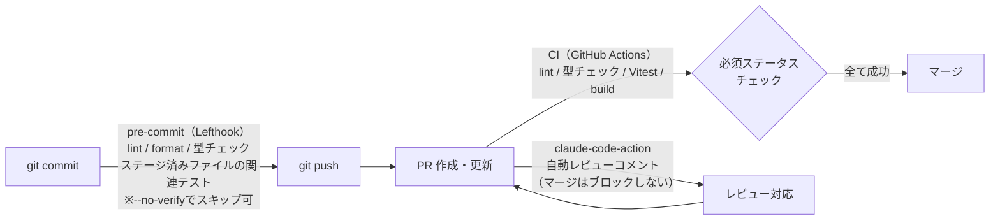

# my-kakeibo-app

AI による支出分析・レシート読み取りを備えた、個人・家族向け家計簿 Web アプリケーション。

## 技術スタック

| カテゴリ                          | 技術                    |
| --------------------------------- | ----------------------- |
| モノレポ管理                      | Turborepo               |
| ランタイム / パッケージマネージャ | Bun                     |
| フレームワーク                    | Next.js 16 (App Router) |
| 言語                              | TypeScript              |
| 認証                              | Clerk                   |
| API                               | Hono + Zod OpenAPI      |
| ORM                               | Drizzle ORM             |
| DB                                | Turso (分散 SQLite)     |
| スタイリング                      | Tailwind CSS v4         |
| UI コンポーネント                 | shadcn/ui + Base UI     |
| フォーム                          | React Hook Form + Zod   |

## ワークスペース構成

```
my-kakeibo-app/
├── apps/
│   └── web/              # Next.js Web アプリ（ポート 3001）
└── packages/
    ├── db/               # Drizzle スキーマ・マイグレーション
    ├── common/           # 共通定数・コード値定義
    ├── ui/               # 共有 UI コンポーネント
    ├── tailwind-config/  # Tailwind 共通設定
    ├── eslint-config/    # ESLint 共通設定
    └── typescript-config/ # TypeScript 共通設定
```

## ローカル起動

### 前提条件

- Bun >= 1.3.13
- Node.js >= 18

### 環境変数

ルート直下と `apps/web/` に `.env.local` を作成し、以下を設定する。

```env
# Clerk
NEXT_PUBLIC_CLERK_PUBLISHABLE_KEY=
CLERK_SECRET_KEY=

# Turso
TURSO_CONNECTION_URL=
TURSO_AUTH_TOKEN=
```

### インストール・起動

```bash
# 依存関係インストール
bun install

# 開発サーバー起動（全ワークスペース）
bun dev
```

Web アプリは http://localhost:3001 で起動します。

E2E テスト（Playwright）を実行する場合は、ブラウザを別途インストールする。

```bash
bunx playwright install
```

`bun install` 時に Lefthook が pre-commit フックを自動設定する。以降、コミット時に lint・format・型チェックが実行され、エラーがあるとコミットは失敗する（各チェックの内容は後述の[コマンド一覧](#コマンド一覧)を参照）。役割分担の詳細は [dev-workflow.md](docs/architecture/decisions/dev-workflow.md) を参照。

### DB マイグレーション

`packages/db/` で実行する（`drizzle.config.ts` がそこにあるため）。

```bash
cd packages/db
bunx drizzle-kit migrate
```

## コマンド一覧

ルートで実行する（Turborepo 経由で全ワークスペースに適用される）。

| コマンド              | 内容                         |
| --------------------- | ---------------------------- |
| `bun dev`             | 開発サーバー起動             |
| `bun run build`       | ビルド                       |
| `bun run lint`        | ESLint 実行                  |
| `bun run format`      | Prettier で整形（ts/tsx/md） |
| `bun run check-types` | TypeScript 型チェック        |
| `bun run test`        | Vitest 実行                  |

## 開発フロー

各段階でどのチェックが実行されるかの全体像（CI・claude-code-actionは導入予定。導入完了時に実態に合わせて更新する）。



- 型チェック・lint はローカルと CI の両方で実行される（ローカルはスキップ可能な早期検知、CI は Branch Protection による強制ゲート）
- テストはローカルでは「ステージ済みファイルに関連するもののみ」（`vitest related`）、CI では全テストを実行する
- build は CI でのみ実行される
- Playwright E2E はこのフローとは別のワークフロー（`.github/workflows/playwright.yml`）

詳細は [dev-workflow.md](docs/architecture/decisions/dev-workflow.md) を参照。

## ドキュメント

| ドキュメント           | パス                                                                                                       | 内容                                                |
| ---------------------- | ---------------------------------------------------------------------------------------------------------- | --------------------------------------------------- |
| 要件定義               | [docs/specs/product.md](docs/specs/product.md)                                                             | プロダクト概要・機能要件・非機能要件                |
| 機能仕様               | [docs/specs/overview.md](docs/specs/overview.md)                                                           | 画面一覧・API・コード値定義                         |
| アーキテクチャ         | [docs/architecture/overview.md](docs/architecture/overview.md)                                             | 技術スタック・DBスキーマ・ディレクトリ構成          |
| 開発フロー             | [docs/architecture/decisions/dev-workflow.md](docs/architecture/decisions/dev-workflow.md)                 | Lefthook・CI・PR自動レビューの役割分担              |
| API実装規約            | [docs/architecture/decisions/api-conventions.md](docs/architecture/decisions/api-conventions.md)           | API認証・DBクライアント・エラーハンドリング等の規約 |
| フロントエンド実装規約 | [docs/architecture/decisions/frontend-conventions.md](docs/architecture/decisions/frontend-conventions.md) | コンポーネント設計・フォーム・orval運用等の規約     |
| テスト戦略             | [docs/architecture/decisions/testing-strategy.md](docs/architecture/decisions/testing-strategy.md)         | Vitest/Playwrightの構成・テスト対象の方針           |
