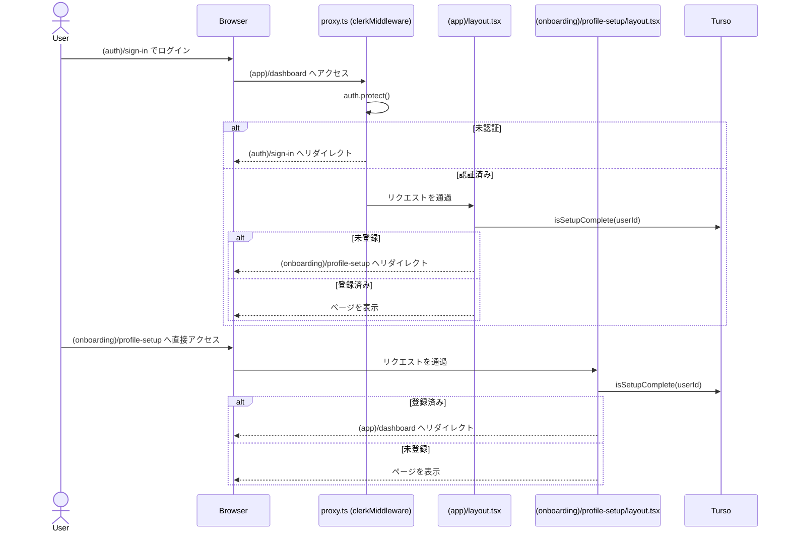
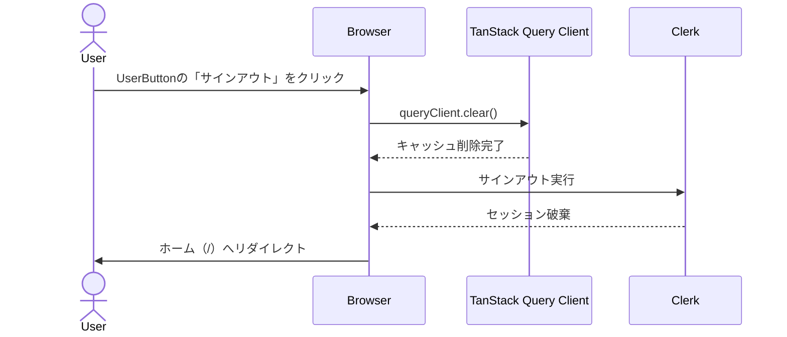

# 認証シーケンス図

Mermaidで管理する（採用理由は [decisions/design-docs-tooling.md](./decisions/design-docs-tooling.md#設計ドキュメント運用mermaid) 参照）。

## サインイン〜初回登録判定（現状の実装）

`proxy.ts`（Next.jsミドルウェア）が認証チェックを行い、`(app)/layout.tsx` がプロフィール登録済みかどうかを判定してリダイレクトする（`server/lib/onboarding.ts` の `isSetupComplete()`）。`(onboarding)/profile-setup/layout.tsx` には対称の逆方向ガードがあり、登録済みユーザーが`/profile-setup`に直接アクセスした場合は`/dashboard`へリダイレクトする。

## サインアウト

このアプリは家族で同じデバイス（タブレット・PC等）を共有して使う想定のため、サインアウト時に**TanStack Queryのキャッシュをクリアしないと、次にログインした別の家族メンバーに前のユーザーのデータが一瞬表示されるリスクがある**。`UserButton`の`signOutCallback`（または同等のフック）で`queryClient.clear()`を呼んでからサインアウトを完了させる。サインアウト後の遷移先（`afterSignOutUrl`）はホーム（`/`）とする。

