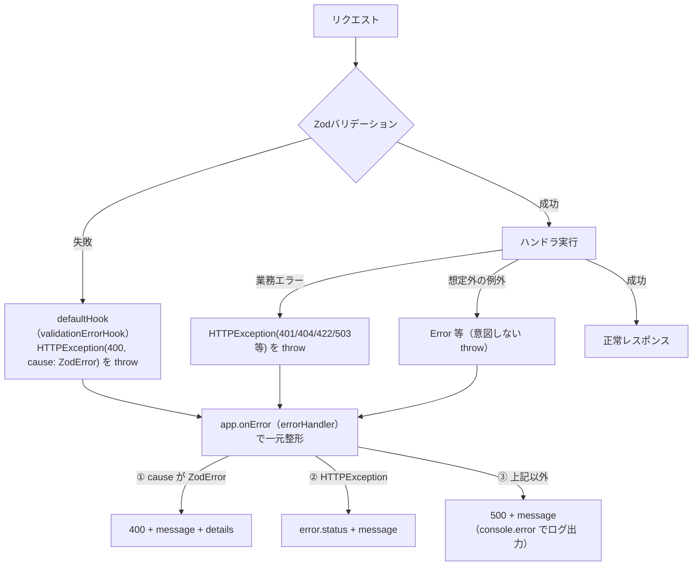

# API・サーバー実装の規約

Hono + Zod OpenAPIを採用した理由は[stack.md](./stack.md#api-hono--zod-openapi)を参照。ここでは実装パターンを定義する。

## Honoルートの実装方針

- アプリの初期化は `OpenAPIHono` を使用（`Hono` の代わり）
- ルート定義は `createRoute` で行い、リクエスト・レスポンスのスキーマを明示する
- 各機能のルートは `server/routes/{feature名}/` ディレクトリに以下の3種類のファイルで分離する
  - `schema.ts`: Zodスキーマ・OpenAPI定義（`createRoute`）
  - `handler.ts`: DBアクセスなどの処理
  - `index.ts`: `OpenAPIHono` インスタンスにルートを登録してexport
  - 1機能に複数エンドポイントがある場合のファイル分割は[下記](#複数エンドポイントを持つ機能のファイル分割2026-08-22決定)を参照
- メインの `app/api/[...route]/route.ts` で各ルートを `.route()` でマウントすると OpenAPI スペックに自動集約される
- Clerk認証は `@clerk/hono` の `clerkMiddleware()` を使用する（`@hono/clerk-auth` は非推奨）
- 各ルートに `clerkMiddleware()` と自前の `authMiddleware`（`server/lib/auth.ts`）をチェーンして適用する（例: `app.use('/profile/*', clerkMiddleware(), authMiddleware)`）。DB上のユーザーが既に存在する前提のルートは、続けて`requireUserMiddleware`も適用する（例: `app.use('/categories/*', clerkMiddleware(), authMiddleware, requireUserMiddleware)`）。詳細は[userIdの取得方法](#useridの取得方法2026-08-29決定)を参照
- Swagger UI は `/api/ui`、OpenAPI スペックは `/api/doc` で公開する（認証不要）
- Next.jsミドルウェア（`proxy.ts`）でページルーティングレベルの認証を行い、Honoミドルウェアでは実際のuserId取得・未認証時の401判定を担当する
- エラーレスポンスは全ルートで共通スキーマ（`errorResponseSchema`）を使用する（詳細は[エラーレスポンス](#エラーレスポンス)参照）
- **状態を変更する操作にGETを使わない**（一覧・詳細取得のみGET、作成・更新・削除・ピン留め等はPOST/PUT/DELETE）。Clerkのセッションcookieが`SameSite=Lax`であるためのCSRF対策として機能する（[security.mdのCSRF対策](./security.md#csrf対策2026-08-23決定確認事項)参照）。この規約を崩すと追加のCSRF対策が必要になる
- 共有スキーマ（複数ルートで使うもの）は `server/shared/` に配置する
  - `error/errorResponseSchema.ts`: `errorResponseSchema`
  - `error/errorResponses.ts`: 共通エラーレスポンス（詳細は[共通エラーレスポンスの再利用](#共通エラーレスポンスの再利用2026-09-04決定)参照）
- パスパラメータの `:id` はUUID文字列のため変換不要（[ID設計: UUID](./stack.md#id設計-uuid全テーブル共通)参照）。検証スキーマは機能横断の共有ファイルを持たず、各機能の`request/`配下に`{リソース名}IdRequestSchema`として個別定義する（例: `categoryIdRequestSchema`）。パスパラメータ名（`:categoryId`等）がどのリソースのIDか読み手に伝わるようにするため、`server/shared/`の汎用`id-schema.ts`（`:id`固定）は廃止した
- DBスキーマは `@repo/db/schema` サブパスからimportする（DBクライアント本体は次項の`server/lib/db.ts`から）。`@repo/db`にはメインエントリ（`.`）自体が存在せず、`./schema`サブパスしか公開していない（理由は[DBクライアントの分離](#dbクライアントの分離)参照）

### userIdの取得方法（2026-08-29決定）

（2026-09-06改訂: Clerk IDとDBの内部IDを別の変数として分離した。経緯は本節末尾の「Clerk IDとDB内部IDを分離した理由」を参照）

各ハンドラ内で `getAuth(c)` を直接呼ぶのではなく、`server/lib/auth.ts` の2段階のミドルウェア（どちらも `hono/factory` の `createMiddleware`）が認証・ユーザー解決を一元的に行う。

```ts
// server/lib/auth.ts
type ClerkVariables = { clerkId: string };
export type AuthEnv = { Variables: ClerkVariables };

export const authMiddleware = createMiddleware<AuthEnv>(async (c, next) => {
  const { userId } = getAuth(c);
  if (!userId) {
    return c.json({ message: unauthorizedErrorMessage }, HTTP_STATUS.UNAUTHORIZED);
  }
  c.set('clerkId', userId); // Clerkの生ID。DBの内部IDとは別物
  await next();
});

type UserVariables = ClerkVariables & { userId: string };
export type UserEnv = { Variables: UserVariables };

export const requireUserMiddleware = createMiddleware<UserEnv>(async (c, next) => {
  const clerkId = c.var.clerkId;

  const [user] = await db
    .select({ id: usersTable.id })
    .from(usersTable)
    .where(eq(usersTable.clerk_id, clerkId));

  if (!user) {
    return c.json({ message: unauthorizedErrorMessage }, HTTP_STATUS.UNAUTHORIZED);
  }

  c.set('userId', user.id); // DBの内部ID（usersTable.id）
  await next();
});
```

- `authMiddleware` はDBに一切アクセスせず、未認証チェックと `c.var.clerkId`（Clerkの生ID）のセットのみを担当する
- `requireUserMiddleware` は `clerkId` から `usersTable` を検索し、DB上の内部ID（`users.id`）を `c.var.userId` にセットする。**`categoriesTable.userId` 等、DBの外部キーは全てこの内部ID（`users.id`）を指しており、Clerkの生IDではない**（[database.mdのテーブル定義](../database.md)参照）ため、所有者チェックを行うハンドラは必ず `requireUserMiddleware` まで適用したうえで `c.var.userId` を使う
- ルート登録は用途に応じてどちらまで適用するかを選ぶ
  - `profileSetupHandler` のように**まだDBにユーザーが存在しない前提**（初回登録）で呼ばれるルートは `authMiddleware` のみ（`app.use('/profile/*', clerkMiddleware(), authMiddleware)`）。`clerkId` をそのまま `usersTable.clerk_id` に保存してユーザーを新規作成する
  - `categories` のように**DB上のユーザーが既に存在する前提**のルートは、続けて `requireUserMiddleware` も適用する（`app.use('/categories/*', clerkMiddleware(), authMiddleware, requireUserMiddleware)`）

ハンドラ側はそれぞれ `c.var.clerkId` / `c.var.userId` で取得する。`AuthEnv`・`UserEnv` により `string` 型として保証されるため、`getAuth(c)` 直呼びの頃に必要だった非null断定（`userId!`）が不要になる。

**`AuthEnv`/`UserEnv` を各所に明示的に渡す必要がある理由:** これらのミドルウェアは `app.use()` された `app`（`route.ts`）に対してのみ `c.set` しており、実際にハンドラを登録する各機能の `OpenAPIHono` インスタンス（`profileRouter`・`categoriesRouter` 等）やハンドラファイルは別インスタンス・別ファイルのため、TypeScriptの型情報は自動では伝播しない。そのため保護対象のルーターとハンドラの両方に、適用したミドルウェアに応じて `AuthEnv` または `UserEnv` を明示的に渡す。

```ts
// server/routes/profile/index.ts（authMiddlewareのみ適用するルート）
const profileRouter = new OpenAPIHono<AuthEnv>({ defaultHook: validationErrorHook });

// server/routes/profile/handler/profileSetupHandler.ts
export const profileSetupHandler: RouteHandler<typeof createUserRoute, AuthEnv> = async (c) => {
  const clerkId = c.var.clerkId;
  // ...
};

// server/routes/categories/index.ts（requireUserMiddlewareまで適用するルート）
const categoriesRouter = new OpenAPIHono<UserEnv>({ defaultHook: validationErrorHook });

// server/routes/categories/handler/categoryListHandler.ts
export const getCategoriesHandler: RouteHandler<typeof getCategoriesRoute, UserEnv> = async (c) => {
  const userId = c.var.userId; // DBの内部ID
  // ...
};
```

**`declare module 'hono' { interface ContextVariableMap { userId: string } }` によるグローバル型拡張は採用しない:** Clerk公式の `@clerk/hono` 自体はこの手法（モジュール拡張）で `getAuth` をどのインスタンスからでも呼べるようにしているが、自前の変数に同じ手法を使うと、`authMiddleware`・`requireUserMiddleware` を適用し忘れたルートでも型上は `clerkId`・`userId` が常に存在することになってしまい、適用漏れを型チェックで検出できなくなる。Hono公式コミュニティのDiscussion（[honojs/discussions#3257](https://github.com/orgs/honojs/discussions/3257)）でも、認証ミドルウェアに関してはグローバル拡張ではなく個別の `Variables` ジェネリクスを推奨している。

**Clerk IDとDB内部IDを分離した理由（2026-09-06決定）:** 当初は `authMiddleware` が `c.set('userId', userId)` と、Clerkの生IDをそのまま `userId` という名前でセットしていた。`categoryListHandler.ts` はこの `c.var.userId` をそのまま `eq(categoriesTable.userId, userId)` の絞り込みに使っていたが、`categoriesTable.userId` は実際には `usersTable.id`（DBの内部UUID）への外部キーであり、Clerkの生IDとは型は同じ`string`でも中身が別物だった。`profileSetupHandler.ts` がユーザー作成時に `usersTable.id`（`.returning()`で取得した内部ID）を使って `categoriesTable.userId` を保存していたため、実際にログインしたユーザーが自分のカテゴリー一覧を取得しようとすると常に0件になる、というテストでは気づきにくい本番バグを生んでいた。同じ`userId`という名前で「Clerkの認証ID」と「DB内部ID」の両方を呼んでいたことが混同の原因だったため、`clerkId`（Clerk由来の生ID）と`userId`（DBの内部ID＝`users.id`）を型・変数名レベルで明確に分離し、両者を橋渡しする専用のミドルウェア（`requireUserMiddleware`）を追加した。

### 複数エンドポイントを持つ機能のファイル分割（2026-08-22決定）

1機能1エンドポイントのみの場合は、これまで通りフラットな `schema.ts`・`handler.ts` のままでよい（無理に分割しない）。`categories` のように1機能に複数エンドポイント（一覧・作成・編集・削除・ピン留め等）が並ぶ場合、`schema.ts` が1ルートあたり50〜90行（`examples` を含むため）に達し、1ファイルに集約すると肥大化する。この場合は `schema`・`handler`・`request`・`response` をそれぞれサブディレクトリ化し、エンドポイント単位でファイルを分割する。

```
server/routes/categories/
  schema/categoryListSchema.ts
  handler/categoryListHandler.ts
  request/categoryListRequest.ts
  response/categoryListResponse.ts
  response/category.ts   ← 複数エンドポイントで共有するドメインスキーマ
  index.ts
```

- ファイル名は `{リソース名}{操作}{役割}.ts`（例: `categoryListSchema.ts`）とする。ディレクトリ（`schema/`・`handler/`）だけで役割を表すと、`schema/list.ts` と `handler/list.ts` のように別ディレクトリに同名ファイルが並び、エディタのタブや `Cmd+P` 検索で見分けづらくなるため、ファイル名単体でも自己説明的になるようにする
- この命名は [Cloudflare公式 `chanfana`（Hono/itty-router向けOpenAPIライブラリ）のテンプレート](https://github.com/cloudflare/chanfana/tree/main/template/src/endpoints)を参考にした。同テンプレートは `taskList.ts`・`taskCreate.ts`・`taskUpdate.ts` のように、ディレクトリを分けず「リソース名+操作」のファイル名だけで1エンドポイント1ファイルを表現している
- 複数エンドポイントにまたがって再利用する共有ドメインスキーマ（例: `categorySchema`・`childCategorySchema`）は、操作名を持たない専用ファイル（例: `response/category.ts`）に分離する。個別エンドポイント専用のレスポンススキーマ（例: `categoryListResponseSchema`）とは別ファイルに保ち、名前と中身の不一致を防ぐ
- `index.ts` は各 `schema/`・`handler/` から集約importしてルーティング登録する点は変わらない

### Zodスキーマexportの命名規則（2026-08-22決定）

Zodスキーマを代入するexport変数は**camelCase**とする（例: `categorySchema`・`errorResponseSchema`・`categoryListResponseSchema`）。

- TypeScriptの一般的な慣習（型はPascalCase、値・インスタンスはcamelCase）に沿う。Zodスキーマは実行時に評価される値であり、型そのものではないため
- このコードベースのスキーマexportは必ず`Schema`という接尾辞を持つ（`categorySchema`等）。Reactコンポーネント（PascalCase・接尾辞なし）と名前が衝突する余地はないため、大文字始まりにして区別する必要もない
- 対応する型（`z.infer<typeof xxxSchema>`）が別途必要になった場合のみ、その時点でPascalCaseの型エイリアスを切る（例: `type Category = z.infer<typeof categorySchema>`）。2026-08-22時点では`server/`配下で`z.infer`を使っている箇所はなく、未使用の型エイリアスを先回りして作らない
- `.openapi('Xxx')`で付けるOpenAPIコンポーネント名（文字列）はこれとは別物で、[下記のレスポンススキーマの命名方針](#レスポンススキーマの命名方針2026-08-11決定)に従いPascalCaseのまま変更しない（生成されるOpenAPIスペック上の表示名のため）

参考: Zod公式ドキュメント（[zod.dev](https://zod.dev/)）は現行スタイルとしてPascalCase（スキーマと推論型を同名にする書き方）を採用しているが、Zod作者自身のDiscussion（[colinhacks/zod #929](https://github.com/colinhacks/zod/discussions/929)）では「TSの一般的な命名慣習に従うならcamelCaseの方が理屈が通る」という意見も出ており、コミュニティで統一された正解はない。このプロジェクトでは上記の理由（値/型の区別・`Schema`接尾辞による衝突回避）からcamelCaseを選んだ。

### レスポンススキーマの命名方針（2026-08-11決定）

`.openapi('Xxx')` で付けるスキーマ名は、そのスキーマが**どのエンドポイントで使われるか**ではなく**ドメイン上何を表すか**で命名する。1つのスキーマ形状が複数エンドポイントで再利用される可能性がある場合（例: `CategoryWithChildren` は一覧取得だけでなく、単一カテゴリ取得・作成・更新のレスポンスでも同じ形状を返す想定）、`CategoryListItem` のようなエンドポイント用途に寄せた名前にしない。

フロントエンド側で画面の用途に合わせた読みやすい名前が欲しい場合は、バックエンドのスキーマ名は変えず、生成された型を利用側コンポーネントでローカルにエイリアスする（[frontend-conventions.mdのコンポーネントpropsの型](./frontend-conventions.md#コンポーネントpropsの型2026-08-11決定)参照）。

### 一覧取得エンドポイントのレスポンス形状（2026-08-12決定）

トップレベルが配列になる一覧取得エンドポイント（`GET /api/categories`・`GET /api/transactions`等）は、レスポンスをドメイン名キーのオブジェクトでラップする（例: `{ categories: [...] }`）。単一リソースを返すエンドポイント（`:id`付きの単体取得・作成・更新・削除、`void`を返すエンドポイント）は対象外で、これまで通り配列でラップせずそのまま返す。

理由: 将来的にページネーション・総件数等のメタ情報を破壊的変更なしに追加できるようにするため（取引一覧は[design docs](../../design/transactions/list.md)で件数表示・ページネーションが既に計画されている）。カテゴリ一覧自体には現時点でその予定はないが、エンドポイントごとに配列かオブジェクトかを個別判断するコストをなくすため、一覧系エンドポイント全体で統一ルールとする。orvalの`forceSuccessResponse`バグ（[frontend-conventions.mdのorval運用方針](./frontend-conventions.md#データフェッチ-tanstack-query--orval)参照）の回避にもなるが、それとは独立した設計判断として決定した。

この方針は権威あるAPI設計ガイドラインとも一致する。[Google AIP-132](https://google.aip.dev/132)は「The response message must include one repeated field corresponding to the resources being returned」とし、`repeated Book books = 1;`のようにリソース名の複数形をフィールド名にする例を示している（今回の`categories`という命名はこのパターンに倣う）。[Microsoft Azure REST API Guidelines](https://github.com/microsoft/api-guidelines/blob/vNext/azure/Guidelines.md)も「DO structure the response to a list operation as an object with a top-level array field containing the set (or subset) of resources」と明記するが、キー名は`value`のような汎用名を既定として推奨しており（「YOU SHOULD use `value` as the name of the top-level array field unless a more appropriate name is available」）、ドメイン名か汎用名かはガイドライン間でも流儀が分かれる。このプロジェクトは[レスポンススキーマの命名方針](#レスポンススキーマの命名方針2026-08-11決定)でドメイン意味による命名を既に採用しているため、一貫性を優先してドメイン名キー（Google流）を選んだ。

### レスポンスの実行時検証方針（2026-09-03決定）

`createRoute`の`responses`に渡すZodスキーマは、OpenAPIドキュメント生成用の型情報であるだけでなく、**orvalがフロントエンドの型を生成する契約そのもの**として扱う。`@hono/zod-openapi`はレスポンスボディを実行時に自動検証・整形する機能を持たない（[honojs/middleware#913](https://github.com/honojs/middleware/issues/913)）ため、ハンドラの最後で明示的にレスポンススキーマの`.parse()`を呼び、実際のレスポンス形状を契約と一致させる。

```ts
const response = categoryListResponseSchema.parse({ categories });
return c.json(response, 200);
```

**目的はDB行の再検証ではなく、契約外フィールドの除去:** DB行には`isPinned`のようにレスポンススキーマ（`childCategorySchema`は`categorySchema.omit({ isPinned: true })`）に存在しないフィールドが残っていることがある。Zodの`z.object()`はデフォルトで未定義キーを`.parse()`結果から除去する仕様（[Zod公式](https://zod.dev/api)：「By default, unrecognized keys are stripped from the parsed result」）のため、これを利用してストリップする。手動での分割代入（`const { isPinned, ...rest } = row`）でも同じ結果は得られるが、スキーマ変更時に手動マッピングの追従漏れが起きても実行時に気づけない。`.parse()`方式なら形状のズレが即座に例外として顕在化する。

**エラー処理は既存の仕組みに乗る:** `.parse()`が投げる`ZodError`は`HTTPException`でラップされていないため、[エラーレスポンスの形式統一](#エラーレスポンスの形式統一-defaulthookでthrow--onerrorで一元整形)の`errorHandler`の③分岐（想定外の例外・500固定・`console.error`ログ）にそのまま乗る。追加のtry/catchやエラーハンドリングは不要。

### 親子構造を持つ一覧のグループ化実装方針（2026-09-03決定）

`categories`のように親子構造を持つ一覧を1クエリで取得しレスポンスの`children`配列に組み立てる場合、親/子の振り分けと`Map<parentId, 子行[]>`の構築は**1回の`for...of`ループ**で同時に行う。

```ts
type CategoryRow = (typeof categoryRows)[number];

const parentRows: CategoryRow[] = [];
const childrenByParentId = new Map<string, CategoryRow[]>();

for (const row of categoryRows) {
  if (row.parentId === null) {
    parentRows.push(row);
    continue;
  }
  const children = childrenByParentId.get(row.parentId);
  if (children) {
    children.push(row);
  } else {
    childrenByParentId.set(row.parentId, [row]);
  }
}

const categories = parentRows.map((row) => ({
  ...row,
  children: childrenByParentId.get(row.id) ?? [],
}));
```

- `parentId === null`の分岐で`continue`することで、以降のループ本体では`row.parentId`がTypeScriptにより自動的に非null（`string`）へ絞り込まれ、`!`による非null断定が不要になる
- `Map.groupBy`（ES2024）は使わない。本番は`export const runtime = 'edge'`（Vercel Edge Runtime）で動作しており、新しい言語機能のサポート状況は[stack.mdのNode.jsバージョン方針](./stack.md#nodejsバージョン方針active-lts2026-08-30決定)が指摘する通りローカルのNode.jsバージョンとは別軸で確認が必要なため、事前検証の手間がない手動ループを優先する
- 列を絞った`select({...})`クエリ結果1件分の型は、Drizzle公式の`$inferSelect`／`InferSelectModel`（テーブル全体の型になり、選択した列と一致しない）ではなく、`type Row = (typeof queryResult)[number]`というTypeScript標準のIndexed Access Types（[公式Handbook](https://www.typescriptlang.org/docs/handbook/2/indexed-access-types.html)）でクエリ結果から直接取り出す

## リクエストボディサイズの上限（2026-08-23決定）

Vercelはプラットフォーム側で全リクエストボディを4.5MBに強制上限しており（超過分は自動的に413エラー。[Vercel公式のFunctions Limits](https://vercel.com/docs/functions/limitations)）、無制限アップロードによるDoSはそもそも起こり得ない。その上で、JSON系エンドポイント（`categories`・`transactions`等、レシート画像アップロードを除く全て）はアプリ側でさらに小さい上限（例: 100KB）をHonoの`bodyLimit`ミドルウェアで明示する。数KBで十分なはずのリクエストに対して4.5MBまで許容してしまうと、Zodのパース前に無駄に大きなペイロードを受け取ってしまうため。

## APIのレート制限（2026-08-23決定）

[OWASP API Security Top 10 (API4:2023 Unrestricted Resource Consumption)](https://owasp.org/API-Security/editions/2023/en/0xa4-unrestricted-resource-consumption/)に基づき、エンドポイントの性質ごとに層を分ける。

- **認証済みエンドポイント全体**: ユーザー単位（`auth.userId`）で緩めの上限を設ける。IP単位にしない理由は、同一IPを複数ユーザーが共有するケース（オフィスWi-Fi等）を誤って巻き込まないため、また1ユーザーがIPを変えても制限を回避できないようにするため
- **AIエンドポイント（レシート読み取り・アドバイス）**: 既存の日次上限（`ai_usage_logs`、[ai.md](../../specs/features/ai.md)）とは別に、ユーザー単位の短時間バースト制限を追加で重ねる（日次上限に達する前の連打でコスト・レイテンシが跳ねるのを防ぐため）
- **Webhookエンドポイント（Clerkの`user.deleted`等）**: 未認証で受けるため、レート制限より署名検証（本命の防御）を優先する
- 実装は[本アプリのAPI（`app/api/[...route]/route.ts`）が`export const runtime = 'edge'`のため](../overview.md)、サーバーレス関数をまたいだカウントが必要。Upstash Redis + `hono-rate-limiter`を使用し、`server/lib/rate-limit.ts`に薄いアダプタとして実装する（将来AWS等へ移行してもUpstashはREST APIのため接続先を変えずに使い続けられる）

## DBクライアントの分離

`packages/db`側で`dotenv`を使って`.env.local`を読み込む`db`インスタンスを提供すると、Next.js環境（環境変数を独自管理）と競合する。そのため`apps/web`側で独自のDBクライアントを作成する。

```
packages/db/   ← スキーマ定義・マイグレーションのみ提供
apps/web/server/lib/db.ts ← Next.js用のDBクライアント（process.envを直接参照）
```

`@repo/db` からはスキーマ（テーブル定義）のみをimportし、`db` インスタンスは `server/lib/db.ts` からimportする。

**`@repo/db`にメインエントリ（`.`）を持たせない（2026-09-04決定）:** 当初`packages/db/src/index.ts`は`dotenv.config()`＋`db`インスタンスの構築と、`export * from './schema/index.js'`によるスキーマの再exportを同居させていた。ESモジュールは1つでも名前をimportするとファイル全体（先頭から）を評価するため、`categoriesTable`等のスキーマだけを`@repo/db`からimportしても、同じファイルにある`dotenv.config()`（内部で`process.cwd()`というNode.js専用APIを呼ぶ）が巻き込まれて実行され、Vercel Edge Runtimeで`A Node.js API is used (process.cwd) which is not supported in the Edge Runtime`エラーが発生した。

回避策として`server/lib/db.ts`との分離（前述）が既にあったが、それだけでは「スキーマを`@repo/db/schema`サブパスからimportする」という規約を守り忘れて`@repo/db`（メインエントリ）から取ってしまうミスを防げない。dotenv公式（「アプリケーションのできるだけ早い段階で」import・configすることを想定しており、共有ライブラリでの利用は想定されていない）・Turborepo公式（「`.env`ファイルはそれを使うApplication Packagesに置く」）のいずれも、環境変数の読み込みを共有パッケージ側に持たせることを推奨していない。

そのため`packages/db/src/index.ts`を削除し、`package.json`の`exports`から`"."`エントリ自体を削除して`"./schema"`サブパスのみを公開する構成にした。これにより`import ... from '@repo/db'`（bare）はモジュール解決エラーになり、規約を破ったコードがビルド時点で機械的に弾かれるようになった。コードベース内で`@repo/db`（メインエントリ）の`db`インスタンスを実際に使っている箇所はなかったため、影響はない（`drizzle.config.ts`はCLI実行時に自前で`dotenv.config()`を呼んでおり無関係）。

## DBアクセスの往復回数最小化（2026-09-04決定）

Turso（HTTP経由でアクセスする分散SQLite）は、ローカルのPostgres等と違って**クエリの往復ごとにネットワークレイテンシが乗る**。そのため、事前チェック（SELECT）と書き込み（UPDATE/INSERT）を素朴に分けず、往復回数を減らせる箇所は減らす。ただし、可読性を著しく落としてまで往復数を削ることはしない（`categoryPinHandler.ts`が最初の適用例）。

- **書き込み対象の行自身の属性だけで判定できる事前条件は、UPDATE文の`WHERE`句に埋め込み、`.returning()`で「更新できたか」を1回のクエリで判定する**（事前のSELECTを丸ごと省略できる）

  ```ts
  const [updated] = await db
    .update(categoriesTable)
    .set({ isPinned: true })
    .where(and(eq(categoriesTable.userId, userId), eq(categoriesTable.id, categoryId), ...))
    .returning({ id: categoriesTable.id });

  if (!updated) {
    throw new HTTPException(HTTP_STATUS.BAD_REQUEST, { message: ... });
  }
  ```

- **複数行にまたがる集計（他の行の件数など）が判定に必要な場合は、`WHERE`句にサブクエリを埋め込まず、判定に必要な行を1回のSELECTでまとめて取得し、アプリケーション側で`find`/`filter`する**。サブクエリで1クエリに畳み込むことも技術的には可能だが、「見つからない」ケースと「集計条件を満たさない」ケースを区別してエラーメッセージを出し分けられなくなり、可読性も落ちるため採用しない

  ```ts
  const expenseCategories = await db
    .select({ id: categoriesTable.id, isPinned: categoriesTable.isPinned })
    .from(categoriesTable)
    .where(and(eq(categoriesTable.userId, userId), eq(categoriesTable.typeCode, CATEGORY_TYPE.EXPENSE), ...));

  const target = expenseCategories.find((c) => c.id === categoryId);
  // target の存在チェックと、expenseCategories.filter(...).length によるピン留め件数チェックを
  // 同じ1回のSELECT結果から行う
  ```

## エラーレスポンス

全ルートで以下の共通スキーマを使用する。

```ts
const errorResponseSchema = z.object({
  message: z.string(),
  details: z
    .array(
      z.object({
        field: z.string(),
        message: z.string(),
      })
    )
    .optional(),
});
```

`code`（HTTPステータスと同じ値を持つフィールド）は持たせない。`errorHandler`の全分岐で`code`の値が常に`response.status`と完全一致し、レスポンスボディとHTTPステータスで同じ情報を二重に持つだけだったため削除した。将来「同じHTTPステータスでも複数の業務エラーを区別したい」という要件が出てきた時点で、業務エラーコードとして追加し直す。

ユーザー向けの固定文言（`message`に入れる値）は `packages/common/src/` に用途別ファイルで定数として集約する。フォーム・Zodバリデーション系は `validation-message.ts`（`requiredMessage` など）、APIレスポンス系は `api-error-message.ts`（`unexpectedErrorMessage`・`validationErrorMessage`・`unauthorizedErrorMessage` など）。`HTTPException`を意図的に`throw`する箇所のメッセージ（`error.message`）はこの集約の対象外で、各呼び出し元が文脈に応じて指定する。

| HTTPステータス | 用途                                                                                                                                                                                               |
| -------------- | -------------------------------------------------------------------------------------------------------------------------------------------------------------------------------------------------- |
| 400            | 不正なリクエスト・フォームバリデーションエラー                                                                                                                                                     |
| 401            | 未認証（`authMiddleware`）。`proxy.ts`の`auth.protect()`が先に404を返すため実運用では到達しない（[profile-setup.mdのバックエンドタスク9](../../tasks/features/profile-setup.md#バックエンド)参照） |
| 409            | 業務上のコンフリクト（重複登録・名前重複等。DBのUNIQUE制約違反に対応）                                                                                                                             |
| 422            | 形式は正しいが処理できない（AIがレシートを読み取れないなど）                                                                                                                                       |
| 503            | 外部サービス障害（Gemini APIダウンなど）                                                                                                                                                           |
| 500            | 予期しないサーバーエラー                                                                                                                                                                           |

### 共通エラーレスポンスの再利用（2026-09-04決定）

`createRoute`の`responses`に渡すZodスキーマは、[orvalがフロントエンドの型を生成する契約](#レスポンスの実行時検証方針2026-09-03決定)であると同時に、Swagger UI上のドキュメントでもある。`errorResponseSchema`の`details`フィールドには`.openapi({ example: ... })`が付いているため、`content`に`schema: errorResponseSchema`とだけ書くと、Swagger UIは401や500のような**実際には`details`を返さないケースでも**`details`付きの例を自動生成してしまう（`errorHandler`の②分岐は`{ message: error.message }`のみを返し、`details`が付くのは①のバリデーションエラー分岐だけ）。

これに対応するため、`server/shared/error/errorResponses.ts`に、実際のレスポンス形と一致する`examples`込みの共通レスポンス定義を用意し、各ルートはそれをそのまま`responses`に代入する。

```ts
// server/shared/error/errorResponses.ts
export const unauthorizedResponse = { description: '...', content: { 'application/json': {
  schema: errorResponseSchema,
  examples: { unauthorized: { value: { message: unauthorizedErrorMessage } } },
} } } as const;

export const internalServerErrorResponse = { /* 同様、message: unexpectedErrorMessage */ };
export const validationErrorResponse = { /* 同様、message: validationErrorMessage + details例 */ };

// 各ルートのschema.ts
responses: {
  400: validationErrorResponse, // または業務固有の400（下記参照）
  401: unauthorizedResponse,
  500: internalServerErrorResponse,
}
```

**使い分けの基準:**

- **全エンドポイント共通・文言が常に同じ**（401＝`unauthorizedErrorMessage`、500＝`unexpectedErrorMessage`、`defaultHook`由来の汎用バリデーションエラー400）→ `errorResponses.ts`の共有オブジェクトを使う。エンドポイントごとに同じ`examples`を複製しない
- **エンドポイント固有の業務ルールに紐づく固定メッセージ**（例: `categoryPinSchema.ts`の400＝`categoryPinTargetInvalidMessage`・`lastPinnedCategoryMessage`、`profileSetupSchema.ts`の409＝`alreadySetupMessage`）→ その`schema.ts`内で`errorResponseSchema`を直接使い、`api-error-message.ts`の定数を参照する`examples`を個別に書く（文字列をハードコードせず定数を参照することで、文言変更時にexampleが自動的に追従し二重管理にならない）

### エラーレスポンスの形式統一: defaultHookでthrow + onErrorで一元整形

`@hono/zod-openapi` は `defaultHook` を指定しない場合、`createRoute` の `request.body` スキーマでのバリデーション失敗時に `{ success: false, error: <ZodError> }`（status 400）を返す。また `app.onError` を設定していない場合、ハンドラ内の未処理例外（`throw new Error(...)` 等）は Hono のデフォルト挙動でプレーンテキスト `"Internal Server Error"`（status 500）になる。いずれも上記の `errorResponseSchema` と形式が一致しない。

これらを統一フォーマットに揃えるため、**`defaultHook` では `HTTPException` を `throw` するだけにし、実際の整形は `app.onError` に一元化する**方式を採用する。



- `server/shared/default-hook.ts` に `validationErrorHook` を定義する。バリデーション失敗時に `HTTPException(HTTP_STATUS.BAD_REQUEST, { cause: result.error })` を `throw` するだけの関数
  ```ts
  export const validationErrorHook = (
    result: { success: true; data: unknown } | { success: false; error: ZodError },
    c: Context
  ): Response | void => {
    if (!result.success) {
      throw new HTTPException(HTTP_STATUS.BAD_REQUEST, { cause: result.error });
    }
  };
  ```
- `server/shared/error-handler.ts` に `errorHandler` を定義する。`app.onError` に渡し、`HTTPException` の `cause` が `ZodError` かどうかで判定して `errorResponseSchema` に整形する
  ```ts
  export const errorHandler = (error: Error, c: Context) => {
    if (error instanceof HTTPException && error.cause instanceof ZodError) {
      const details = error.cause.issues.map((issue) => ({
        field: issue.path.join('.'),
        message: issue.message,
      }));
      return c.json({ message: validationErrorMessage, details }, HTTP_STATUS.BAD_REQUEST);
    }
    if (error instanceof HTTPException) {
      return c.json({ message: error.message }, error.status);
    }
    return c.json({ message: unexpectedErrorMessage }, HTTP_STATUS.INTERNAL_SERVER_ERROR);
  };
  ```

**3つの分岐の設計意図:**

| 分岐                                               | ステータス                                         | 判定方法                          | 理由                                                                                                                                                                                             |
| -------------------------------------------------- | -------------------------------------------------- | --------------------------------- | ------------------------------------------------------------------------------------------------------------------------------------------------------------------------------------------------ |
| ① バリデーション失敗                               | 常に400固定（`HTTP_STATUS.BAD_REQUEST`）           | `error.cause instanceof ZodError` | `error.status === 400`で判定すると、将来Zod検証と無関係な理由で意図的に400を`throw`するケースが増えた際に誤って`error.cause.issues`を読みに行き実行時エラーになる。`cause`の型で判定する方が安全 |
| ② 業務ロジックが意図的に`throw`した`HTTPException` | `error.status`（動的）                             | `error instanceof HTTPException`  | ステータス・メッセージを`errorHandler`側で固定せず、各`throw`元（401/403/404/409/422/503など）に委ねることで、新しい業務エラーが増えても`errorHandler`の変更が不要になる                         |
| ③ 想定外の例外                                     | 常に500固定（`HTTP_STATUS.INTERNAL_SERVER_ERROR`） | 上記以外                          | `HTTPException`でない（意図的に`throw`されていない）例外はすべて予期しないエラーとして扱う                                                                                                       |

**`defaultHook` と `onError` で設定場所が非対称になる点に注意:**

- `defaultHook` は `.openapi()` 呼び出し時にバリデーターへ焼き込まれるため、親の `OpenAPIHono` インスタンスに設定しても `.route()` でマウントしたサブルーター（各 `server/routes/{feature名}/index.ts` の `OpenAPIHono` インスタンス）には伝播しない（[honojs/middleware#708](https://github.com/honojs/middleware/issues/708), [#773](https://github.com/honojs/middleware/issues/773)）。そのため **各サブルーター（例: `profileRouter`）に個別に `new OpenAPIHono({ defaultHook: validationErrorHook })` を指定する**必要がある
- `onError` は `.route()` によるルート統合の仕組み上、サブルーター側で個別に `onError` を設定していない限りそのまま親のルーティングテーブルに統合されるため、**`app/api/[...route]/route.ts` の `app` に `app.onError(errorHandler)` を1箇所設定するだけで、マウントされた全サブルーターのエラーもキャッチできる**（サブルーター側に重複設定は不要）

なお、ステータスコードは [REST的には `422 Unprocessable Entity` がより正確という議論があるが](https://github.com/w3cj/stoker)、既存の `schema.ts`・フロントエンドの分岐コードとの整合性を優先し、**400のまま**とした。

### DB制約違反の409マッピング（2026-07-20決定、profile-setupが最初の適用例）

DBのUNIQUE制約違反（例: `users.clerk_id`の重複登録）は、想定外の例外（500）ではなく、業務上のコンフリクト（409）として`HTTPException`で意図的に`throw`し直す。

```ts
let user: { id: string } | undefined;
try {
  [user] = await tx.insert(usersTable).values({ clerk_id: userId, ... }).returning({ id: usersTable.id });
} catch (error) {
  const isDuplicateUserError =
    error instanceof DrizzleQueryError &&
    error.cause instanceof LibsqlError &&
    error.cause.code === 'SQLITE_CONSTRAINT';

  if (isDuplicateUserError) {
    throw new HTTPException(HTTP_STATUS.CONFLICT, { message: alreadySetupMessage });
  }
  throw error;
}
```

**判定は「該当INSERT文だけを個別にtry/catchで囲む」ことで構造的に絞り込む（メッセージ文字列のパースはしない）:** SQLite/libsqlのエラーは、PostgreSQLの`error.constraint`のような構造化された制約名を持たず、`error.cause.code === 'SQLITE_CONSTRAINT'`だけでは「どのINSERT文の、どの制約か」を区別できない。トランザクション内の全INSERTを1つの`try/catch`で囲むと、無関係なテーブル（例: `categories`のデータ不整合という別のバグ）の制約違反まで「重複登録」という誤ったメッセージ・ステータスに丸め込んでしまい、かつ409は`errorHandler`の想定外分岐（③）を通らないため`console.error`にも記録されず、不具合に気づきにくくなる。エラーメッセージの文字列マッチ（`error.cause.message`に`users.clerk_id`が含まれるか等）も代替案としてあるが、SQLiteコミュニティの一般的な見解として「エラーメッセージのパースに頼るべきではない」（バージョン・ロケールで変わりうるため）とされており不採用。「対象のINSERT文だけをtry/catchで囲む」方式であれば、メッセージ内容に関わらず、どのテーブルの制約違反かをコードの構造そのもので保証できる。

### エラーログ

外部監視サービス（Sentry等）は導入せず、Vercel標準のRuntime Logs（Functionsのconsole出力を収集する機能）で対応する。個人・家族規模の利用のため、新しい技術選定・追加コストをかけずVercelダッシュボードでの検索で十分と判断した（[stack.mdのホスティング選定](./stack.md#ホスティング-vercelhobbyプラン)参照）。

`errorHandler`の「③想定外の例外（500固定）」分岐で、`console.error`にClerkの`userId`（`getAuth(c)`から取得。未認証なら`null`）・リクエストパス（`c.req.path`）・エラー内容を出力する。これにより「いつ・誰が・どのエンドポイントで」予期しない例外が発生したかをVercelのログ検索で追える。①バリデーション失敗・②業務ロジックが意図的に`throw`した`HTTPException`は、原因がエラーレスポンスの`message`・`details`から明確なためログ出力は不要。
