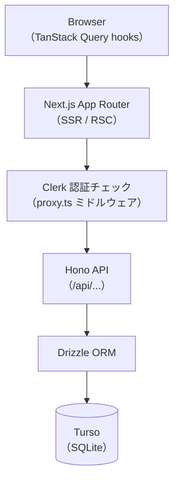
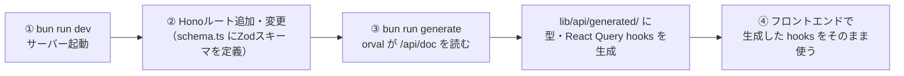

# アーキテクチャ概要

## 構成図

```
my-kakeibo-app/          ← Turborepo モノレポ
├── apps/
│   └── web/             ← Next.js 16 (App Router)
└── packages/
    ├── db/              ← Drizzle ORM スキーマ・マイグレーション
    ├── common/          ← 共通定数・コード値
    ├── ui/              ← 共有 UI コンポーネント
    ├── tailwind-config/ ← Tailwind 共通設定
    ├── eslint-config/   ← ESLint 共通設定
    └── typescript-config/ ← TypeScript 共通設定
```

## 技術スタック

| カテゴリ                     | 技術                             | バージョン         |
| ---------------------------- | -------------------------------- | ------------------ |
| フレームワーク               | Next.js (App Router)             | 16.2.0             |
| 言語                         | TypeScript                       | 5.9.2              |
| ランタイム                   | Bun                              | -                  |
| モノレポ管理                 | Turborepo                        | -                  |
| 認証（フロント）             | Clerk                            | `@clerk/nextjs` v7 |
| 認証（APIサーバー）          | Clerk                            | `@clerk/hono`      |
| API                          | Hono + Zod OpenAPI               | v4                 |
| APIドキュメント              | Swagger UI（`@hono/swagger-ui`） | -                  |
| APIクライアント生成          | orval                            | -                  |
| データフェッチ               | TanStack Query                   | -                  |
| AI（画像認識・テキスト生成） | Google Gemini API                | -                  |
| ORM                          | Drizzle ORM                      | -                  |
| DB                           | Turso（分散 SQLite）             | -                  |
| スタイリング                 | Tailwind CSS v4                  | -                  |
| UI コンポーネント            | shadcn/ui + Base UI              | -                  |
| フォーム                     | React Hook Form + Zod            | -                  |
| テスト（単体・結合）         | Vitest                           | -                  |
| テスト（E2E）                | Playwright                       | -                  |
| Git hooks                    | Lefthook                         | -                  |
| 定期実行                     | Vercel Cron Jobs                 | -                  |

## ディレクトリ構成（apps/web）

```
apps/web/
├── app/
│   ├── (auth)/          ← 認証ページ群（Clerk）
│   ├── (onboarding)/    ← 初回登録ページ群（プロフィール設定）
│   ├── (app)/           ← 認証・初回登録済みページ群（家計簿機能）
│   └── api/[...route]/  ← Hono API エントリポイント（全ルートを集約）
├── components/
│   ├── ui/              ← shadcn/ui コンポーネント
│   └── provider.tsx     ← TanStack Query の QueryClientProvider
├── features/            ← 機能別コンポーネント・ロジック
├── lib/
│   └── api/
│       └── generated/   ← orval が生成するコード（型・React Query hooks）
└── server/              ← サーバーサイドコード
    ├── lib/
    │   └── db.ts        ← Drizzle DBクライアント（Next.js環境用）
    ├── shared/          ← 複数ルートで共有するスキーマ
    │   ├── error.ts     ← ErrorResponseSchema（全ルート共通）
    │   └── common.ts    ← IdParamSchema・IdResponseSchema
    └── routes/          ← Hono ルート（機能別）
        ├── transactions/ ← 取引記録
        │   ├── index.ts      ← ルートをexport
        │   ├── schema.ts     ← Zodスキーマ・OpenAPI定義
        │   └── handler.ts    ← DBアクセス処理
        ├── categories/   ← カテゴリ管理
        ├── family-members/ ← 家族構成
        ├── profile/      ← プロフィール設定
        └── ai/           ← AI機能
```

## データフロー



### 型生成フロー（開発時）



## `(app)`レイアウト構成

`(app)/layout.tsx`で全画面共通のレイアウトを構成する。個人・家族向けの認証必須アプリであり、公開Webサービスのような利用規約・お問い合わせ等のリンクを持つ従来的な「フッター」は不要と判断し、採用しない。

- **ヘッダー（PC・スマホ共通）**: 画面タイトル + Clerkの`UserButton`（アカウント設定・サインアウト）のみのミニマム構成。月切り替えや家族メンバースライドなど各画面固有のUIはヘッダーに含めない。`UserButton`もClerkの`appearance` propの対象であり、サインイン/サインアップと同じ方針（[画面設計書運用（Stitch）](./decisions/design-docs-tooling.md#画面設計書運用stitch)参照）でStitchで決めた配色・トーンに統一する
  - `UserButton`のドロップダウンには`<UserButton.MenuItems>`+`<UserButton.Link label="ヘルプ" href="/help" />`（[Clerk公式](https://clerk.com/docs/nextjs/guides/customizing-clerk/adding-items/user-button)）でカスタム項目「ヘルプ」を追加する（[help.md](../specs/features/help.md)参照）。ナビ項目・専用ヘルプアイコンの追加ではなく既存のアカウント設定の入口に相乗りする形のため、下記の「専用の『設定』項目を追加しない」方針とも矛盾しない
- **ナビゲーション（PC・スマホ共通の下部固定タブバー）**: トップレベル画面5つ（ホーム・取引記録・カテゴリ管理・家族構成管理・本格的アドバイス。[画面一覧](../specs/overview.md#画面一覧)参照）への切り替えを、自前の下部固定タブバーコンポーネント1つで統一する（ナビ項目5つ。アイコン+ラベル。アイコンの具体的な選定はStitchでのデザイン確定後に行う）。個人開発・家族利用というスケールを踏まえ、PC専用にshadcn/uiの`Sidebar`コンポーネントを別途実装・保守するコストより、1コンポーネントで統一する実装のシンプルさを優先した（PCでは画面いっぱいに伸ばさず中央寄せで幅を制限し、間延びを抑える。具体的にはメインコンテンツと同じ最大幅[1200px]に揃え、タブ間の余白とクリック領域を確保する）。専用の「設定」項目・「レシート」専用項目は追加しない（家族構成管理・カテゴリ管理がアプリ固有の設定に該当し、アカウント自体の設定はClerkの`UserButton`のドロップダウンで足りるため。レシート読み取りは後述のFABから入れるため、ナビとレシートスキャン画面への入口が2つになる重複を避ける）
  - 画面名「ダッシュボード」はユーザー向け表示ラベルとしては「ホーム」に変更（[画面一覧](../specs/overview.md#画面一覧)参照）。ルートパス（`(app)/dashboard`）・機能名としての「ダッシュボード」呼称（[dashboard.md](../specs/features/dashboard.md)等）はそのまま維持し、表示ラベルのみの変更とする
- **「+取引を追加」フローティングボタン（PC・スマホ共通）**: 取引登録は最も頻度の高い操作のため、ナビゲーション経由を介さず即座に[取引登録フォーム](../specs/features/transactions.md)へ遷移できるよう、下部タブバーに重ねて全画面共通でフローティング表示する。タップすると「手入力で記録」「レシートで記録」の2択をその場に表示する（[レシート読み取り](../specs/features/ai.md#1-レシート読み取り自動入力receipt_scan)はこのアプリの強みであり、手入力と同じ優先度で見せるため。下部タブに専用項目を追加する案もあったが、遷移先（`/transactions/new`の単発フォーム）が手入力と同じであり入口が二重になるだけのため採用しない）。「手入力で記録」を選ぶと通常通り単発フォームを開き、「レシートで記録」を選ぶと同じフォームをレシート読み取りUIを開いた状態で表示する

## 関連ドキュメント

技術的意思決定（[decisions/](./decisions/)）:

- [stack.md](./decisions/stack.md): 技術スタックの選定理由
- [api-conventions.md](./decisions/api-conventions.md): API・サーバー実装の規約
- [frontend-conventions.md](./decisions/frontend-conventions.md): フロントエンド実装の規約
- [security.md](./decisions/security.md): セキュリティ対応方針
- [testing-strategy.md](./decisions/testing-strategy.md): テスト戦略
- [dev-workflow.md](./decisions/dev-workflow.md): 開発フロー（Lefthook・CI・PRレビュー）
- [design-docs-tooling.md](./decisions/design-docs-tooling.md): 設計ドキュメントのツール選定（Mermaid・Stitch）

その他:

- [データベース設計](./database.md)
- [画面遷移図](./screen-flow.md)
- [認証シーケンス図](./auth-sequence.md)
