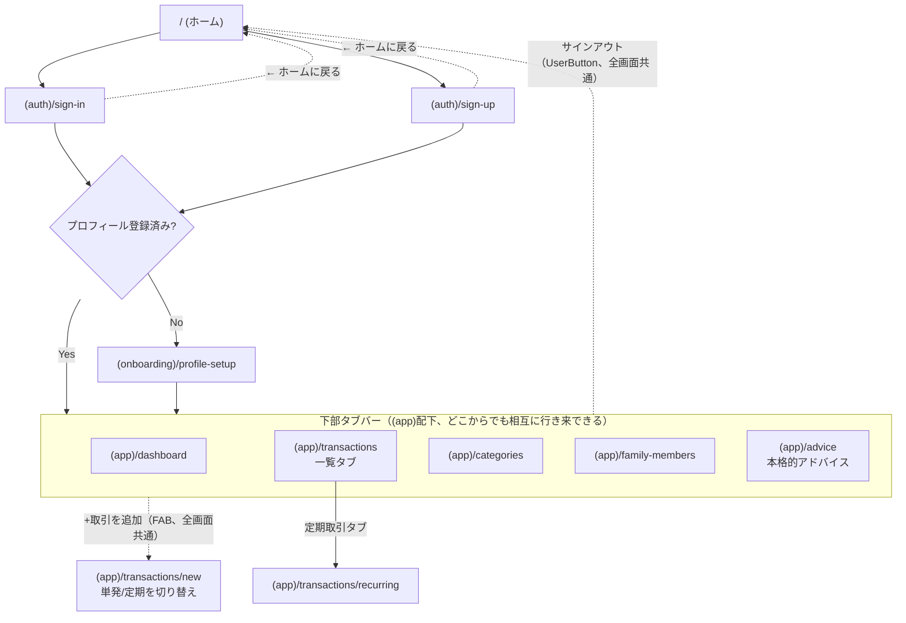

# 画面遷移図

Mermaidで管理する（採用理由は [decisions/design-docs-tooling.md](./decisions/design-docs-tooling.md#設計ドキュメント運用mermaid) 参照）。

画面設計（Stitch）が確定した画面から随時追記する。対象画面は [画面一覧](../specs/overview.md#画面一覧) を参照。

## 全体遷移（雛形）

[`(app)`レイアウト構成](./overview.md#applayoutレイアウト構成)の通り、タブバー内の5画面は対等な関係で、ダッシュボードを経由せず直接行き来できる。「+取引を追加」のフローティングボタンは全画面共通でどこからでも`/transactions/new`に遷移できる。サインアウトは`afterSignOutUrl="/"`によりホームへ遷移する（[auth-sequence.md](./auth-sequence.md#サインアウト)参照）。
