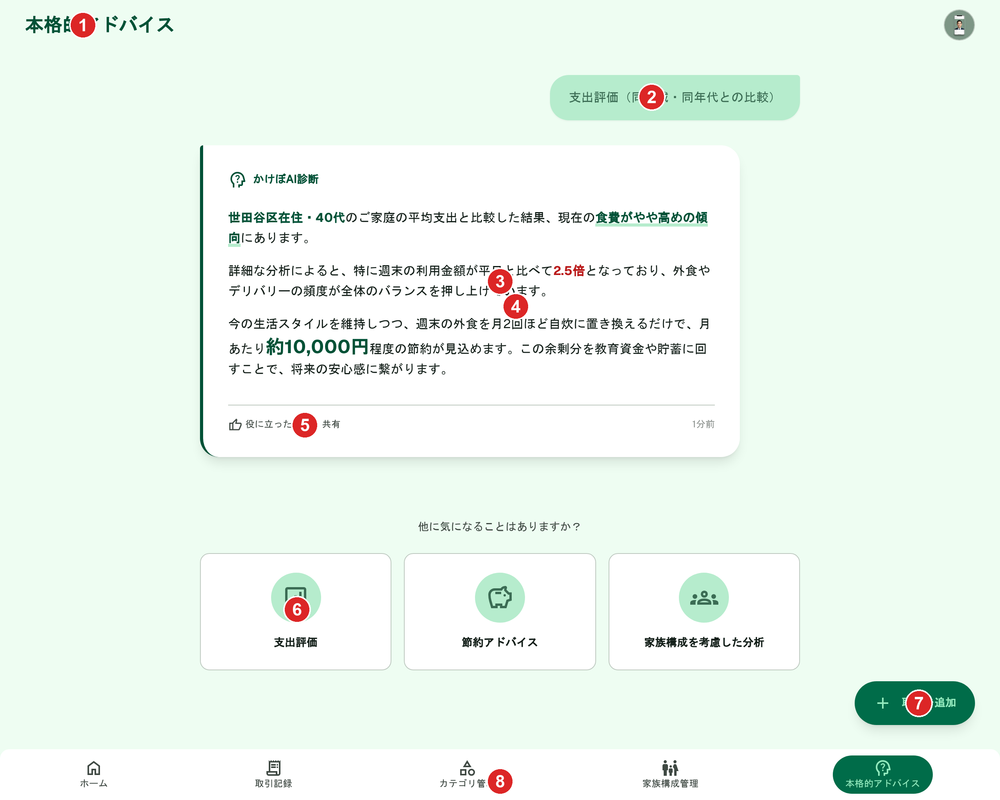
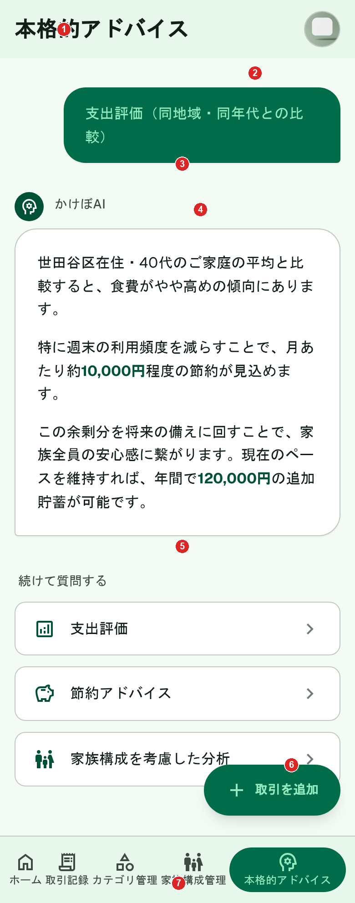

# 本格的アドバイス（AI機能）

[機能仕様](../specs/features/ai.md#3-本格的アドバイスdetailed_advice)に対応する画面（`(app)/advice`）。レシート読み取り・簡易支出分析は独立画面を持たず、それぞれ[取引記録](./transactions-create.md)・[ホーム](./home.md)に組み込まれるためここには含まない。

## 関連画面

| 遷移元 | 遷移先 |
|---|---|
| 下部固定ナビゲーション（どこからでも） | `(app)/advice`（「本格的アドバイス」タブ、トピック選択前の初期状態） |
| トピックカード（支出評価/節約アドバイス/家族構成を考慮した分析） | 同画面内でセッション開始。ユーザー発言+AI回答（SSEで逐次表示）を追加表示 |
| 回答後のトピックカード（再表示） | 新しいセッションを開始（既存セッションへの追記ではない） |
| FAB「+ 取引を追加」（どこからでも） | `/transactions/new` |

全体の遷移図は[architecture/screen-flow.md](../architecture/screen-flow.md)を参照。

## 関連API

| メソッド | パス | 用途 |
|---|---|---|
| POST | `/api/advice/sessions` | トピック選択でセッション作成。取引データ・居住地域・年齢・家族構成をプロンプトに含め、Geminiの応答をSSE（`text/event-stream`）で逐次返す |

詳細な仕様（利用制限・セッション/メッセージのデータ構造・将来のチャット拡張方針）は[機能仕様](../specs/features/ai.md#3-本格的アドバイスdetailed_advice)を参照。

## 採番済みスクリーンショット

採番は`docs/design/screenshots/ai-{pc|sp}-numbered.png`（Pillowで番号ピンを描画）。元画像は`ai-{pc|sp}.png`。いずれも回答表示済みの状態（初期状態のトピック選択前の画面は未生成）。

### PC版

Stitch Screen ID: `screens/524cdf96f4ce405485f9816e9496490c`（タイトル「本格的アドバイス - かけぼ (PC版・回答表示済)」）

### SP版

Stitch Screen ID: `screens/3a2d8acc09b14d82b734a77e2a9c4c39`（タイトル「本格的アドバイス - かけぼ (モバイル版・回答表示済)」）

## パーツ一覧

| No | 名称 | 説明 | 遷移先・挙動 |
|---|---|---|---|
| ① | ヘッダー | 画面タイトル「本格的アドバイス」+ユーザーアバターのみ。サブタイトル・ロボットアイコン・ヘルプアイコンなし | - |
| ② | ユーザー発言吹き出し | 画面右側に寄せた角丸枠（アバターなし）で、選択したトピック名を表示 | - |
| ③ | AI回答カード | 2〜3段落の具体的なアドバイス文。PC版は左寄せカード、SP版は幅いっぱいのカード | - |
| ④ | 数値の太字強調 | 節約額・支出比率等の重要な数値を太字で表示 | - |
| ⑤ | 投稿風フッター（PC版のみ） | 「役に立った」「共有」+相対時刻。**仕様外**（[仕様外要素](#仕様外要素実装時は無視すること)参照） | - |
| ⑥ | トピック再選択カード | 回答の下に3つのトピックカード（支出評価/節約アドバイス/家族構成を考慮した分析）を再表示 | タップで新しいセッションを開始（[業務フロー](../specs/features/ai.md#3-本格的アドバイスdetailed_advice)参照） |
| ⑦ | 「+ 取引を追加」FAB | 全画面共通のフローティングボタン | タップで「手入力で作成」「レシートから作成」の2択を表示（[common-components.md](./common-components.md)参照） |
| ⑧ | 下部固定ナビゲーション | 5項目（本格的アドバイスがアクティブ） | 各画面へ遷移 |

## 状態一覧

| 状態 | 表示内容 |
|---|---|
| 初期状態（トピック選択前） | 3つのトピックカードのみを表示し、まだユーザー発言・AI回答はない状態（本モックアップでは未生成。回答表示済みの状態のみ確認済み） |
| 回答ストリーミング中 | SSEで逐次表示中、テキストが流れ込んでくる状態（本モックアップでは静止画のため未表現） |
| 利用制限超過 | 1日5セッション超過時、429エラー表示（本モックアップでは未生成） |
| エラー状態 | [frontend-conventions.mdのエラーハンドリング方針](../architecture/decisions/frontend-conventions.md#フロントエンドのエラーハンドリング方針)を参照。フォーム送信失敗は`Alert`、フォームを伴わない操作の失敗はSonnerトースト |

## レスポンシブ差分

- PC版はAI回答カードが画面幅の一部に左寄せ表示、SP版は幅いっぱいに表示
- PC版のみ回答カードに「役に立った」「共有」の投稿風フッターが表示される（[仕様外要素](#仕様外要素実装時は無視すること)参照）
- トピック再選択カードはPC版が横3列、SP版が縦1列

## 採用した方向性

- **トピック選択 → 回答のチャット風表示**: ユーザーが選んだトピックを画面右側に寄せた吹き出し（アバターなしのシンプルな角丸枠）で「ユーザーの発言」として表示し、その下にAIの回答をカード形式で表示する。仕様の「トピックを選ぶ→回答を1件もらう」という1往復の構造を、チャットのメッセージ履歴のような見た目で表現した
- **回答の表示**: 2〜3段落程度の具体的なアドバイス文。重要な数値（節約額・支出比率等）を太字で強調
- **回答後の再選択**: 回答の下に3つのトピックカード（支出評価／節約アドバイス／家族構成を考慮した分析）を再表示し、[新しいセッションが作られる](../specs/features/ai.md#3-本格的アドバイスdetailed_advice)仕様の「次のトピックを選べる」動線を表現
- **配色の統一**: 過去の生成試行でコーラル/レッド系の強い色や英語表記（"Kakebo AI分析"等）が混入する候補があったため、それらを除外し、エメラルドグリーン+ブルー/アンバー/ピンクのアクセントに統一された候補を採用した
- **ナビゲーション**: 他画面と共通の下部固定タブバー（5項目、本格的アドバイスがアクティブ）+「+ 取引を追加」FAB

## 既存実装との差分

未実装のため差分なし。

## 仕様外要素（実装時は無視すること）

| 対象 | 内容 | 対応方針 |
|---|---|---|
| PC版AI回答カード | 「役に立った」「共有」ボタン+相対時刻（「1分前」）が表示されている。仕様にはこのような投稿風フッターは存在しない | 実装時は含めない。回答カードはアドバイス文のみで構成する |

## 更新履歴

| 日付 | 変更内容 |
|---|---|
| 2026-06-22 | 全画面作り直し方針のもと再生成し確定（PC: `screens/524cdf96f4ce405485f9816e9496490c`、SP: `screens/3a2d8acc09b14d82b734a77e2a9c4c39`）。`_template.md`の新フォーマット（関連画面・関連API・採番済みスクリーンショット・パーツ一覧・状態一覧・レスポンシブ差分）に合わせて全面リライト。旧版（Stitchモックアップ形式のみの記載）から刷新 |
