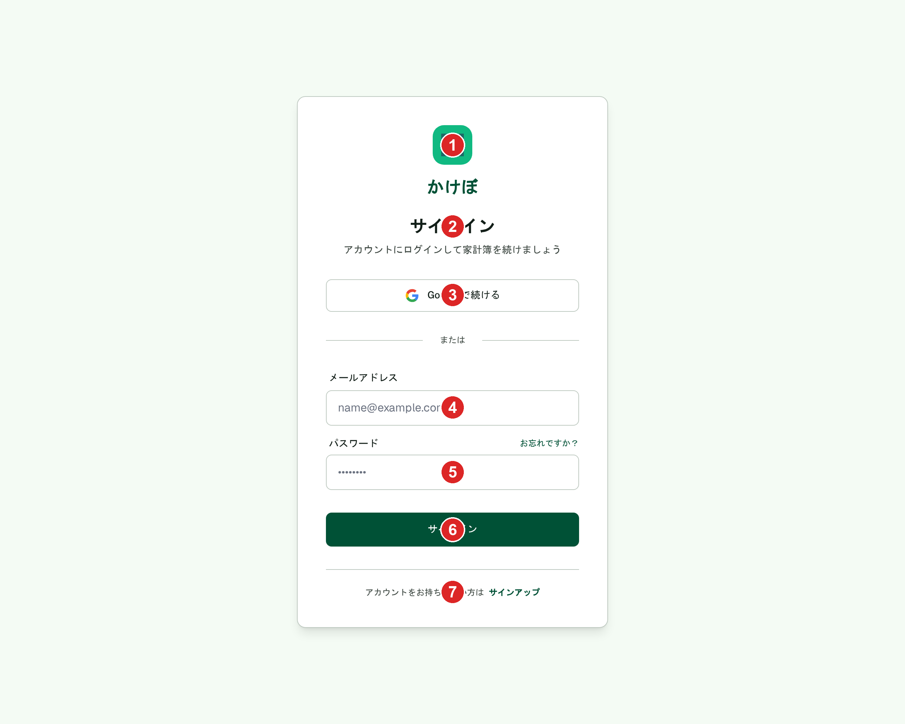
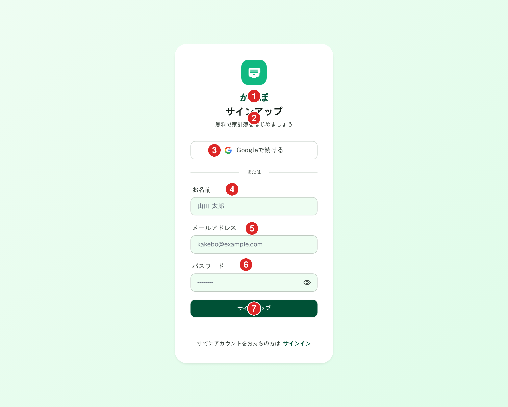

# サインイン・サインアップ（Clerk参考モックアップ）

[security.md](../architecture/decisions/security.md)・[design-docs-tooling.md](../architecture/decisions/design-docs-tooling.md#画面設計書運用stitch)の方針により、実装はClerkのプリビルトUIコンポーネント（`<SignIn />`/`<SignUp />`）をそのまま使用し、フルスクラッチでの再設計は行わない（パスワードリセット・MFA・i18n等をClerkが担保している機能を自前で再実装するリスクを避けるため）。

このファイルのモックアップは**実装するカスタムレイアウトではない**。Clerk公式の`appearance` prop（`variables`・`elements`・`theme`）で配色・トーンをどう反映すべきかの**見た目の参考資料**として、Stitchで`<SignIn />`/`<SignUp />`の構成（ロゴ・入力欄・ソーシャルログインボタン・タイトル・リンク）を再現したもの。実装時は引き続きClerkコンポーネントの`appearance` propのみで調整し、独自のフォーム実装は行わない。

CRUDの概念がない単一画面のため、サインイン・サインアップを状態パターンとして1ファイルで管理する（[_template.md](./_template.md)冒頭のコメント参照）。

## 関連画面

| 遷移元 | 遷移先 |
|---|---|
| ホーム（未認証時のランディング） | `(auth)/sign-in` |
| ホーム（未認証時のランディング） | `(auth)/sign-up` |
| サインイン画面下部リンク | `(auth)/sign-up` |
| サインアップ画面下部リンク | `(auth)/sign-in` |
| サインイン画面の「← ホームに戻る」リンク（⓪） | ホーム（未認証時のランディング） |
| サインアップ画面の「← ホームに戻る」リンク（⓪） | ホーム（未認証時のランディング） |

全体の遷移図は[architecture/screen-flow.md](../architecture/screen-flow.md)を参照。

## 関連API

なし。認証・セッション管理はClerkが担当する（[security.md](../architecture/decisions/security.md)参照）。独自のAPIエンドポイントは存在しない。

## 採番済みスクリーンショット

### サインイン（PC版）

Stitch Screen ID: `screens/b688eee8d58643459f2c3ce30057dac4`（タイトル「サインイン (Clerk参考モックアップ)」）。`generate_screen_from_text`で新規生成。SP版は未生成。

### 状態パターン

#### サインアップ（PC版）

Stitch Screen ID: `screens/2b1a822fb5044ad0b64303860034626f`（タイトル「サインアップ (Clerk参考用モックアップ) - かけぼ」）。サインイン画面（`screens/b688eee8d58643459f2c3ce30057dac4`）を基準スクリーンに`generate_variants`で再生成し、仕様外要素だったフッターリンク（利用規約・プライバシーポリシー・ヘルプセンター）を削除した。

変更点: タイトルが「サインアップ」、サブテキストが「無料で家計簿をはじめましょう」に変わり、「お名前」入力欄が追加される。下部リンクが「すでにアカウントをお持ちの方は　サインイン」に変わる。カード自体の構成（ロゴ位置・Googleボタン・区切り線・フッターボタン）はサインインと統一。SP版は未生成。

## パーツ一覧

| No | 名称 | 説明 | 遷移先・挙動 |
|---|---|---|---|
| ⓪ | 「← ホームに戻る」テキストリンク | 矢印アイコン+テキストリンク。カード上部に配置（**モックアップ画像には未反映**。次回Stitch再生成時に追加予定） | クリックでホーム（未認証時のランディング）へ遷移。ロゴクリックのみでは戻り導線として発見しづらいため、明示的なリンクとして別途用意する（2026-06-25決定） |
| ① | ロゴ+アプリ名「かけぼ」 | エメラルドグリーンの角丸正方形+貯金箱アイコン、下にアプリ名 | 見た目のみで遷移リンクにはしない（戻り導線は⓪が担う）。サインイン・サインアップで共通の見た目を意図（[仕様外要素](#仕様外要素実装時は無視すること)参照、サインアップ側はロゴ意匠が依然一致していない） |
| ② | タイトル+サブテキスト | サインイン: 「サインイン」+「アカウントにログインして家計簿を続けましょう」。サインアップ: 「サインアップ」+「無料で家計簿をはじめましょう」 | - |
| ③ | 「Googleで続ける」ボタン | Googleロゴ付きアウトラインボタン | ソーシャルログイン（Clerk標準機能） |
| ④ | メールアドレス入力欄（サインインのみ）/お名前入力欄（サインアップのみ） | サインアップのみ「お名前」欄が追加される | - |
| ⑤ | メールアドレス入力欄（サインアップ） | - | - |
| ⑥ | パスワード入力欄 | サインインは「お忘れですか?」リンク付き、サインアップは表示切替アイコン付き | - |
| ⑦ | 送信ボタン（「サインイン」/「サインアップ」） | エメラルドグリーンの塗りボタン | Clerk標準のサインイン/サインアップ処理 |
| - | 下部リンク | 「アカウントをお持ちでない方は　サインアップ」/「すでにアカウントをお持ちの方は　サインイン」 | 互いの画面へ遷移 |

パーツ番号はサインイン画面（7ピン）・サインアップ画面（7ピン）それぞれの画像に振っており、項目の意味は上表の通り対応する（入力欄の構成が異なるため完全な1対1ではない）。

## 状態一覧

| 状態 | 表示内容 |
|---|---|
| サインイン/サインアップ | [状態パターン](#状態パターン)参照 |
| エラー状態 | モックアップ上の表現はなし。Clerkのプリビルトコンポーネントが標準で表示するエラー文言・バリデーション表示にすべて委ねる（独自実装は行わない） |
| ローディング状態 | モックアップ上の表現はなし。Clerkのプリビルトコンポーネントの標準動作に委ねる |

## レスポンシブ差分

SP版は未生成。Clerkのプリビルトコンポーネントは標準でレスポンシブ対応済みのため、Stitchでの個別検証は行わない。

## 採用した方向性

- **Clerkのプリビルトコンポーネントをそのまま使用**: パスワードリセット・MFA・i18n等の自前再実装リスクを避ける（[security.md](../architecture/decisions/security.md)・[design-docs-tooling.md](../architecture/decisions/design-docs-tooling.md#画面設計書運用stitch)参照）
- **モックアップは「実装するレイアウトではなく見た目の参考資料」と明確に位置づけ**: `appearance` propでの配色・フォント・余白等のテーマ適用イメージを掴むためのみに使う
- **サインインとサインアップでカードの構成を統一**: ロゴ・Googleボタン・区切り線・フッターボタンの配置を共通化し、`appearance` propでの一貫したテーマ適用がしやすいことを示した
- **ホームへの戻り導線はロゴではなく明示的なテキストリンクにする**: ロゴクリックでホームに戻れる実装は一般的だが、クリック可能だと気づきにくいという指摘を受け、矢印付き「← ホームに戻る」テキストリンクを別途設ける方針に変更（2026-06-25）。ロゴはブランド表示としての見た目のみに留める

## 既存実装との差分

未実装のため差分なし。現状の`app/page.tsx`はClerkクイックスタートのボイラープレートのままで、未認証ユーザー向けのランディングページ自体が存在しない（[design-docs-tooling.md](../architecture/decisions/design-docs-tooling.md#画面設計書運用stitch)参照、別途ホーム画面の設計対象）。

## 仕様外要素（実装時は無視すること）

- サインアップ画面（`screens/2b1a822fb5044ad0b64303860034626f`）のロゴアイコンが、サインイン画面の貯金箱アイコンと異なる意匠（クレジットカード/吹き出し風）になっている。これまで`generate_screen_from_text`を2回（計7回失敗含む）、`generate_variants`を1回試行したが解消されず（2026-06-25）、Stitch側でアイコンの具体的な意匠指定が反映されにくい既知の制約として、これ以上の再生成は行わない方針とした。実装時は[サインイン画面](#サインインpc版)のロゴ意匠（貯金箱アイコン）に統一すること
- いずれもPC版のみで、SP版は未生成

## 更新履歴

| 日付 | 変更内容 |
|---|---|
| 2026-06-23 | `/grill-me`セッション追加タスク6に対応。サインイン・サインアップの参考モックアップを`generate_screen_from_text`で新規生成し、新規ファイルとして作成（`screens/b688eee8d58643459f2c3ce30057dac4`・`screens/a4168fdd59da4076bcbc653c62879a9d`） |
| 2026-06-25 | サインアップ画面をサインイン基準に`generate_variants`で再生成（`screens/2b1a822fb5044ad0b64303860034626f`）。フッターリンク（利用規約・プライバシーポリシー・ヘルプセンター）の仕様外要素を解消。ロゴアイコン不一致は今回も解消せず、既知の制約として再生成対象から外す |
| 2026-06-25 | ランディングページへ戻る導線がないことに気づき検討。ロゴクリックのみでは発見しづらいため、明示的な「← ホームに戻る」テキストリンク（⓪）を別途設ける方針に変更。関連画面表・パーツ一覧・採用した方向性を更新（モックアップ画像への反映は次回Stitch再生成時） |
