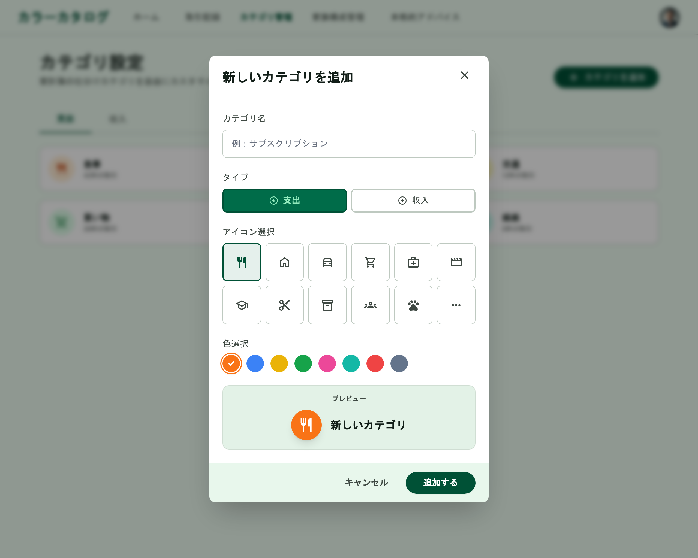

# カテゴリ管理（新規作成）

[機能仕様](../specs/features/categories.md)に対応するカテゴリ新規追加Dialog。[categories-list.md](./categories-list.md)の「新しいカテゴリを追加」ボタンから開く。Dialogの見た目の共通フレームワーク（タイトル+×アイコン、フッターのボタン配置）は[modals.md](./modals.md#dialog共通構成カテゴリ新規追加家族メンバー追加本人情報編集)を参照。

## 関連画面

| 遷移元 | 遷移先 |
|---|---|
| [categories-list.md](./categories-list.md)の「新しいカテゴリを追加」ボタン | カテゴリ新規追加Dialog（同画面上にDialog表示） |

全体の遷移図は[architecture/screen-flow.md](../architecture/screen-flow.md)を参照。

## 関連API

| メソッド | パス | 用途 |
|---|---|---|
| POST | `/api/categories` | カテゴリ新規作成（`icon`・`color`を含む） |

詳細は[機能仕様のAPIエンドポイント](../specs/features/categories.md#apiエンドポイント)を参照。

## 採番済みスクリーンショット

すべてPC版。SP版は未生成（[仕様外要素](#仕様外要素実装時は無視すること)参照）。

Stitch Screen ID: `screens/edfd5598b2d74a5f8d18d4fc350138ba`

## パーツ一覧

共通の枠組み（タイトル+×アイコン、フッターのボタン配置）は[modals.mdのDialog共通構成](./modals.md#dialog共通構成カテゴリ新規追加家族メンバー追加本人情報編集)を参照。

| 名称 | 説明 |
|---|---|
| フォーム項目 | カテゴリ名・タイプ（支出/収入）・アイコン選択（8〜12個のグリッド）・色選択（8個のカラースウォッチ、紫系除く）・プレビュー（選択したアイコン+色の円形バッジ） |

## 状態一覧

特になし（入力フォームのため空状態は発生しない）。エラー状態（API失敗時のトースト等）・送信中状態の表現は本モックアップ上は未確認。

## レスポンシブ差分

SP版は未生成のため記載なし（[仕様外要素](#仕様外要素実装時は無視すること)参照）。

## 採用した方向性

- **アイコン・色ピッカーUIの追加**: 旧版ではこのDialogのアイコン・色選択UIが未確認のままだったため、今回新たに「アイコン選択グリッド（8〜12個）」「色選択スウォッチ（8個、紫系除く）」「アイコン+色のプレビュー」を含む形で再生成し、[カテゴリアイコン・背景色](../specs/features/categories.md#カテゴリアイコン背景色)の「キュレーションされたアイコン+色のセット」の方向性を視覚的に確認できるようにした
- **Dialog（フォーム入力系）の統一構成**: タイトル+右上×アイコン、フォーム本体、フッターに「キャンセル」+プライマリアクションを右寄せ配置、という構成を他のDialogと統一（[modals.md](./modals.md#採用した方向性)参照）

## 既存実装との差分

未実装のため差分なし。

## 仕様外要素（実装時は無視すること）

- 背景に表示されている下層画面は、Stitchが生成時に参照した旧バージョンであることが多く、実装時の背景画面は[categories-list.md](./categories-list.md)の確定モックアップを参照すること。モーダル自体の構成（フォーム項目・ボタン配置）のみがこのドキュメントの参照対象
- SP（モバイル）版は未生成。レイアウトは画面幅に応じてDialogが画面下部からのシート形式になる可能性があるが、Stitchでの個別検証は行っていない。実装時にshadcn/uiのDialogのレスポンシブ挙動に委ねてよい

## 更新履歴

| 日付 | 変更内容 |
|---|---|
| 2026-06-22 | 全画面作り直し方針のもと再生成・新規作成し確定。アイコン・色ピッカーUIを追加。`modals.md`に集約していた内容から分割し、本ファイルとして独立 |
