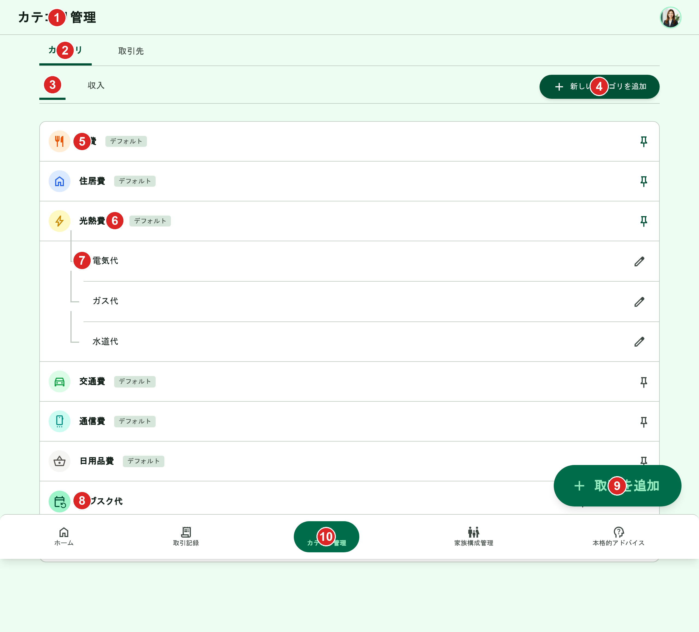
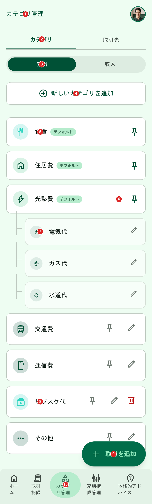

# カテゴリ管理（一覧）

[機能仕様](../specs/features/categories.md)に対応する画面（`(app)/categories`）の一覧表示部分。新規作成・編集・削除は[categories-create.md](./categories-create.md)・[categories-edit.md](./categories-edit.md)・[categories-delete.md](./categories-delete.md)を参照。

## 関連画面

| 遷移元 | 遷移先 |
|---|---|
| 下部固定ナビゲーション（どこからでも） | `(app)/categories`（「カテゴリ管理」タブ） |
| 「新しいカテゴリを追加」ボタン | カテゴリ新規追加Dialog（[categories-create.md](./categories-create.md)） |
| 各行の編集アイコン | カテゴリ編集Dialog（[categories-edit.md](./categories-edit.md)） |
| 各行の削除アイコン | カテゴリ削除確認AlertDialog（[categories-delete.md](./categories-delete.md)） |
| FAB「+ 取引を追加」（どこからでも） | `/transactions/new` |

全体の遷移図は[architecture/screen-flow.md](../architecture/screen-flow.md)を参照。

## 関連API

| メソッド | パス | 用途 |
|---|---|---|
| GET | `/api/categories` | カテゴリ一覧取得（`typeCode`でフィルタ。ピン留め状態を含む） |
| PUT | `/api/categories/:id/pin` | ピン留め |
| DELETE | `/api/categories/:id/pin` | ピン留め解除 |

新規作成・編集・削除のAPIは各CRUDファイルを参照。詳細は[機能仕様のAPIエンドポイント](../specs/features/categories.md#apiエンドポイント)を参照。

## 採番済みスクリーンショット

採番は`docs/design/screenshots/categories-{pc|sp}-numbered.png`（Pillowで番号ピンを描画）。元画像は`categories-{pc|sp}.png`。PC版・SP版とも同一のヘッダー構成（タイトル+アバターのみ）に統一されたため、番号もPC/SP共通で対応する。

### PC版

Stitch Screen ID: `screens/06165406bcf1486c8928fae970981671`（タイトル「カテゴリ管理 - かけぼ (上位タブ・トグル追加 案1)」）。確定済みの旧版（`screens/bb40de401a514873b5bfb0690b184543`）を基準に`generate_variants`（`creativeRange: REFINE`, `aspects: [LAYOUT, TEXT_CONTENT]`）で「カテゴリ/取引先」親タブと子カテゴリ開閉トグルを追加

スクリーンショットはページ全体をスクロールキャプチャしたものであり、FAB・下部固定ナビゲーションがリスト中盤に重なって見えるのはキャプチャ時の表示アーティファクトで、実際は両方とも画面下部に固定表示される。

### SP版

Stitch Screen ID: `screens/62aefdf520444b77a88a667e1e17ed79`（タイトル「カテゴリ管理 - かけぼ (上位タブ追加・案1)」）。確定済みの旧版（`screens/d044ff875db848f18b84c504f4b2d9b1`）を基準に`generate_variants`で同様の変更を加えて生成

## パーツ一覧

| No | 名称 | 説明 | 遷移先・挙動 |
|---|---|---|---|
| ① | ヘッダー | 画面タイトル「カテゴリ管理」+ユーザーアバターのみ。ロゴ・ナビリンク・通知アイコンなし | - |
| ② | 「カテゴリ/取引先」親タブ | 「カテゴリ」タブを選択中の状態。「取引先」タブも並べて表示（非アクティブ） | タップで「取引先」タブ（[transaction-parties-list.md](./transaction-parties-list.md)）に切り替え |
| ③ | 支出/収入サブタブ | PC版は下線型タブ、SP版はピル型セグメントコントロール（[仕様外要素](#仕様外要素実装時は無視すること)参照） | タップで表示対象の`typeCode`を切り替え |
| ④ | 「新しいカテゴリを追加」ボタン | PC版は画面右上、SP版はタブ下に幅いっぱい | カテゴリ新規追加Dialogを開く（[categories-create.md](./categories-create.md)参照） |
| ⑤ | カテゴリ行 | 円形カラーアイコン+カテゴリ名+「デフォルト」バッジ（システムデフォルトのみ）+ピン留めアイコン（線=OFF/塗り=ON） | 行クリックで編集Dialog（[categories-edit.md](./categories-edit.md)）。ピンアイコンクリックでピン留めON/OFF。デフォルトカテゴリは編集・削除アイコンを表示しない |
| ⑥ | 子カテゴリの開閉トグル | 親カテゴリ（光熱費）の行に表示されるシェブロンアイコン。初期状態は展開済み | タップで子カテゴリ（電気代・ガス代・水道代）の表示/非表示を切り替え |
| ⑦ | 親子カテゴリのグルーピング | 光熱費の下にツリー線付きインデントで子カテゴリ（電気代・ガス代・水道代）を表示。子カテゴリ行にも編集アイコンを表示 | 子カテゴリも自分のものであれば編集・ピン留め可能（[親カテゴリ](../specs/features/categories.md#親カテゴリグラフ上のグルーピング)参照） |
| ⑧ | 編集・削除アイコン（独自カテゴリ） | 自分が追加したカテゴリ（サブスク代・ペット費等）の行にのみ表示するペンシル・ゴミ箱アイコン | 編集アイコンで[categories-edit.md](./categories-edit.md)、削除アイコンで[categories-delete.md](./categories-delete.md) |
| ⑨ | 「+ 取引を追加」FAB | 全画面共通のフローティングボタン | タップで「手入力で作成」「レシートから作成」の2択を表示（[common-components.md](./common-components.md)参照） |
| ⑩ | 下部固定ナビゲーション | 5項目（カテゴリ管理がアクティブ） | 各画面へ遷移 |

## 状態一覧

| 状態 | 表示内容 |
|---|---|
| 空状態 | 発生しない。デフォルトカテゴリ（支出12種・収入4種）が常に存在するため、タイプ切替でカテゴリ0件になることはない |
| エラー状態 | カテゴリ一覧取得（GET）失敗時、リスト部分に汎用エラーメッセージ+再試行ボタンを表示する想定（モックアップ上の表現はなし） |
| ローディング状態 | 初回読み込み中はリスト部分をスケルトン表示する想定（モックアップ上の表現はなし） |
| 子カテゴリの折りたたみ状態 | 開閉トグル（パーツ⑥）をタップして子カテゴリを非表示にした状態。モックアップ上の表現はなし（初期状態の展開済みのみ生成）。実装はクライアント側のローカルなUI状態として保持する想定 |

## レスポンシブ差分

- 「新しいカテゴリを追加」ボタンの位置がPC版は画面右上、SP版はタブ下中央に幅いっぱいで配置と異なる（レイアウト上の自然な差分として許容）
- タブのスタイルがPC版は下線型、SP版はピル型と異なる（[仕様外要素](#仕様外要素実装時は無視すること)参照、本来は統一すべき）

## 採用した方向性

- **1列リスト形式**: カードグリッドではなく縦1列のリスト形式。情報量が増えても縦スクロールのみで把握しやすい
- **ピン留めアイコン**: 星ではなくピンアイコンに統一（[用語・命名の固定ルール](./style-guide.md#用語命名の固定ルール)参照）。住居費・食費・光熱費は[ユーザー作成時の初期ピン留め](../specs/features/categories.md#カテゴリの固定表示ピン留め)に合わせてON状態（塗り）で表示した
- **アイコン+背景色のバッジ**: 各カテゴリ行にアイコン（オレンジ/ブルー/イエロー/グリーン等の背景色付き）を表示。[カテゴリアイコン・背景色](../specs/features/categories.md#カテゴリアイコン背景色)の「キュレーションされたアイコン+色のセット」の方向性と一致
- **親子カテゴリのグルーピング**: 光熱費の下に電気代・ガス代・水道代がツリー線付きインデントで表示され、[親カテゴリ](../specs/features/categories.md#親カテゴリグラフ上のグルーピング)の1階層構造を視覚的に表現。子カテゴリの行にも編集アイコンを表示し、子カテゴリも編集可能であることを明示した（2026-06-22ユーザー指摘の未表現項目への対応）
- **独自カテゴリの表示**: デフォルトカテゴリのみだった旧版から改め、自分が追加した独自カテゴリ（サブスク代・ペット費）を2件以上含め、編集・削除アイコンが表示されることを確認できるようにした（2026-06-22ユーザー指摘の未表現項目への対応）
- **デフォルトカテゴリの編集・削除アイコン非表示**: [権限ルール](../specs/features/categories.md#権限ルール)上システムデフォルトは編集・削除不可のため、デフォルトカテゴリの行にはピン留めアイコンのみを表示し、独自カテゴリの行にのみ編集・削除アイコンを表示するよう明示的に指示した
- **支出/収入タブ**: `typeCode`別に表示を切り替える、仕様の「支出」「収入」別管理に対応
- **ナビゲーション**: [common-components.md](./common-components.md)で確定した共通パーツ（5項目日本語ラベル、通知アイコンなし、左サイドバーなし）に統一
- **「カテゴリ/取引先」親タブ**: [取引先の管理画面の仕様](../specs/features/transaction-parties.md#管理画面)（専用画面を持たず、カテゴリ管理画面にタブを追加する）に対応。下部固定ナビゲーションの表示ラベルは「カテゴリ管理」のまま変更しない
- **子カテゴリの開閉トグル**: 子カテゴリの件数が増えた場合に一覧が縦に長くなりすぎることを防ぐため、親カテゴリ単位で折りたたみ可能にした。初期状態は展開済み（[2026-06-22ユーザー指摘の未表現項目への対応](#採用した方向性)で追加した子カテゴリの編集導線が、折りたたみによって見えなくなることを避けるため）

## 既存実装との差分

未実装のため差分なし。

## 仕様外要素（実装時は無視すること）

| 対象 | 内容 | 対応方針 |
|---|---|---|
| SP版タブ | 「支出」「収入」タブがピル型セグメントコントロールになっている（PC版は下線型）。[common-components.md](./common-components.md)の確定方針は下線型への統一 | 実装時はSP版も下線型タブに統一する。次回再生成時に修正する |

## 更新履歴

| 日付 | 変更内容 |
|---|---|
| 2026-06-22 | `_template.md`に基づき再作成。パーツ採番・状態一覧・レスポンシブ差分・関連画面・関連APIを追加 |
| 2026-06-22（2回目） | 全画面作り直し方針のもと再生成。ヘッダーからロゴ・ナビリンク・通知アイコンを除去、デフォルトカテゴリの編集・削除アイコンを除去、子カテゴリの編集導線・独自カテゴリ2件・ピン留めON状態を追加して確定（PC: `screens/bb40de401a514873b5bfb0690b184543`、SP: `screens/d044ff875db848f18b84c504f4b2d9b1`） |
| 2026-06-22（3回目） | 取引先機能の追加に伴い、「カテゴリ」「取引先」タブ構成への変更をテキストで記録（[今後反映予定の変更](#今後反映予定の変更モックアップ未更新)）。モックアップ自体の再生成は別スレッドで実施予定 |
| 2026-06-22（4回目） | 一覧・新規作成・編集・削除が1ファイルに混在し読みづらいとのユーザー指摘を受け、`categories.md`を分割。本ファイルは一覧部分のみを担当（[categories-create.md](./categories-create.md)・[categories-edit.md](./categories-edit.md)・[categories-delete.md](./categories-delete.md)に分割） |
| 2026-06-23 | `/grill-me`セッション追加タスク2に対応。確定済みPC/SPを基準に`generate_variants`で「カテゴリ/取引先」親タブ・子カテゴリ開閉トグルを追加して再確定（PC: `screens/06165406bcf1486c8928fae970981671`、SP: `screens/62aefdf520444b77a88a667e1e17ed79`）。パーツ番号を②③⑥として追加し、テキストのみで記録していた「今後反映予定の変更」節を削除 |
