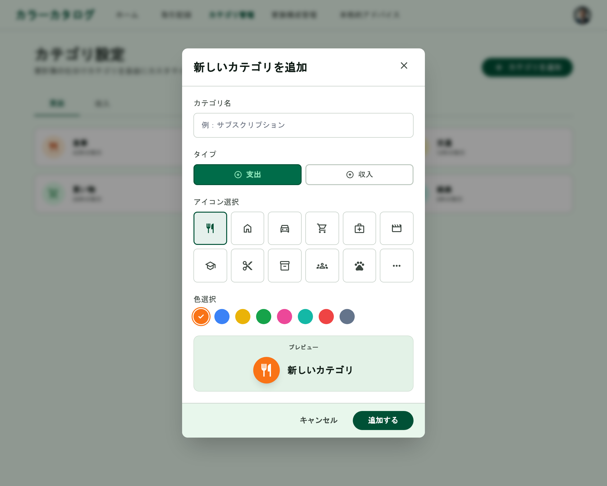

# カテゴリ管理（新規作成）

[機能仕様](../../specs/features/categories.md)に対応するカテゴリ新規追加Dialog。[categories/list.md](./list.md)の「新しいカテゴリを追加」ボタンから開く。Dialogの見た目の共通フレームワーク（タイトル+×アイコン、フッターのボタン配置）は[modals.md](../modals.md#dialog共通構成カテゴリ新規追加家族メンバー追加本人情報編集)を参照。

## 関連画面

| 遷移元                                                          | 遷移先                                         |
| --------------------------------------------------------------- | ---------------------------------------------- |
| [categories/list.md](./list.md)の「新しいカテゴリを追加」ボタン | カテゴリ新規追加Dialog（同画面上にDialog表示） |

全体の遷移図は[architecture/screen-flow.md](../../architecture/screen-flow.md)を参照。

## 関連API

| メソッド | パス              | 用途                                      |
| -------- | ----------------- | ----------------------------------------- |
| POST     | `/api/categories` | カテゴリ新規作成（`icon`・`color`を含む） |

詳細は[機能仕様のAPIエンドポイント](../../specs/features/categories.md#apiエンドポイント)を参照。

## 採番済みスクリーンショット

すべてPC版。SP版は未生成（[仕様外要素](#仕様外要素実装時は無視すること)参照）。

Stitch Screen ID: `screens/edfd5598b2d74a5f8d18d4fc350138ba`

## パーツ一覧

共通の枠組み（タイトル+×アイコン、フッターのボタン配置）は[modals.mdのDialog共通構成](../modals.md#dialog共通構成カテゴリ新規追加家族メンバー追加本人情報編集)を参照。

| 名称         | 説明                                                                                                                                                                                                                                                              |
| ------------ | ----------------------------------------------------------------------------------------------------------------------------------------------------------------------------------------------------------------------------------------------------------------- |
| フォーム項目 | カテゴリ名・タイプ（支出/収入）・アイコン選択（初期表示8〜12個のグリッド+「もっと見る」でDialog内その場に残りの候補を展開。両者とも開いた時点で先頭候補が初期選択済み）・色選択（8個のカラースウォッチ、紫系除く）・プレビュー（選択したアイコン+色の円形バッジ） |

## 状態一覧

特になし（入力フォームのため空状態は発生しない）。エラー状態（API失敗時のトースト等）・送信中状態の表現は本モックアップ上は未確認。

## レスポンシブ差分

SP版は未生成のため記載なし（[仕様外要素](#仕様外要素実装時は無視すること)参照）。

## 採用した方向性

- **アイコン・色ピッカーUIの追加**: 旧版ではこのDialogのアイコン・色選択UIが未確認のままだったため、今回新たに「アイコン選択グリッド（8〜12個）」「色選択スウォッチ（8個、紫系除く）」「アイコン+色のプレビュー」を含む形で再生成し、[カテゴリアイコン・背景色](../../specs/features/categories.md#カテゴリアイコン背景色)の「キュレーションされたアイコン+色のセット」の方向性を視覚的に確認できるようにした
- **Dialog（フォーム入力系）の統一構成**: タイトル+右上×アイコン、フォーム本体、フッターに「キャンセル」+プライマリアクションを右寄せ配置、という構成を他のDialogと統一（[modals.md](../modals.md#採用した方向性)参照）
- **アイコンライブラリはlucide-reactに統一（2026-08-15決定）**: Footerのナビゲーションアイコンは[Google Material Symbols](https://fonts.google.com/icons)（SVGを個別ダウンロードして`public/icon/`に配置）だが、カテゴリアイコンは候補が今後20〜30種以上に拡張していく想定のため統一しなかった。Material Symbolsはnpmパッケージとして配布されておらず、候補を増やすたびにSVGを個別ダウンロード・配置する運用は現実的でないため、パッケージとして名前解決できるlucide-reactを継続する
- **アイコン→色の自動プリセットは不採用（2026-08-15決定）**: 当初はアイコン選択に連動して色を自動プリセットする案があったが、不要と判断し撤回。アイコン・色は完全に独立した選択項目とし、フォームを開いた時点でそれぞれ先頭候補が初期選択された状態にする（未選択状態を作らない）
- **「もっと見る」はDialog内でその場に展開（2026-08-15決定）**: 初期グリッド外の候補は、別のPopover/Sheetを重ねるのではなく同じDialog内のグリッドに追加表示する。アイコン選択→下のプレビューで確認、という一連の操作の視界を分断しないため

## 既存実装との差分

未実装のため差分なし。

## 今後反映予定の変更（モックアップ未更新）

- **親カテゴリ選択フィールド**: [機能仕様の親カテゴリ](../../specs/features/categories.md#親カテゴリグラフ上のグルーピング)には存在するが、現行モックアップのパーツ一覧（カテゴリ名・タイプ・アイコン選択・色選択・プレビュー）には未反映。実装時は「親カテゴリ」Select（子を持たないカテゴリのみ選択可能。任意項目）と、その直下に[常設ヘルプテキスト+ヘルプページへのリンク](../../specs/features/categories.md#親カテゴリグラフ上のグルーピング)を追加する。モックアップ自体の再生成は別タスク（[tasks/categories.md](../../tasks/features/categories.md)参照）
- **取引先新規追加Dialogとの共通化（2026-07-25決定）**: [transaction-parties/create.md](../transaction-parties/create.md)の取引先新規追加Dialogと共通化した1つのフォームにする。フォーム内で対象（カテゴリ/取引先）を切り替え可能にし、切り替えに応じてフォーム項目（取引先選択時はアイコン・色選択を非表示にし、名前+タイプのみにする）と呼び出すAPIを変える。現行モックアップは単独Dialogのままなので再生成が必要

## 仕様外要素（実装時は無視すること）

- 背景に表示されている下層画面は、Stitchが生成時に参照した旧バージョンであることが多く、実装時の背景画面は[categories/list.md](./list.md)の確定モックアップを参照すること。モーダル自体の構成（フォーム項目・ボタン配置）のみがこのドキュメントの参照対象
- SP（モバイル）版は未生成。レイアウトは画面幅に応じてDialogが画面下部からのシート形式になる可能性があるが、Stitchでの個別検証は行っていない。実装時にshadcn/uiのDialogのレスポンシブ挙動に委ねてよい

## 更新履歴

| 日付       | 変更内容                                                                                                                                                                                                                        |
| ---------- | ------------------------------------------------------------------------------------------------------------------------------------------------------------------------------------------------------------------------------- |
| 2026-06-22 | 全画面作り直し方針のもと再生成・新規作成し確定。アイコン・色ピッカーUIを追加。`modals.md`に集約していた内容から分割し、本ファイルとして独立                                                                                     |
| 2026-08-15 | `/grill-me`セッションでアイコン・色ピッカーの実装方針を精査。アイコンライブラリはlucide-react継続（Google Material Symbolsへの統一は不採用）、アイコン→色の自動プリセット機能を撤回、「もっと見る」はDialog内その場展開、と決定 |
| 2026-07-25 | 実装検討の中で、取引先新規追加Dialogとの共通化を決定。[今後反映予定の変更](#今後反映予定の変更モックアップ未更新)に記録（モックアップ再生成は別タスク）                                                                         |
