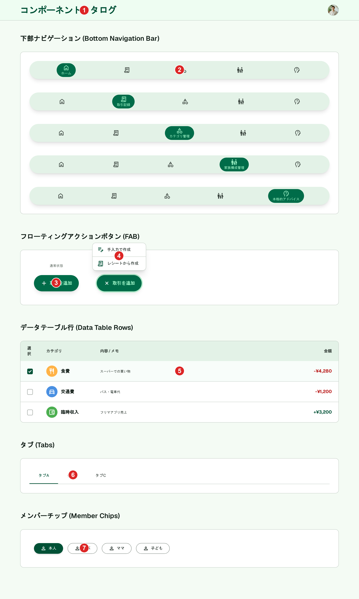

# 共通UIパーツ

[architecture/overview.md](../architecture/overview.md#app-レイアウト構成)で定義した、全画面共通のヘッダー・下部ナビゲーション・FABをまとめたコンポーネントカタログ。各機能画面（ホーム・取引記録・カテゴリ管理・家族構成管理・本格的アドバイス）は、ここで確定したパーツに合わせて実装する。

## Stitchモックアップ

- **PC版（確定・再生成済み、2026-06-22）**: `screens/428b6c9720c641828d287fde5f5bab7a`（タイトル「コンポーネントカタログ - かけぼ (PC版)」）。テーブル行・タブ・メンバーチップのコンポーネントを新規追加し、FABポップアップの文言を「手入力で作成」「レシートから作成」に統一した
- 旧版（`screens/1d724c480c70455c96d68402c4e40ba8`、`screens/6dc6fa7fe4f5440394ca9fdcbbbc3dda`）はテーブル行・タブ・メンバーチップの定義がない、または通知アイコン・フッターブランド表記を含んでいたため作り直した。削除候補として[README.md](./README.md#stitch管理画面での削除候補任意手動作業)に追加済み
- 本カタログはPC版のみ（SP版は作らない。各機能画面のSP版で個別に確認する）

## 採番済みスクリーンショット

Stitch Screen ID: `screens/428b6c9720c641828d287fde5f5bab7a`

## パーツ一覧

| No  | 名称                         | 説明                                                                                                                                                                                      | 使用画面                                                   |
| --- | ---------------------------- | ----------------------------------------------------------------------------------------------------------------------------------------------------------------------------------------- | ---------------------------------------------------------- |
| ①   | ヘッダー                     | 画面タイトル + ユーザーアバターのみ。通知アイコン等は含めない                                                                                                                             | 全画面共通                                                 |
| ②   | 下部固定ナビゲーション       | 5項目（ホーム・取引記録・カテゴリ管理・家族構成管理・本格的アドバイス）。アクティブ項目はピル形状の緑背景+ラベル、非アクティブはアイコンのみ。5項目それぞれがアクティブな状態を並べて掲載 | 全画面共通                                                 |
| ③   | FAB（通常状態）              | 「+ 取引を追加」の横長ピル形状ボタン                                                                                                                                                      | ホーム・取引記録など                                       |
| ④   | FAB（展開状態）              | タップ時に「手入力で作成」「レシートから作成」の2択ポップアップを表示                                                                                                                     | 同上                                                       |
| ⑤   | データテーブル行             | チェックボックス+円形カラーアイコン+メインテキスト/サブテキスト+金額（プラス＝緑、マイナス＝赤）                                                                                          | 取引記録・カテゴリ管理・家族構成管理の一覧                 |
| ⑥   | タブ・セグメントコントロール | 下線型。アクティブ項目の下に太い緑の下線                                                                                                                                                  | 取引記録「一覧/定期取引」、取引登録フォーム「単発/定期」等 |
| ⑦   | メンバーチップ               | 「本人」「パパ」「ママ」「子ども」のラベルチップ。選択中はプライマリグリーンの塗り                                                                                                        | 取引登録フォームの家族メンバー選択等                       |

## 採用した方向性

- **ヘッダー**: 画面タイトル + ユーザーアバターのみのシンプルな構成（[architecture/overview.md](../architecture/overview.md#app-レイアウト構成)の「ヘッダーは最小限」方針通り）。**通知アイコンは含めない**
- **下部固定ナビゲーション**: 5項目（ホーム・取引記録・カテゴリ管理・家族構成管理・本格的アドバイス）。アクティブ項目はピル形状の緑背景+ラベル表示、非アクティブはアイコンのみで視認性を確保。5項目それぞれがアクティブな状態を1枚に並べて確認できるようにした
- **FAB**: 「+ 取引を追加」のピル形状ボタン（円形ではなく横長のピル型）。タップで「手入力で作成」「レシートから作成」の2択を表示する仕様（[ai.md](../specs/features/ai.md#1-レシート読み取り自動入力receipt_scan)参照）について、通常状態と展開状態（ポップアップ表示）の両方をこのカタログに含める（2026-06-22に文言を「手入力で記録」「レシートで記録」から「〜で作成」に統一する方針に変更。再生成時に反映）
- **データテーブル行**: 取引記録・カテゴリ管理・家族構成管理など一覧画面で共通のテーブル行コンポーネント。チェックボックス（左端）+ 円形カラーアイコン（カテゴリ・項目を視覚的に区別）+ メインテキスト/サブテキストの2行表示 + 右端の数値（金額等、プラスは緑・マイナスは赤）。一覧画面ごとに見た目が変わらないよう、この定義を個別画面生成プロンプトで毎回参照する
- **タブ・セグメントコントロール**: 下線型タブ（アクティブ項目の下に太い緑の下線、非アクティブはグレーテキスト）に統一する。取引記録の「一覧/定期取引」、取引登録フォームの「単発/定期」等、画面内で状態が切り替わるタブ・ラジオ切替はすべてこのスタイルに統一する
- **メンバーチップ**: 「本人」「パパ」「ママ」「子ども」を表すラベルチップ。選択中はプライマリグリーンの塗り、非選択中はグレーアウトラインのピル形状で統一する

## 既存実装との差分

未実装のため差分なし。

## 仕様外要素（実装時は無視すること）

| 対象                     | 内容                                                                                                   | 対応方針                                                                                                                   |
| ------------------------ | ------------------------------------------------------------------------------------------------------ | -------------------------------------------------------------------------------------------------------------------------- |
| 各見本セクションの見出し | 「下部ナビゲーション (Bottom Navigation Bar)」のように、日本語見出しの後ろに英語の括弧書きが付いている | このカタログ自体は実装対象の画面ではなく内部リファレンスのため実害はない。実装時・他画面への流用時はこの英語表記を含めない |

通知アイコン・フッターブランド表記（「かけぼ Modern Finance」「Privacy Policy」「Terms of Service」「Help Center」）は除去済み。

## 更新履歴

| 日付                | 変更内容                                                                                                                                                                                    |
| ------------------- | ------------------------------------------------------------------------------------------------------------------------------------------------------------------------------------------- |
| 2026-06-22          | 通知アイコン・フッターブランド表記を除去し再生成。FABの展開状態（手入力/レシートの2択ポップアップ）を追加                                                                                   |
| 2026-06-22（2回目） | テーブル行・タブ・メンバーチップのコンポーネントを新規追加し、FABポップアップ文言を「手入力で作成」「レシートから作成」に統一して再生成・確定（`screens/428b6c9720c641828d287fde5f5bab7a`） |
| 2026-06-22（3回目） | スクリーンショットに番号ピンを描画し、採番済みスクリーンショット・パーツ一覧を追加                                                                                                          |
