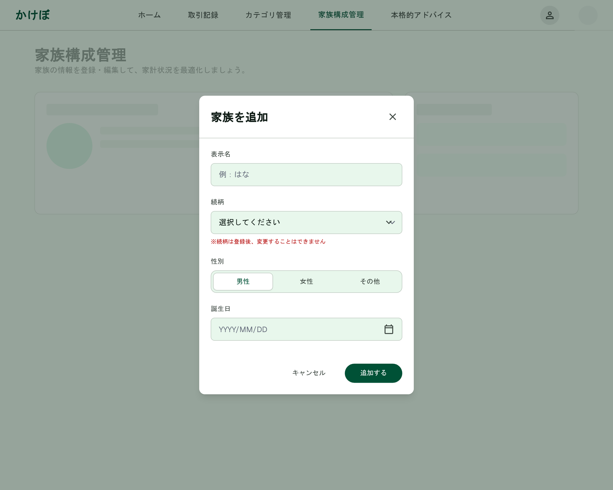

# 家族構成管理（新規作成）

[機能仕様](../specs/features/family-members.md)に対応する家族メンバー新規追加Dialog。[family-members-list.md](./family-members-list.md)の「家族を追加」ボタンから開く。続柄・表示名・性別・誕生日を入力（続柄は新規作成時のみ指定可）。Dialogの見た目の共通フレームワークは[modals.md](./modals.md#dialog共通構成カテゴリ新規追加家族メンバー追加本人情報編集)を参照。

## 関連画面

| 遷移元 | 遷移先 |
|---|---|
| [family-members-list.md](./family-members-list.md)の「家族を追加」ボタン | 家族メンバー新規追加Dialog（同画面上にDialog表示） |

全体の遷移図は[architecture/screen-flow.md](../architecture/screen-flow.md)を参照。

## 関連API

| メソッド | パス | 用途 |
|---|---|---|
| POST | `/api/family-members` | 家族メンバー新規作成（続柄は新規作成時のみ指定） |

詳細は[機能仕様](../specs/features/family-members.md)を参照。

## 採番済みスクリーンショット

すべてPC版。SP版は未生成（[仕様外要素](#仕様外要素実装時は無視すること)参照）。

Stitch Screen ID: `screens/ad5d2305d3144156ab8fd43bd1d24d15`

## パーツ一覧

共通の枠組み（タイトル+×アイコン、フッターのボタン配置）は[modals.mdのDialog共通構成](./modals.md#dialog共通構成カテゴリ新規追加家族メンバー追加本人情報編集)を参照。

| 名称 | 説明 |
|---|---|
| フォーム項目 | 表示名・続柄（新規作成時のみ指定可能の注記付き）・性別（3択）・誕生日。**居住地域フィールドは含まない**（本人のみの項目のため） |

## 状態一覧

特になし（入力フォームのため空状態は発生しない）。

## レスポンシブ差分

SP版は未生成のため記載なし（[仕様外要素](#仕様外要素実装時は無視すること)参照）。

## 採用した方向性

- **居住地域フィールドを含めない**: 居住地域は本人のみが持つ項目のため、新規メンバー追加では除外（本人の編集は[family-members-edit.md](./family-members-edit.md)を参照）
- **Dialog（フォーム入力系）の統一構成**: タイトル+右上×アイコン、フォーム本体、フッターに「キャンセル」+プライマリアクションを右寄せ配置、という構成を他のDialogと統一（[modals.md](./modals.md#採用した方向性)参照）

## 既存実装との差分

未実装のため差分なし。

## 仕様外要素（実装時は無視すること）

- 背景に表示されている下層画面は、Stitchが生成時に参照した旧バージョンであることが多く、実装時の背景画面は[family-members-list.md](./family-members-list.md)の確定モックアップを参照すること
- SP（モバイル）版は未生成。実装時にshadcn/uiのDialogのレスポンシブ挙動に委ねてよい
- 性別ボタン（3択）の見た目がセグメントトラック+白カプセル（選択中の項目が白い背景で示される）になっているが、[family-members-edit.md](./family-members-edit.md#採用した方向性)の本人(SELF)編集Dialogのスタイル（濃いプライマリグリーンの塗り+白文字、非選択はテキストのみ）に統一する（[style-guide.mdの性別3択ボタン](./style-guide.md#共通レイアウト)参照）

## 更新履歴

| 日付 | 変更内容 |
|---|---|
| 2026-06-22 | 全画面作り直し方針のもと再生成・新規作成し確定。`modals.md`に集約していた内容から分割し、本ファイルとして独立 |
| 2026-06-26 | 性別ボタンのスタイルを本人編集Dialog基準に統一する決定を仕様外要素に反映 |
