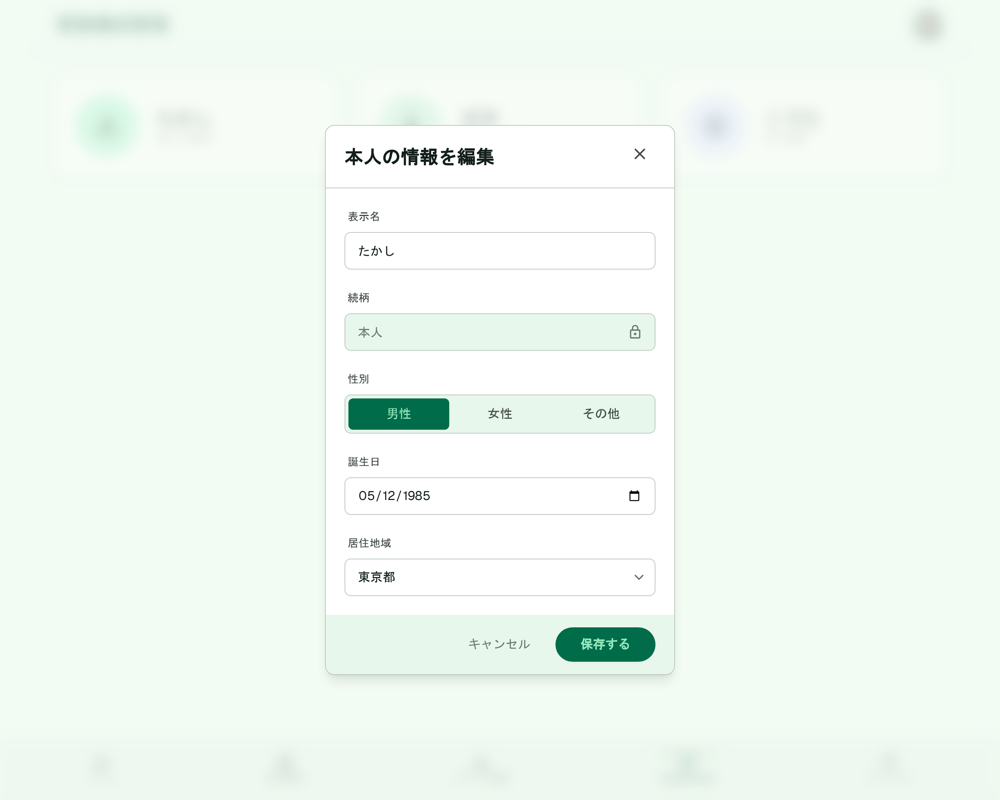

# 家族構成管理（編集）

[機能仕様](../../specs/features/family-members.md)に対応する家族メンバー編集Dialog。[family-members/list.md](./list.md)の各行の編集アイコンから開く。**本人(SELF)行**と**配偶者・子等の行**でフォーム項目が異なるため、2パターンに分けて記載する。Dialogの見た目の共通フレームワークは[modals.md](../modals.md#dialog共通構成カテゴリ新規追加家族メンバー追加本人情報編集)を参照。

## 関連画面

| 遷移元                                                            | 遷移先                                           |
| ----------------------------------------------------------------- | ------------------------------------------------ |
| [family-members/list.md](./list.md)本人行の編集アイコン           | 本人(SELF)情報編集Dialog（同画面上にDialog表示） |
| [family-members/list.md](./list.md)配偶者・子等の行の編集アイコン | 家族メンバー編集Dialog（同画面上にDialog表示）   |

全体の遷移図は[architecture/screen-flow.md](../../architecture/screen-flow.md)を参照。

## 関連API

| メソッド | パス                      | 用途                                                                                                           |
| -------- | ------------------------- | -------------------------------------------------------------------------------------------------------------- |
| PUT      | `/api/family-members/:id` | 家族メンバー編集（続柄は更新対象外。対象が本人の場合のみ`regionCode`を受け付け、`users.regionCode`も同時更新） |

両パターンとも同一のエンドポイントを呼ぶ。詳細は[機能仕様](../../specs/features/family-members.md)を参照。

## 採番済みスクリーンショット

すべてPC版。SP版は未生成（[仕様外要素](#仕様外要素実装時は無視すること)参照）。

### 本人(SELF)情報編集Dialog

Stitch Screen ID: `screens/daa93ce80ec9400382b68dbfedf13988`

### 配偶者・子等の編集Dialog

専用のモックアップは生成していない。[family-members/create.md](./create.md)の新規追加Dialogと同形式で、初期値に既存メンバーの値が入り、続柄欄が編集不可ロック表示になった状態として扱う。

## パーツ一覧

共通の枠組み（タイトル+×アイコン、フッターのボタン配置）は[modals.mdのDialog共通構成](../modals.md#dialog共通構成カテゴリ新規追加家族メンバー追加本人情報編集)を参照。

### 本人(SELF)情報編集Dialog

| 名称         | 説明                                                                                                                                                                    |
| ------------ | ----------------------------------------------------------------------------------------------------------------------------------------------------------------------- |
| フォーム項目 | 表示名（編集可）・続柄（「本人」+鍵アイコンの編集不可ロック表示）・性別（編集可）・誕生日（編集可）・居住地域（都道府県のみの単一プルダウン、編集可、**本人のみ表示**） |

### 配偶者・子等の編集Dialog

| 名称         | 説明                                                                                                           |
| ------------ | -------------------------------------------------------------------------------------------------------------- |
| フォーム項目 | 表示名・性別・誕生日のみ編集可。続柄は表示のみで変更不可。居住地域フィールドは含まない（本人のみの項目のため） |

## 状態一覧

特になし（入力フォームのため空状態は発生しない）。

## レスポンシブ差分

SP版は未生成のため記載なし（[仕様外要素](#仕様外要素実装時は無視すること)参照）。

## 採用した方向性

- **本人（SELF）編集モーダルの特別対応**: 通常の家族メンバー編集と異なり、「続柄」を編集不可のロック表示にし、本人のみの項目である「居住地域」（都道府県のみの単一プルダウン）を追加。[本人（SELF）のみの追加編集項目](../../specs/features/family-members.md#本人selfのみの追加編集項目-居住地域)の仕様を正しく反映している
- **続柄の固定表示**: 両パターンとも続柄は変更不可。[続柄は新規作成時のみ指定可、以降は全メンバー共通で編集不可](../../specs/features/family-members.md#概要)というルールと整合
- **Dialog（フォーム入力系）の統一構成**: タイトル+右上×アイコン、フォーム本体、フッターに「キャンセル」+プライマリアクションを右寄せ配置、という構成を他のDialogと統一（[modals.md](../modals.md#採用した方向性)参照）
- **性別3択ボタンの基準スタイル**: 本人(SELF)情報編集Dialogの性別ボタン（選択中はプライマリグリーンの塗り+白文字、非選択はテキストのみ・枠は白背景）を、profile-setup・family-members-createを含む全画面共通の基準スタイルとして採用した（2026-06-26決定。画面によって薄緑の塗りやセグメントトラック+白カプセル等、見た目が不統一だったため統一。詳細は[style-guide.mdの性別3択ボタン](../style-guide.md#共通レイアウト)参照）

## 既存実装との差分

未実装のため差分なし。

## 仕様外要素（実装時は無視すること）

- 背景に表示されている下層画面は、Stitchが生成時に参照した旧バージョンであることが多く、実装時の背景画面は[family-members/list.md](./list.md)の確定モックアップを参照すること
- SP（モバイル）版は未生成。実装時にshadcn/uiのDialogのレスポンシブ挙動に委ねてよい

## 更新履歴

| 日付                | 変更内容                                                                                                                                                                                                                 |
| ------------------- | ------------------------------------------------------------------------------------------------------------------------------------------------------------------------------------------------------------------------ |
| 2026-06-22          | 本人(SELF)情報編集Dialogを全画面作り直し方針のもと再生成し確定。居住地域は都道府県単一プルダウンに修正済み。`modals.md`に集約していた内容から分割し、本ファイルとして独立                                                |
| 2026-06-22（2回目） | 一覧・新規作成・編集・削除が1ファイルに混在し読みづらいとのユーザー指摘を受け、`family-members.md`から分割して新規作成。配偶者・子等の編集Dialogは専用モックアップがなく、新規作成Dialogとの差分のみを記載する形式とした |
| 2026-06-26          | 本人(SELF)編集Dialogの性別3択ボタンスタイルを、全画面共通の基準スタイルとして採用する決定を反映                                                                                                                          |
