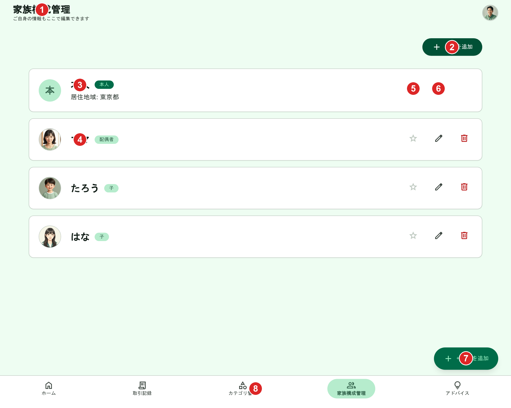
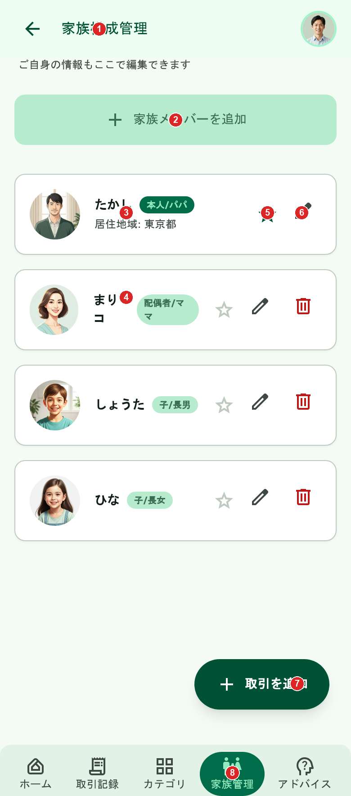

# 家族構成管理（一覧）

[機能仕様](../../specs/features/family-members.md)に対応する画面（`(app)/family-members`）の一覧表示部分。新規作成・編集・削除は[family-members/create.md](./create.md)・[family-members/edit.md](./edit.md)・[family-members/delete.md](./delete.md)を参照。

## 関連画面

| 遷移元                                 | 遷移先                                                                  |
| -------------------------------------- | ----------------------------------------------------------------------- |
| 下部固定ナビゲーション（どこからでも） | `(app)/family-members`（「家族構成管理」タブ）                          |
| 「家族を追加」ボタン                   | 家族メンバー新規追加フォーム（[family-members/create.md](./create.md)） |
| 各行の編集アイコン                     | 家族メンバー編集フォーム（[family-members/edit.md](./edit.md)）         |
| 各行の削除アイコン（本人以外）         | 家族メンバー削除確認（[family-members/delete.md](./delete.md)）         |
| FAB「+ 取引を追加」（どこからでも）    | `/transactions/new`                                                     |

全体の遷移図は[architecture/screen-flow.md](../../architecture/screen-flow.md)を参照。

## 関連API

| メソッド | パス                              | 用途                                                                     |
| -------- | --------------------------------- | ------------------------------------------------------------------------ |
| GET      | `/api/family-members`             | 家族メンバー一覧取得（本人を先頭、以降作成順）                           |
| PUT      | `/api/family-members/:id/default` | デフォルトメンバーに指定（指定すると、それまでのデフォルトは自動で解除） |

新規作成・編集・削除のAPIは各CRUDファイルを参照。詳細は[機能仕様](../../specs/features/family-members.md)を参照。

## 採番済みスクリーンショット

採番は`docs/design/screenshots/family-members-{pc|sp}-numbered.png`（Pillowで番号ピンを描画）。元画像は`family-members-{pc|sp}.png`。

### PC版

Stitch Screen ID: `screens/642339c5ef824c21accef86df264b5e3`（タイトル「家族構成管理 - かけぼ (PC版・シンプル構成)」）

### SP版

Stitch Screen ID: `screens/d6940c56101b486485c8181bc2ee62e8`（タイトル「家族構成管理 - かけぼ (モバイル版)」）

## パーツ一覧

| No  | 名称                   | 説明                                                                                                                                                                                        | 遷移先・挙動                                                                                                                                                         |
| --- | ---------------------- | ------------------------------------------------------------------------------------------------------------------------------------------------------------------------------------------- | -------------------------------------------------------------------------------------------------------------------------------------------------------------------- |
| ①   | ヘッダー               | 画面タイトル「家族構成管理」+説明文「ご自身の情報もここで編集できます」+ユーザーアバター。SP版のみ左端に戻る矢印アイコンが付くが仕様外（[仕様外要素](#仕様外要素実装時は無視すること)参照） | アバタータップでプロフィール編集モーダル等                                                                                                                           |
| ②   | 「家族を追加」ボタン   | PC版は画面右上、SP版は説明文下に幅いっぱい                                                                                                                                                  | [family-members/create.md](./create.md)のフォームを開く                                                                                                              |
| ③   | 本人行                 | 円形アバター+表示名+続柄バッジ「本人」+「居住地域: 東京都」+デフォルト★（塗り）+編集アイコン。**削除アイコンなし**（本人は削除不可）                                                        | 編集アイコンタップで[family-members/edit.md](./edit.md)（本人(SELF)情報編集Dialog）                                                                                  |
| ④   | 配偶者・子等の行       | 円形アバター+表示名+続柄バッジ（配偶者/子等）+デフォルト★（枠線=非デフォルト）+編集・削除アイコン。**居住地域等の追加項目は表示しない**（本人のみの項目のため）                             | 編集アイコンで[family-members/edit.md](./edit.md)、削除アイコンで[family-members/delete.md](./delete.md)                                                             |
| ⑤   | デフォルトメンバーの★  | 塗り=デフォルト、枠線=非デフォルト。初期状態は本人が★塗り                                                                                                                                   | タップでデフォルトメンバーを切り替え（[デフォルトメンバー](../../specs/features/family-members.md#デフォルトメンバーisdefault)参照、本モックアップでは静的表示のみ） |
| ⑥   | 編集アイコン           | 行右端のペンシルアイコン                                                                                                                                                                    | タップで編集フォームを開く（[family-members/edit.md](./edit.md)）                                                                                                    |
| ⑦   | 「+ 取引を追加」FAB    | 全画面共通のフローティングボタン                                                                                                                                                            | タップで「手入力で作成」「レシートから作成」の2択を表示（[common-components.md](../common-components.md)参照）                                                       |
| ⑧   | 下部固定ナビゲーション | 5項目（家族構成管理がアクティブ）。ラベルが「家族管理」「アドバイス」と省略表示されているが仕様外（[仕様外要素](#仕様外要素実装時は無視すること)参照）                                      | 各画面へ遷移                                                                                                                                                         |

## 状態一覧

| 状態             | 表示内容                                                                                                         |
| ---------------- | ---------------------------------------------------------------------------------------------------------------- |
| 空状態           | 発生しない。本人レコードがプロフィール設定時に必ず作成されるため、一覧が0件になることはない                      |
| エラー状態       | 一覧取得（GET）失敗時、リスト部分に汎用エラーメッセージ+再試行ボタンを表示する想定（モックアップ上の表現はなし） |
| ローディング状態 | 初回読み込み中はリスト部分をスケルトン表示する想定（モックアップ上の表現はなし）                                 |

## レスポンシブ差分

- 「家族を追加」ボタンの位置がPC版は画面右上、SP版は説明文下に幅いっぱいで配置と異なる（レイアウト上の自然な差分として許容）
- SP版のみヘッダー左端に戻る矢印アイコンが付く（[仕様外要素](#仕様外要素実装時は無視すること)参照）

## 採用した方向性

- **本人行の特別扱い**: 一覧の先頭に必ず「本人」行を表示し、続柄バッジ「本人」を付与。デフォルト★（塗り）・編集アイコンのみ（削除アイコンなし）を表示し、[権限ルール](../../specs/features/family-members.md#権限ルール)（本人は削除不可）を正しく反映
- **居住地域編集の統合**: 本人行にのみ「居住地域: 東京都」を表示し、他のメンバー行には学年・世帯区分等の余計な項目を一切表示しない。[本人（SELF）のみの追加編集項目: 居住地域](../../specs/features/family-members.md#本人selfのみの追加編集項目-居住地域)の統合方針を正しく反映できている（複数回の生成試行で、他メンバー行に「学年」「世帯区分」等の架空項目が混入する候補や、AIアドバイスバナーが混入する候補があったため、それらを除外して本構成を採用した）
- **説明文**: 見出し下に「ご自身の情報もここで編集できます」を表示し、単身利用者にも画面を開く理由が伝わるようにしている
- **デフォルトメンバーの★**: 本人が塗り★、他メンバーは枠線☆で初期表示。[デフォルトメンバー](../../specs/features/family-members.md#デフォルトメンバーisdefault)の初期状態と一致
- **続柄の固定表示**: バッジで続柄（本人/配偶者/子等）を表示するのみで、編集フォームからは変更できない構成。[続柄は新規作成時のみ指定可、以降は全メンバー共通で編集不可](../../specs/features/family-members.md#概要)というルールと整合
- **ナビゲーション**: 他画面と共通の下部固定タブバー（5項目、家族構成管理がアクティブ）+「+取引を追加」FAB

## 既存実装との差分

未実装のため差分なし。

## 仕様外要素（実装時は無視すること）

| 対象                                | 内容                                                                                                                                                                | 対応方針                                                                                                        |
| ----------------------------------- | ------------------------------------------------------------------------------------------------------------------------------------------------------------------- | --------------------------------------------------------------------------------------------------------------- |
| SP版ヘッダー                        | 左端に戻る矢印アイコンが表示されている。本画面はタブ遷移先のトップ画面であり「戻る」先がないため不要                                                                | 実装時はSP版ヘッダーにも戻る矢印を含めない（タイトル+アバターのみ）                                             |
| 下部固定ナビゲーション（PC/SP共通） | 「家族構成管理」が「家族管理」、「本格的アドバイス」が「アドバイス」と省略表示されている。[common-components.md](../common-components.md)の確定ラベルはフルテキスト | 実装時はフルラベル「家族構成管理」「本格的アドバイス」を使用する                                                |
| SP版続柄バッジ                      | 「配偶者/マ\nママ」「子/長男」のように、続柄に加えて愛称・出生順がバッジ内に結合表示され、狭い幅で改行している                                                      | 実装時はバッジに続柄（本人/配偶者/子/その他）のみを表示する。愛称・出生順は仕様に存在しない項目のため表示しない |
| 「家族を追加」ボタンの文言          | PC版「家族を追加」、SP版「家族メンバーを追加」と表記が異なる                                                                                                        | 実装時はどちらも同一の文言に統一する（表記は実装時に決定）                                                      |

## 更新履歴

| 日付                | 変更内容                                                                                                                                                                                                                                                                                                                                |
| ------------------- | --------------------------------------------------------------------------------------------------------------------------------------------------------------------------------------------------------------------------------------------------------------------------------------------------------------------------------------- |
| 2026-06-22          | 全画面作り直し方針のもと再生成し確定（PC: `screens/642339c5ef824c21accef86df264b5e3`、SP: `screens/d6940c56101b486485c8181bc2ee62e8`）。`_template.md`の新フォーマット（関連画面・関連API・採番済みスクリーンショット・パーツ一覧・状態一覧・レスポンシブ差分）に合わせて全面リライト。旧版（Stitchモックアップ形式のみの記載）から刷新 |
| 2026-06-22（2回目） | 一覧・新規作成・編集・削除が1ファイルに混在し読みづらいとのユーザー指摘を受け、`family-members.md`を分割。本ファイルは一覧部分のみを担当（[family-members/create.md](./create.md)・[family-members/edit.md](./edit.md)・[family-members/delete.md](./delete.md)に分割）                                                                 |
