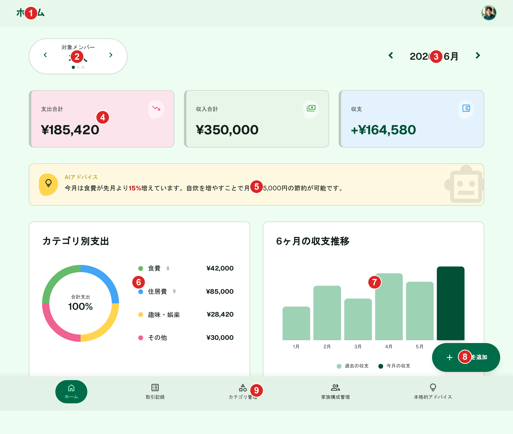
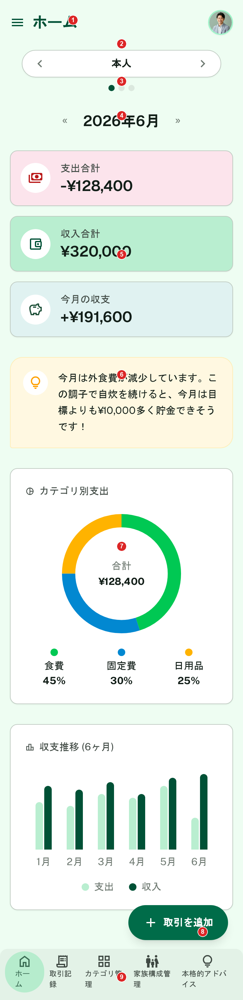
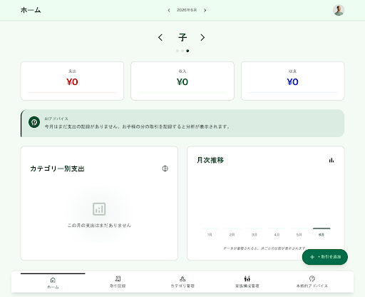

# ホーム（旧称: ダッシュボード）

[機能仕様](../specs/features/dashboard.md)に対応する画面（`/dashboard`）。ルートパス・機能名としては「ダッシュボード」のままだが、ユーザー向け表示ラベルは「ホーム」（[specs/overview.md](../specs/overview.md#画面一覧)参照）。

## 関連画面

| 遷移元 | 遷移先 |
|---|---|
| 下部固定ナビゲーション（どこからでも） | `/dashboard`（「ホーム」タブ） |
| ホーム画面（どこからでも） | `/transactions/new`（「+取引を追加」FAB） |

全体の遷移図は[architecture/screen-flow.md](../architecture/screen-flow.md)を参照。

## 関連API

| メソッド | パス | 用途 |
|---|---|---|
| GET | `/api/dashboard` | 選択中の月・家族メンバーのサマリー（支出合計・収入合計・収支）、カテゴリ別支出、6ヶ月収支推移を取得 |
| GET | `/api/family-members` | メンバースライドの一覧（本人を先頭、以降作成順） |

詳細な仕様（集計ロジック・カテゴリ表示枠の決め方）は[機能仕様](../specs/features/dashboard.md)を参照。

## 採番済みスクリーンショット

### PC版

Stitch Screen ID: `screens/17e5d40f968c4016a65e4dbbc960e5ba`（タイトル「ホーム (PC版) - かけぼ (本人データ)」）

### SP版

Stitch Screen ID: `screens/e249f87b01ca43da885043f9edb179f7`（タイトル「ホーム (モバイル版) - かけぼ (本人データ表示)」）

### 状態パターン（タブ切替・フィルタ適用等）

#### 「子」スライド + カテゴリ別支出の空状態（PC版）

Stitch Screen ID: `screens/0a98f2ba175244c28b5592f758d4ae0d`

変更点: メンバー切替で「本人」から「子」のスライドに切り替えた状態。あわせて、支出が1件もない月の空状態表現も確認している。コンポーネントカタログ再生成前の旧基準スクリーンから生成したため、カラーカタログ・コンポーネントカタログ確定後の配色とは未統一（[仕様外要素](#仕様外要素実装時は無視すること)参照）。次回再生成時は新しいPC版確定スクリーン（`screens/17e5d40f968c4016a65e4dbbc960e5ba`）を基準に`generate_variants`で作り直す

## パーツ一覧

| No | 名称 | 説明 | 遷移先・挙動 |
|---|---|---|---|
| ① | ヘッダー | 画面タイトル「ホーム」+ ユーザーアバター。通知アイコンなし。SP版のみ左端にハンバーガーメニューアイコンが付くが仕様外（[仕様外要素](#仕様外要素実装時は無視すること)参照） | アバタータップでプロフィール編集モーダル等（[common-components.md](./common-components.md)参照） |
| ② | メンバー切替 | 「本人」等のラベル+左右矢印。SP版は下部にドットインジケーターも表示（PC版は未表示、[仕様外要素](#仕様外要素実装時は無視すること)参照） | 矢印タップ/スワイプでメンバースライドを切替。本人を先頭、以降作成順 |
| ③ | 月切替 | 「«2026年6月»」 | 矢印タップで前月・翌月に1ヶ月単位で移動。全スライド共通 |
| ④ | サマリー3カード | 支出合計（ピンク系）・収入合計（緑系）・収支（ブルー系） | 選択中の月・メンバーでフィルタした集計値を表示 |
| ⑤ | AI簡易分析バナー | アンバー系背景。ロボットアイコン+分析テキスト | メンバーごとに1日1回生成・キャッシュ（[ai.md](../specs/features/ai.md)参照） |
| ⑥ | カテゴリ別支出（円グラフ） | 親カテゴリ合算後、ピン留め優先+金額上位で最大5枠、残りは「その他」 | 凡例に金額表示。支出が1件もない月は空状態を表示（[状態パターン](#状態パターンタブ切替フィルタ適用等)参照） |
| ⑦ | 6ヶ月収支推移（棒グラフ） | 選択中の月を含む過去6ヶ月分の収支。選択中の月のバーを濃い色で強調 | 月切替と連動 |
| ⑧ | FAB | 「+ 取引を追加」横長ピル形状ボタン | タップで「手入力で作成」「レシートから作成」の2択ポップアップ（[common-components.md](./common-components.md)参照） |
| ⑨ | 下部固定ナビゲーション | 5項目（ホーム・取引記録・カテゴリ管理・家族構成管理・本格的アドバイス）。「ホーム」がアクティブ | 各タブへ遷移 |

## 状態一覧

正常表示以外の状態をここにまとめる。タブ切替・フィルタ適用等の状態パターンは上記の[状態パターン](#状態パターンタブ切替フィルタ適用等)節にスクリーンショット付きで記載済み。

| 状態 | 表示内容 |
|---|---|
| カテゴリ別支出の空状態 | 「この月の支出はまだありません」等のメッセージ（[状態パターン](#状態パターンタブ切替フィルタ適用等)のスクリーンショットで確認済み） |
| エラー状態 | [frontend-conventions.mdのエラーハンドリング方針](../architecture/decisions/frontend-conventions.md#フロントエンドのエラーハンドリング方針)を参照。初回取得失敗はコンテンツ差し替え+再試行 |
| ローディング状態 | [frontend-conventions.md](../architecture/decisions/frontend-conventions.md#フロントエンドのエラーハンドリング方針)を参照。初回取得中はサマリー・グラフ部分をスケルトン表示 |

## レスポンシブ差分

- SP版はメンバー切り替えにスワイプ操作が追加される（PC版は矢印クリックのみ）
- SP版はメンバー切替に下部ドットインジケーターが表示される（PC版はピル+矢印のみ。[仕様外要素](#仕様外要素実装時は無視すること)参照）
- SP版はサマリー3カードを縦に1列で積み重ねる（PC版は横3列）

## 採用した方向性

- **配色**: [カラーカタログ](./README.md#カラーカタログ共通パーツ)に統一。支出=ピンク系、収入=明るいグリーン系、収支=ブルー系の3色でサマリーカードを区別。カテゴリ円グラフはグリーン・ブルー・イエロー・ピンクの多色構成。AIインサイトバナーはアンバー系の背景で目立たせる（[ai.md](../specs/features/ai.md)参照）
- **構成**: 仕様通り、世帯合計は表示せず本人を含むメンバーごとのスライド切り替え（矢印、SP版はドットインジケーターも）、月切り替え「«2026年6月»」、サマリー3カード（支出合計・収入合計・収支）、AI簡易分析バナー、カテゴリ別円グラフ、6ヶ月収支推移の棒グラフ（[dashboard.md](../specs/features/dashboard.md)参照）
- **ナビゲーション**: [common-components.md](./common-components.md)で確定した共通パーツ（5項目日本語ラベル、通知アイコンなし、左サイドバーなし）に統一
- **FAB**: 「+ 取引を追加」フローティングボタン。タップ時の「手入力で作成」「レシートから作成」の2択表示は[common-components.md](./common-components.md)で別途確認済み（このホーム画面自体のモックアップでは静的表示のみ）
- **状態パターン（メンバー切替・空状態）**: 「子」のスライドに切り替えた状態を別スクリーンとして生成し、メンバーごとにデータが変わること、および支出が1件もない月の空状態を確認した（カラーカタログ・コンポーネントカタログ確定前に生成したものを暫定的に流用しているため、次回再生成時は新基準スクリーンから作り直す）

## 既存実装との差分

未実装のため差分なし。

## 仕様外要素（実装時は無視すること）

| 対象 | 内容 | 対応方針 |
|---|---|---|
| SP版ヘッダー | タイトル「ホーム」の左にハンバーガーメニューアイコンが付いている（[common-components.md](./common-components.md)のヘッダー定義は「タイトル+アバターのみ」） | 実装時はハンバーガーメニューを含めない。Stitchが独自に追加したもので仕様上の要素ではない |
| PC版メンバー切替 | ドットインジケーターが表示されていない（SP版には表示されている） | 実装時はPC版にもドットインジケーターを表示する（仕様では矢印+ドットの併用と定義） |
| 「子」スライド状態パターン | AI簡易分析バナーの背景色がアンバー系ではなく緑系になっている（本人スライドではアンバー系で正しく表現されている） | 実装時はメンバーに関わらずアンバー系背景に統一する。Stitchの生成結果のばらつきによるもので仕様上の差分ではない |

## 更新履歴

| 日付 | 変更内容 |
|---|---|
| 2026-06-22 | カラーカタログ・コンポーネントカタログ確定後の配色・共通パーツに合わせて再生成。「子」スライド+空状態の状態パターンを追加 |
| 2026-06-22（2回目） | 全画面再生成方針のもとPC版・SP版を再生成し確定（`screens/17e5d40f968c4016a65e4dbbc960e5ba`、`screens/e249f87b01ca43da885043f9edb179f7`）。`_template.md`の新フォーマット（関連画面・関連API・採番済みスクリーンショット・パーツ一覧・状態一覧・レスポンシブ差分）に合わせて全面リライト |
