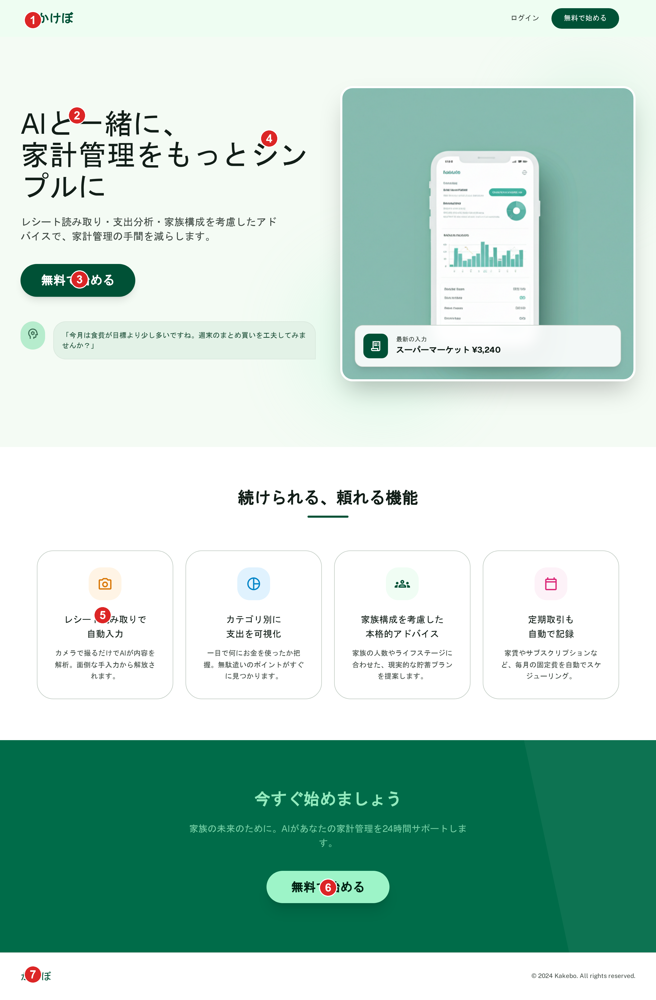
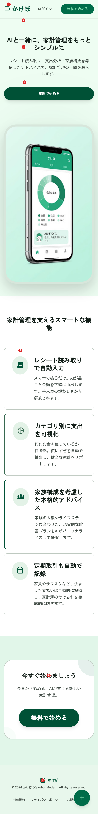

# ランディングページ（トップページ）

未ログインユーザー向けのマーケティングページ（`/`）。サインアップ前のユーザーに向けて機能紹介・CTAを表示する。サインイン済みユーザーがアクセスした場合はダッシュボードへリダイレクトする想定（[architecture/overview.md](../architecture/overview.md)のルートグループ構成を参照）。

## 関連画面

| 遷移元 | 遷移先 |
|---|---|
| 「ログイン」リンク（ヘッダー） | `/sign-in`（Clerkのサインインページ） |
| 「無料で始める」ボタン（ヘッダー・ヒーロー・末尾CTA、いずれも同一遷移） | `/sign-up`（Clerkのサインアップページ） |
| サインアップ完了後 | `(onboarding)/profile-setup`（初回のみ。[profile-setup.md](./profile-setup.md)参照） |

全体の遷移図は[architecture/screen-flow.md](../architecture/screen-flow.md)を参照。

## 関連API

なし。静的なマーケティングページであり、APIアクセスは発生しない。認証は`/sign-in`・`/sign-up`（Clerk提供のページ）に委ねる。

## 採番済みスクリーンショット

採番は`docs/design/screenshots/landing-{pc|sp}-numbered.png`（Pillowで番号ピンを描画）。元画像は`landing-{pc|sp}.png`。

### PC版

Stitch Screen ID: `screens/edb90ad78dab48fb94a951d6aeff94e4`（タイトル「家計簿アプリ「かけぼ」ランディングページ (PC版)」）

### SP版

Stitch Screen ID: `screens/d8f51952286f4904ae670a0c31dd5d34`（タイトル「家計簿アプリ「かけぼ」ランディングページ (モバイル版)」）

## パーツ一覧

| No | 名称 | 説明 | 遷移先・挙動 |
|---|---|---|---|
| ① | ヘッダー | 左に「かけぼ」ロゴ、右に「ログイン」（テキストリンク）+「無料で始める」（エメラルドグリーンの塗りボタン）。**このページのみロゴを表示する**（`(app)`配下の画面はロゴ非表示、[common-components.md](./common-components.md)参照）。下部固定ナビゲーション・FABは表示しない | ログインで`/sign-in`、無料で始めるで`/sign-up` |
| ② | ヒーロー見出し+サブ見出し | 「AIと一緒に、家計管理をもっとシンプルに」+「レシート読み取り・支出分析・家族構成を考慮したアドバイスで、家計管理の手間を減らします。」 | - |
| ③ | ヒーローCTAボタン | 「無料で始める」（大きめ、エメラルドグリーンの塗り） | タップで`/sign-up` |
| ④ | ヒーローモックアップ画像 | スマートフォン画面風のプレースホルダー画像（円グラフ等を含む抽象的な家計簿画面のイメージ） | - |
| ⑤ | 機能紹介カード（4つ） | 「レシート読み取りで自動入力」「カテゴリ別に支出を可視化」「家族構成を考慮した本格的アドバイス」「定期取引も自動で記録」。PC版は横4列、SP版は縦1列 | - |
| ⑥ | 最後のCTAセクション | 緑の帯背景に「今すぐ始めましょう」見出し+説明文+「無料で始める」ボタン | タップで`/sign-up` |
| ⑦ | フッター | 「かけぼ」ロゴ+コピーライト表記 | - |

## 状態一覧

| 状態 | 表示内容 |
|---|---|
| 通常表示 | 本ページのみ。ログイン状態の分岐や、フォーム送信等の動的状態は存在しない（静的ページ） |

## レスポンシブ差分

- PC版は機能紹介カードを横4列、SP版は縦1列で表示
- PC版のヒーローはテキストとモックアップ画像を左右に並べて表示、SP版は縦に積む
- 構成・CTAの内容自体はPC/SPで同一

## 採用した方向性

- **シンプルな1ページ構成**: ヘッダー（ロゴ+ログイン+無料で始める）→ヒーロー（見出し+CTA+モックアップ画像）→機能紹介カード4つ→最後のCTA→フッター、という一般的なマーケティングLPの構成に統一。`(app)`配下の画面と異なり下部固定ナビ・FABを一切表示しない
- **このページのみロゴを表示**: 他の確定済み画面ではロゴを表示しない方針だが、未ログインユーザー向けのこのページのみブランド認知のためロゴを表示する
- **3つの生成候補から選定**: 同条件で3パターンが生成され、以下の理由で2番目の候補（`screens/edb90ad78dab48fb94a951d6aeff94e4`）を採用した
  - 不採用候補1（`screens/bff2c9c862f34cc597d36378f4105d7b`）: 指示した構成に加え、「AIによる家計のパーソナルトレーニング」という指示外の追加バナーセクションが混入していたため不採用
  - 不採用候補3（`screens/5c1cf04d61fa459bab4451a29f582901`）: 「10,000人以上のご家族が利用中」という仕様に存在しない誇張された利用者数統計、およびブランド名の英語表記「Kakebo (かければ)」が混入していたため不採用
  - 採用候補2: 指示した構成のみで構成されており、誇張表現や指示外のセクションが混入していなかった
- **AI機能のユーザー向け表現**: 仕様上の内部実装（Google Gemini API）には言及せず、ユーザー向け文言では一貫して「AI」と表現

## 既存実装との差分

未実装のため差分なし。

## 仕様外要素（実装時は無視すること）

| 対象 | 内容 | 対応方針 |
|---|---|---|
| SP版フッター右下 | 「+」のフローティングアクションボタン（FAB）が表示されている。本ページは未ログイン状態のマーケティングページであり、取引追加のFABは存在しない（[common-components.md](./common-components.md)のFABは`(app)`配下専用） | 実装時はランディングページにFABを含めない |
| ヒーローモックアップ画像内のスマートフォン画面 | 「ホーム」「食費」「支出」等のタブラベルや円グラフが表示されているが、実際のホーム画面の仕様とは厳密に一致しない簡易的なプレースホルダー | 実装時は実際のホーム画面のスクリーンショットや、それに近い静止画素材を使用してよい。文言の一致は不要 |

## 更新履歴

| 日付 | 変更内容 |
|---|---|
| 2026-06-22 | 全画面作り直し方針のもと新規作成（PC: `screens/edb90ad78dab48fb94a951d6aeff94e4`、SP: `screens/d8f51952286f4904ae670a0c31dd5d34`）。`_template.md`の新フォーマット（関連画面・関連API・採番済みスクリーンショット・パーツ一覧・状態一覧・レスポンシブ差分）で作成 |
