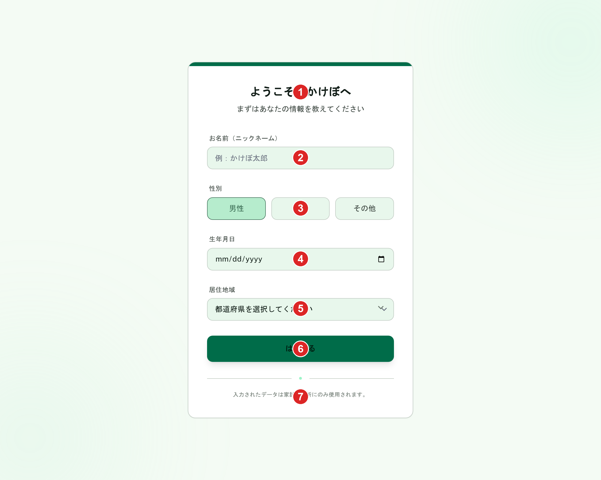
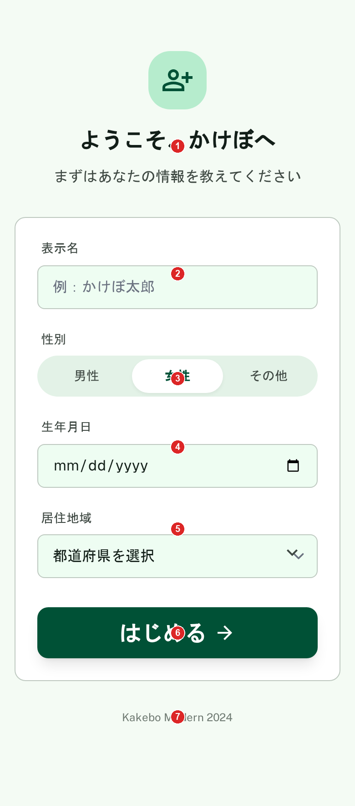

# プロフィール設定（オンボーディング）

[機能仕様](../specs/features/profile-setup.md)に対応する画面（`(onboarding)/profile-setup`）。Clerkでサインアップ直後、`users`テーブルにレコードが存在しない場合にのみ表示される一度限りのセットアップ画面。

## 関連画面

| 遷移元 | 遷移先 |
|---|---|
| サインアップ直後（`(app)/layout.tsx`の`isSetupComplete()`判定でリダイレクト） | `(onboarding)/profile-setup` |
| 「はじめる」ボタン送信成功後 | `/dashboard`（ホーム） |

全体の遷移図は[architecture/screen-flow.md](../architecture/screen-flow.md)を参照。

## 関連API

| メソッド | パス | 用途 |
|---|---|---|
| POST | `/api/profile/setup` | プロフィール初回登録。`users`テーブルへのINSERT（`clerkId`・`regionCode`）と`family_members`テーブルへのINSERT（本人レコード・`relationshipCode=SELF`）をトランザクションで実行。レスポンスは204 No Content |

詳細は[機能仕様](../specs/features/profile-setup.md)を参照。初回登録後に`regionCode`を更新する専用APIはなく、[家族構成管理の本人編集](./family-members-edit.md)から更新する。

## 採番済みスクリーンショット

採番は`docs/design/screenshots/profile-setup-{pc|sp}-numbered.png`（Pillowで番号ピンを描画）。元画像は`profile-setup-{pc|sp}.png`。

### PC版

Stitch Screen ID: `screens/99736301e1ad487e96309ab08ba276a2`（タイトル「初回プロフィール設定 - かけぼ (オンボーディング・PC版)」）

### SP版

Stitch Screen ID: `screens/ad587bfee7ba4d70a55d18c7f201b1cd`（タイトル「初回プロフィール設定 - かけぼ (モバイル版)」）

## パーツ一覧

| No | 名称 | 説明 | 遷移先・挙動 |
|---|---|---|---|
| ① | 見出し | 「ようこそ、かけぼへ」+「まずはあなたの情報を教えてください」。**ヘッダー・下部固定ナビゲーション・FABは表示しない** | - |
| ② | 表示名（テキスト入力） | `family_members`本人レコードの`displayName` | - |
| ③ | 性別（3択ボタン） | 「男性/女性/その他」。`family_members`本人レコードの`genderCode` | タップで選択。選択中はプライマリグリーンの塗り |
| ④ | 生年月日（日付入力） | `family_members`本人レコードの`birthday` | - |
| ⑤ | 居住地域（都道府県のみの単一プルダウン） | `users.regionCode`。**市区町村の入力は不要**（[修正経緯](#採用した方向性)参照） | - |
| ⑥ | 「はじめる」ボタン | 横幅いっぱい、エメラルドグリーンの塗り | タップで`POST /api/profile/setup`を呼び、成功時にダッシュボードへリダイレクト |
| ⑦ | 補足テキスト/フッター | PC版「入力されたデータは家計の分析にのみ使用されます。」、SP版「Kakebo Modern 2024」。いずれも**仕様外**（[仕様外要素](#仕様外要素実装時は無視すること)参照） | - |

## 状態一覧

| 状態 | 表示内容 |
|---|---|
| バリデーションエラー | 必須項目未入力時、各フィールド下にエラーメッセージを表示する想定（モックアップ上の表現はなし） |
| 送信中 | 「はじめる」ボタンをローディング状態にし、二重送信を防ぐ想定（モックアップ上の表現はなし） |
| エラー状態 | [frontend-conventions.mdのエラーハンドリング方針](../architecture/decisions/frontend-conventions.md#フロントエンドのエラーハンドリング方針)を参照。400はフィールドごと、それ以外は`Alert`で汎用エラー表示 |

## レスポンシブ差分

- PC版は中央に1枚のカードを配置、SP版は画面幅いっぱいにカードを配置
- フォーム項目・CTAの構成自体はPC/SPで同一

## 採用した方向性

- **ナビゲーションなしの単発フォーム**: `(app)`グループの画面と異なり、下部固定ナビ・ヘッダー・FABを一切表示しない。[ルートグループ構成](../specs/features/profile-setup.md#ルートグループ構成)で`(onboarding)`が`(app)`と明確に分離されている設計を画面上でも表現している
- **収集項目**: `users.regionCode`と`family_members`の本人(SELF)レコードに必要な項目（表示名・性別・生年月日・居住地域）のみに絞った1ページのフォーム。続柄は本人固定のため入力項目に含めない
- **居住地域は都道府県のみの単一プルダウンに修正**: 旧版は都道府県+市区町村の2段階選択だったが、[家族構成管理](./family-members-list.md)の仕様確認で`regionCode`が`REGION_MAP`（都道府県単位のコード値）であることが判明したため、本画面も都道府県のみの単一プルダウンに修正した。市区町村の入力項目は仕様に存在しない
- **CTA**: 画面下部に大きな「はじめる」ボタン（横幅いっぱい、エメラルドグリーン）。送信後は`POST /api/profile/setup`を呼び、成功時にダッシュボードへリダイレクトする想定。初回の生成候補でこのボタンがHTML上に欠落していたため、「省略不可」と明示して再生成し確定させた

## 既存実装との差分

`(onboarding)/profile-setup`は実装済み（`ProfileSetupForm.tsx`）。性別フォーム（パーツ③）の`GenderField`を3択ボタン（`ToggleGroup`）に差し替え、CTAボタンを単一の「はじめる」ボタンに統一し、角丸も[style-guide.mdの角丸・形状](../design/style-guide.md#角丸・形状)の方針に合わせて修正済み。現時点で設計との差分はない。

## 仕様外要素（実装時は無視すること）

| 対象 | 内容 | 対応方針 |
|---|---|---|
| PC版フッター | 「入力されたデータは家計の分析にのみ使用されます。」という注記が表示されている。プライバシーポリシーページ等へのリンクはなく単純なテキストのみ | 実装するかは任意判断でよい（リンクがないテキストのみのため害は薄い） |
| SP版フッター | 「Kakebo Modern 2024」という英語テキストが表示されている。仕様に存在しない要素 | 実装時は含めない |
| 入力欄（表示名・生年月日・居住地域）の背景色 | ページ背景同系の薄緑に着色されている | 意図した差別化ではなくStitchの生成ブレと判断し、白背景に統一する（[style-guide.mdのフォーム入力欄の背景色](./style-guide.md#共通レイアウト)参照） |
| 性別ボタン（パーツ③）選択中の塗り色 | 薄緑の塗り+ボーダーになっている | [family-members-edit.md](./family-members-edit.md#採用した方向性)の本人(SELF)編集Dialogのスタイル（濃いプライマリグリーンの塗り+白文字）に統一する（[style-guide.mdの性別3択ボタン](./style-guide.md#共通レイアウト)参照） |

## 更新履歴

| 日付 | 変更内容 |
|---|---|
| 2026-06-22 | 全画面作り直し方針のもと再生成し確定（PC: `screens/99736301e1ad487e96309ab08ba276a2`、SP: `screens/ad587bfee7ba4d70a55d18c7f201b1cd`）。居住地域を都道府県のみの単一プルダウンに修正（`REGION_MAP`の仕様との不整合を解消）。`_template.md`の新フォーマット（関連画面・関連API・採番済みスクリーンショット・パーツ一覧・状態一覧・レスポンシブ差分）に合わせて全面リライト。旧版（Stitchモックアップ形式のみの記載）から刷新 |
| 2026-06-26 | フォーム入力欄の背景色を白に統一する決定、性別ボタンのスタイルを本人編集Dialog基準に統一する決定を反映。実装済みの`ProfileSetupForm.tsx`を確認し、性別フォームがSelect実装になっている差分・CTAボタンの構成差分を「既存実装との差分」に記録 |
| 2026-06-27 | 「はじめる」ボタンの角丸がpill形状になっている差分を「既存実装との差分」に追記。[style-guide.mdの角丸・形状](../design/style-guide.md#角丸・形状)に主要CTAボタンの角丸方針（pillではなく中程度の角丸に統一）を新規決定・反映。性別フォームのToggleGroup差し替え・CTAボタン統一・角丸修正が完了したため「既存実装との差分」を解消済みに更新 |
