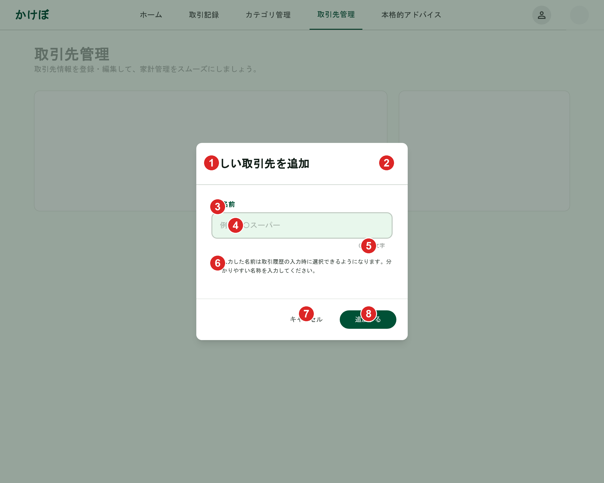

# 取引先（新規作成）

[機能仕様](../../specs/features/transaction-parties.md)に対応する取引先新規追加Dialog。[transaction-parties/list.md](./list.md)の「新しい取引先を追加」ボタンから開く。名前のみを入力する（[transaction-parties.mdの概要](../../specs/features/transaction-parties.md#概要)の通り、取引先はアイコン・色を持たない）。Dialogの見た目の共通フレームワークは[modals.md](../modals.md#dialog共通構成カテゴリ新規追加家族メンバー追加本人情報編集)を参照。

## 関連画面

| 遷移元                                                                 | 遷移先                                       |
| ---------------------------------------------------------------------- | -------------------------------------------- |
| [transaction-parties/list.md](./list.md)の「新しい取引先を追加」ボタン | 取引先新規追加Dialog（同画面上にDialog表示） |

全体の遷移図は[architecture/screen-flow.md](../../architecture/screen-flow.md)を参照。

## 関連API

| メソッド | パス                       | 用途                                                       |
| -------- | -------------------------- | ---------------------------------------------------------- |
| POST     | `/api/transaction-parties` | 取引先新規作成（カテゴリ管理画面・取引先タブからの追加用） |

詳細は[機能仕様](../../specs/features/transaction-parties.md#apiエンドポイント)を参照。`typeCode`は[transaction-parties/list.md](./list.md)で選択中の支出/収入サブタブから決まるため、このDialog自体には入力欄を設けない。

## 採番済みスクリーンショット

すべてPC版。SP版は他のDialog（[modals.md](../modals.md#仕様外要素実装時は無視すること)参照）と同様に未生成。

Stitch Screen ID: `screens/85cb28bfe42146d4a72de9aa30df8407`（タイトル「取引先新規追加ダイアログ - 案2 (アクセシビリティ重視)」）。確定済みの[家族メンバー追加Dialog](../family-members/create.md)（`screens/ad5d2305d3144156ab8fd43bd1d24d15`）を基準に`generate_variants`（`creativeRange: REFINE`, `aspects: [TEXT_CONTENT, LAYOUT]`）で生成

## パーツ一覧

共通の枠組み（タイトル+×アイコン、フッターのボタン配置）は[modals.mdのDialog共通構成](../modals.md#dialog共通構成カテゴリ新規追加家族メンバー追加本人情報編集)を参照。

| No  | 名称                           | 説明                                                                                                                   |
| --- | ------------------------------ | ---------------------------------------------------------------------------------------------------------------------- |
| ①   | タイトル「新しい取引先を追加」 | -                                                                                                                      |
| ②   | 閉じる×アイコン                | -                                                                                                                      |
| ③   | 「名前」ラベル                 | アイコン付きラベル                                                                                                     |
| ④   | 名前入力欄                     | プレースホルダー「例：○○スーパー」                                                                                     |
| ⑤   | 文字数カウンター               | 「0/50文字」表示。[バリデーション](../../specs/features/transaction-parties.md#バリデーション)の最大50文字制約を視覚化 |
| ⑥   | 補足説明テキスト               | 「入力した名前は取引履歴の入力時に選択できるようになります。分かりやすい名称を入力してください。」                     |
| ⑦   | 「キャンセル」ボタン           | グレーテキストボタン                                                                                                   |
| ⑧   | 「追加する」ボタン             | エメラルドグリーンの塗りボタン                                                                                         |

## 状態一覧

特になし（入力フォームのため空状態は発生しない）。名前重複時のエラー表示は[バリデーション](../../specs/features/transaction-parties.md#バリデーション)（同一ユーザー・同一タイプ内で重複不可）に従い、入力欄下にエラーメッセージを表示する想定（モックアップ上の表現はなし）。

## レスポンシブ差分

SP版は未生成のため記載なし（[仕様外要素](#仕様外要素実装時は無視すること)参照）。

## 採用した方向性

- **名前のみの単一フィールド**: [取引先の特徴](../../specs/features/transaction-parties.md#概要)（アイコン・背景色を持たない、`name`のみ）に対応し、カテゴリ新規追加Dialogにあったアイコン・色選択UIを含めない
- **文字数カウンター**: [バリデーション](../../specs/features/transaction-parties.md#バリデーション)の「最大50文字」制約をユーザーが入力中に把握できるよう表示
- **補足説明テキスト**: 取引先が取引登録フォームでどう使われるか（[取引登録フォームとの連携](../../specs/features/transaction-parties.md#取引登録フォームとの連携)）を簡潔に補足
- **Dialog（フォーム入力系）の統一構成**: タイトル+右上×アイコン、フォーム本体、フッターに「キャンセル」+プライマリアクションを右寄せ配置、という構成を他のDialogと統一（[modals.md](../modals.md#採用した方向性)参照）

## 既存実装との差分

未実装のため差分なし。

## 仕様外要素（実装時は無視すること）

| 対象 | 内容                                                                                                                                                                                                                                                                                                                         | 対応方針                                                                                                                                                                   |
| ---- | ---------------------------------------------------------------------------------------------------------------------------------------------------------------------------------------------------------------------------------------------------------------------------------------------------------------------------- | -------------------------------------------------------------------------------------------------------------------------------------------------------------------------- |
| 背景 | 上部にロゴ+ナビリンク（ホーム/取引記録/カテゴリ管理/取引先管理/本格的アドバイス）が表示されている旧バージョンの画面が背景に映っている。下部固定ナビゲーション方針（[architecture/overview.md](../../architecture/overview.md#app-レイアウト構成)）と矛盾するが、これはDialog自体の構成ではなく背景キャプチャの古さによるもの | [modals.mdの仕様外要素](../modals.md#仕様外要素実装時は無視すること)と同じ扱い。実装時の背景画面は[transaction-parties/list.md](./list.md)の確定モックアップを参照すること |
| 背景 | ヘッダーの管理画面タイトルが「取引先管理」という独立画面のように表示されている                                                                                                                                                                                                                                               | 実際は[管理画面の仕様](../../specs/features/transaction-parties.md#管理画面)の通り、カテゴリ管理画面内の「取引先」タブとして実装する。専用ページは作らない                 |

SP（モバイル）版は未生成。実装時にshadcn/uiのDialogのレスポンシブ挙動に委ねてよい。

## 更新履歴

| 日付       | 変更内容                                                                                                                                          |
| ---------- | ------------------------------------------------------------------------------------------------------------------------------------------------- |
| 2026-06-22 | `_template.md`に基づき新規作成。家族メンバー追加Dialog確定版を基準に`generate_variants`で生成し確定（`screens/85cb28bfe42146d4a72de9aa30df8407`） |
