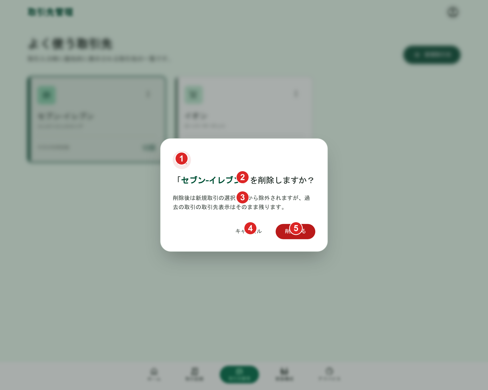

# 取引先（削除）

[機能仕様](../../specs/features/transaction-parties.md)に対応する取引先削除確認AlertDialog。[transaction-parties/list.md](./list.md)の各行の削除アイコンから開く。見た目の共通フレームワークは[modals.md](../modals.md#alertdialog共通構成カテゴリ削除確認家族メンバー削除確認取引削除確認)を参照。

## 関連画面

| 遷移元                                                     | 遷移先                                                 |
| ---------------------------------------------------------- | ------------------------------------------------------ |
| [transaction-parties/list.md](./list.md)各行の削除アイコン | 取引先削除確認AlertDialog（同画面上にAlertDialog表示） |

全体の遷移図は[architecture/screen-flow.md](../../architecture/screen-flow.md)を参照。取引登録フォームの編集アイコンからは削除に遷移しない（[管理画面の仕様](../../specs/features/transaction-parties.md#管理画面)の通り、削除は専用の管理画面に限定）。

## 関連API

| メソッド | パス                           | 用途                               |
| -------- | ------------------------------ | ---------------------------------- |
| DELETE   | `/api/transaction-parties/:id` | 取引先論理削除（自分の取引先のみ） |

詳細は[機能仕様の業務フロー](../../specs/features/transaction-parties.md#業務フロー-取引先の削除管理画面のみ)を参照。

## 採番済みスクリーンショット

すべてPC版。SP版は他のAlertDialog（[modals.md](../modals.md#仕様外要素実装時は無視すること)参照）と同様に未生成。

Stitch Screen ID: `screens/20956e8371fa4939a5f7d527b074811e`（タイトル「取引先削除確認 - かけぼ (バリエーション2: 強調表示)」）。確定済みの[カテゴリ削除確認AlertDialog](../categories/delete.md)（`screens/804616cc5c174019995c877203c09bec`）を基準に`generate_variants`（`creativeRange: REFINE`, `aspects: [TEXT_CONTENT]`）で生成

## パーツ一覧

共通の枠組み（警告アイコン・フッターのボタン配置）は[modals.mdのAlertDialog共通構成](../modals.md#alertdialog共通構成カテゴリ削除確認家族メンバー削除確認取引削除確認)を参照。

| No  | 名称                 | 説明                                                                                                                                                                                                                                                                                                 |
| --- | -------------------- | ---------------------------------------------------------------------------------------------------------------------------------------------------------------------------------------------------------------------------------------------------------------------------------------------------- |
| ①   | 警告アイコン         | アンバー系の三角に!アイコン                                                                                                                                                                                                                                                                          |
| ②   | タイトル             | 対象の取引先名を含む確認文（例:「『セブン-イレブン』を削除しますか？」）                                                                                                                                                                                                                             |
| ③   | 本文                 | 「削除後は新規取引の選択候補から除外されますが、過去の取引の取引先表示はそのまま残ります。」（[削除の仕様](../../specs/features/transaction-parties.md#削除)の論理削除の説明）。カテゴリ削除確認にあった「定期取引テンプレートの停止」の文言は含めない（取引先には定期取引との直接の関係がないため） |
| ④   | 「キャンセル」ボタン | グレーテキストボタン                                                                                                                                                                                                                                                                                 |
| ⑤   | 「削除する」ボタン   | 赤系の塗りボタン                                                                                                                                                                                                                                                                                     |

## 状態一覧

特になし（確認ダイアログのため空状態は発生しない）。

## レスポンシブ差分

SP版は未生成のため記載なし（[仕様外要素](#仕様外要素実装時は無視すること)参照）。

## 採用した方向性

- **AlertDialog（削除確認系）の統一構成**: アンバー系の警告アイコン、対象名入りタイトル、削除の影響範囲の説明文、「キャンセル」+赤系「削除する」を右寄せ配置（[modals.md](../modals.md#採用した方向性)参照）
- **「子を持つため削除できない」制約の不在**: [削除の仕様](../../specs/features/transaction-parties.md#削除)の通り、取引先はカテゴリと異なり親子構造を持たないため、カテゴリ削除確認にあったような制約分岐の説明文は含めない

## 既存実装との差分

未実装のため差分なし。

## 仕様外要素（実装時は無視すること）

- 背景に表示されている下層画面（「よく使う取引先」のカード一覧UI）は、[transaction-parties/list.md](./list.md)で確定したフラットな1列リストとは異なる構成。Stitchが生成時に参照した別バージョンであり、実装時の背景画面は[transaction-parties/list.md](./list.md)の確定モックアップを参照すること
- SP（モバイル）版は未生成。実装時にshadcn/uiのAlertDialogのレスポンシブ挙動に委ねてよい

## 更新履歴

| 日付       | 変更内容                                                                                                                                               |
| ---------- | ------------------------------------------------------------------------------------------------------------------------------------------------------ |
| 2026-06-22 | `_template.md`に基づき新規作成。カテゴリ削除確認AlertDialog確定版を基準に`generate_variants`で生成し確定（`screens/20956e8371fa4939a5f7d527b074811e`） |
