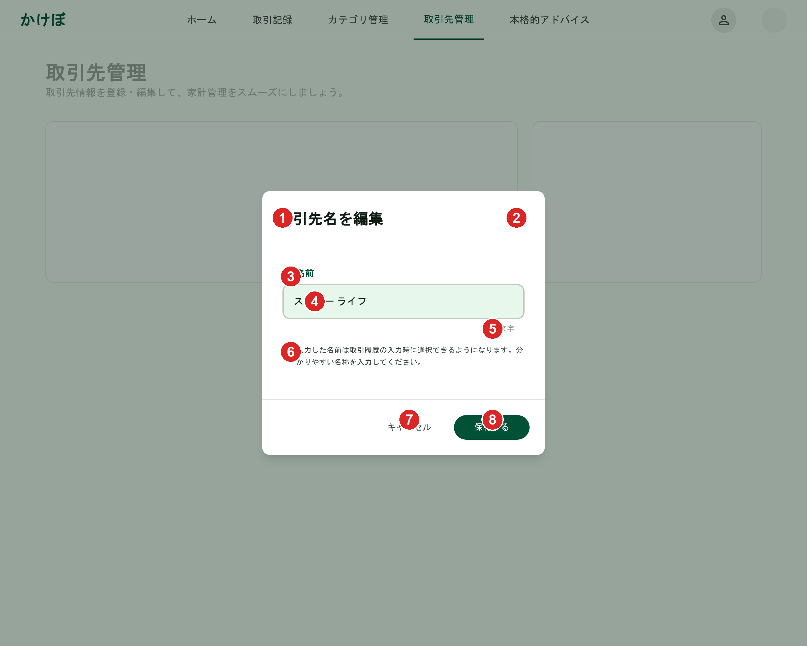

# 取引先（編集）

[機能仕様](../../specs/features/transaction-parties.md)に対応する取引先名称変更Dialog。[transaction-parties/list.md](./list.md)の各行の編集アイコンから開く。フォーム項目は[transaction-parties/create.md](./create.md)と同形式（名前1項目のみ）で、初期値が既存の値で埋まっている点と、フッターのプライマリボタン文言が異なる点のみが差分。Dialogの見た目の共通フレームワークは[modals.md](../modals.md#dialog共通構成カテゴリ新規追加家族メンバー追加本人情報編集)を参照。

## 関連画面

| 遷移元                                                                                                 | 遷移先                                               |
| ------------------------------------------------------------------------------------------------------ | ---------------------------------------------------- |
| [transaction-parties/list.md](./list.md)の各行の編集アイコン                                           | 取引先名称変更Dialog（同画面上にDialog表示）         |
| [取引登録フォーム](../../specs/features/transaction-parties.md#既存の編集即時反映)の取引先編集アイコン | 同じDialogを開く（即時反映、フォーム送信を待たない） |

全体の遷移図は[architecture/screen-flow.md](../../architecture/screen-flow.md)を参照。

## 関連API

| メソッド | パス                           | 用途                                                                                             |
| -------- | ------------------------------ | ------------------------------------------------------------------------------------------------ |
| PUT      | `/api/transaction-parties/:id` | 取引先の名称変更（自分の取引先のみ）。取引先一覧・取引登録フォームの簡易編集UIの両方から呼ばれる |

詳細は[機能仕様](../../specs/features/transaction-parties.md#業務フロー-取引先の名称変更管理画面取引登録フォーム共通)を参照。

## 採番済みスクリーンショット

すべてPC版。SP版は他のDialog（[modals.md](../modals.md#仕様外要素実装時は無視すること)参照）と同様に未生成。

Stitch Screen ID: `screens/ddb322c65ea54b18bb6509478248ec83`（タイトル「取引先名を編集ダイアログ - バリエーション1 (標準)」）。確定済みの[取引先新規追加Dialog](./create.md)（`screens/85cb28bfe42146d4a72de9aa30df8407`）を基準に`generate_variants`（`creativeRange: REFINE`, `aspects: [TEXT_CONTENT]`）で生成

## パーツ一覧

共通の枠組み（タイトル+×アイコン、フッターのボタン配置）は[modals.mdのDialog共通構成](../modals.md#dialog共通構成カテゴリ新規追加家族メンバー追加本人情報編集)を参照。

| No  | 名称                       | 説明                                                                                                 |
| --- | -------------------------- | ---------------------------------------------------------------------------------------------------- |
| ①   | タイトル「取引先名を編集」 | [transaction-parties/create.md](./create.md)の「新しい取引先を追加」と異なり既存編集であることを明示 |
| ②   | 閉じる×アイコン            | -                                                                                                    |
| ③   | 「名前」ラベル             | -                                                                                                    |
| ④   | 名前入力欄                 | 既存の値が初期値として入力済み（例:「スーパー ライフ」）                                             |
| ⑤   | 文字数カウンター           | 入力済み文字数を反映（例:「7/50文字」）                                                              |
| ⑥   | 補足説明テキスト           | 新規追加時と同じ文言                                                                                 |
| ⑦   | 「キャンセル」ボタン       | グレーテキストボタン                                                                                 |
| ⑧   | 「保存する」ボタン         | エメラルドグリーンの塗りボタン。新規追加時の「追加する」から文言変更                                 |

## 状態一覧

特になし（入力フォームのため空状態は発生しない）。名前重複時のエラー表示は[バリデーション](../../specs/features/transaction-parties.md#バリデーション)（編集時は自分自身を除外して判定）に従い、入力欄下にエラーメッセージを表示する想定（モックアップ上の表現はなし）。自分の取引先以外を編集しようとした場合の403エラーはUI上では発生し得ない（自分の取引先の行にのみ編集アイコンが表示される）。

## レスポンシブ差分

SP版は未生成のため記載なし（[仕様外要素](#仕様外要素実装時は無視すること)参照）。

## 採用した方向性

- **新規追加Dialogと同形式**: [取引先の新規作成（インライン・遅延作成）](../../specs/features/transaction-parties.md#新規作成インライン遅延作成)と異なり、既存編集は即時反映のシンプルな名称変更のみのため、新規追加Dialogと同じ単一フィールド構成を維持し、初期値・ボタン文言のみ変更した
- **「保存する」への文言変更**: 既存データの更新であることを明示し、新規追加の「追加する」と区別

## 既存実装との差分

未実装のため差分なし。

## 仕様外要素（実装時は無視すること）

[transaction-parties/create.md](./create.md#仕様外要素実装時は無視すること)と同じ背景の古いバージョン（ロゴ+ナビリンク、「取引先管理」という独立画面のような表示）が混入している。実装時は[transaction-parties/list.md](./list.md)の確定モックアップを参照すること。

SP（モバイル）版は未生成。実装時にshadcn/uiのDialogのレスポンシブ挙動に委ねてよい。

## 更新履歴

| 日付       | 変更内容                                                                                                                                        |
| ---------- | ----------------------------------------------------------------------------------------------------------------------------------------------- |
| 2026-06-22 | `_template.md`に基づき新規作成。取引先新規追加Dialog確定版を基準に`generate_variants`で生成し確定（`screens/ddb322c65ea54b18bb6509478248ec83`） |
