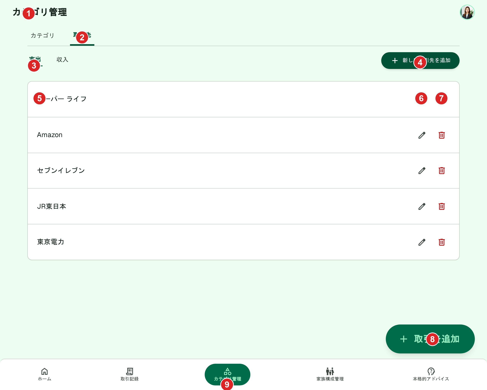
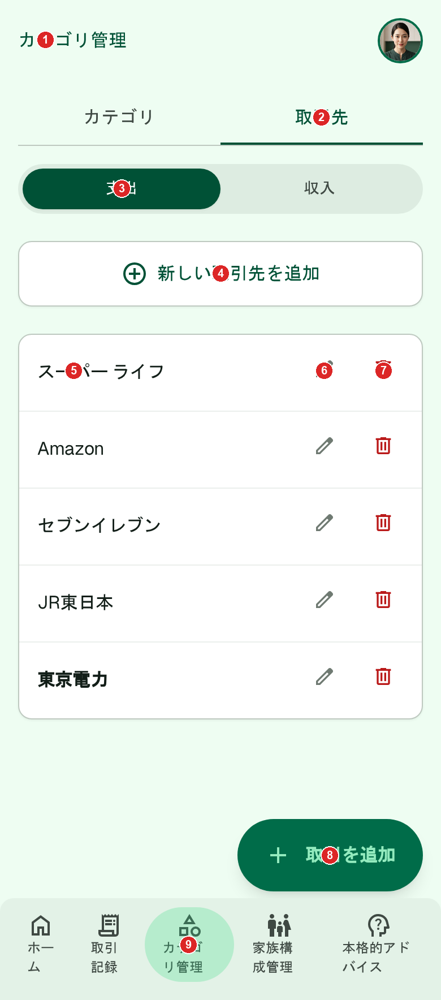

# 取引先（一覧）

[機能仕様](../../specs/features/transaction-parties.md)に対応する画面。専用ルートは持たず、[カテゴリ管理画面](../categories/list.md)（`(app)/categories`）に新設する「取引先」タブの中身として表示される。新規作成・編集・削除は[transaction-parties/create.md](./create.md)・[transaction-parties/edit.md](./edit.md)・[transaction-parties/delete.md](./delete.md)を参照。

## 関連画面

| 遷移元                                                 | 遷移先                                                                    |
| ------------------------------------------------------ | ------------------------------------------------------------------------- |
| 下部固定ナビゲーション「カテゴリ管理」（どこからでも） | `(app)/categories`「取引先」タブ                                          |
| カテゴリ管理画面の「カテゴリ」タブ                     | 「取引先」タブ（同一画面内のタブ切替）                                    |
| 「新しい取引先を追加」ボタン                           | 取引先新規追加Dialog（[transaction-parties/create.md](./create.md)）      |
| 各行の編集アイコン                                     | 取引先名称変更Dialog（[transaction-parties/edit.md](./edit.md)）          |
| 各行の削除アイコン                                     | 取引先削除確認AlertDialog（[transaction-parties/delete.md](./delete.md)） |
| FAB「+ 取引を追加」（どこからでも）                    | `/transactions/new`                                                       |

全体の遷移図は[architecture/screen-flow.md](../../architecture/screen-flow.md)を参照。

## 関連API

| メソッド | パス                       | 用途                                                                              |
| -------- | -------------------------- | --------------------------------------------------------------------------------- |
| GET      | `/api/transaction-parties` | 取引先一覧取得（`typeCode`でフィルタ。デフォルトでは`deletedAt`がNULLのもののみ） |

新規作成・編集・削除のAPIは各CRUDファイルを参照。詳細は[機能仕様のAPIエンドポイント](../../specs/features/transaction-parties.md#apiエンドポイント)を参照。

## 採番済みスクリーンショット

採番は`docs/design/screenshots/transaction-parties-list-{pc|sp}-numbered.png`（Pillowで番号ピンを描画）。

### PC版

Stitch Screen ID: `screens/03f0f2a781ea42e08880a49082a1a059`（タイトル「取引先管理 - かけぼ (支出タブ・案1)」）。確定済みの[カテゴリ一覧PC版](../categories/list.md#pc版)（`screens/bb40de401a514873b5bfb0690b184543`）を基準に`generate_variants`（`creativeRange: REFINE`, `aspects: [TEXT_CONTENT, LAYOUT]`）で生成

### SP版

Stitch Screen ID: `screens/fefeb6bfee844fcfaf9b7287d81391cd`（タイトル「取引先管理 - かけぼ (支出タブ・案2)」）。確定済みの[カテゴリ一覧SP版](../categories/list.md#sp版)（`screens/d044ff875db848f18b84c504f4b2d9b1`）を基準に`generate_variants`で生成

## パーツ一覧

| No  | 名称                         | 説明                                                                                                                                                | 遷移先・挙動                                                                                                   |
| --- | ---------------------------- | --------------------------------------------------------------------------------------------------------------------------------------------------- | -------------------------------------------------------------------------------------------------------------- |
| ①   | ヘッダー                     | 画面タイトル「カテゴリ管理」+ユーザーアバターのみ。ロゴ・ナビリンク・通知アイコンなし。カテゴリ管理画面と共通                                       | -                                                                                                              |
| ②   | 「カテゴリ/取引先」親タブ    | 「取引先」タブを選択中の状態。「カテゴリ」タブは非アクティブで並んで表示される                                                                      | タップで「カテゴリ」タブ（[categories/list.md](../categories/list.md)）に切り替え                              |
| ③   | 支出/収入サブタブ            | 既存のカテゴリ一覧と同じ構成。`typeCode`で取引先を絞り込む                                                                                          | タップで表示対象の`typeCode`を切り替え                                                                         |
| ④   | 「新しい取引先を追加」ボタン | PC版は画面右上、SP版はサブタブ下に幅いっぱい                                                                                                        | 取引先新規追加Dialogを開く（[transaction-parties/create.md](./create.md)）                                     |
| ⑤   | 取引先行（名前）             | 円形カラーアイコン・背景色・ピン留め・デフォルトバッジ・親子階層インデントなし。名前のみのフラットな1列リスト                                       | -                                                                                                              |
| ⑥   | 編集アイコン                 | 行右端の鉛筆アイコン                                                                                                                                | 取引先名称変更Dialogを開く（[transaction-parties/edit.md](./edit.md)）                                         |
| ⑦   | 削除アイコン                 | 行右端のゴミ箱アイコン（赤系）                                                                                                                      | 取引先削除確認AlertDialogを開く（[transaction-parties/delete.md](./delete.md)）                                |
| ⑧   | 「+ 取引を追加」FAB          | 全画面共通のフローティングボタン                                                                                                                    | タップで「手入力で作成」「レシートから作成」の2択を表示（[common-components.md](../common-components.md)参照） |
| ⑨   | 下部固定ナビゲーション       | 5項目（カテゴリ管理がアクティブ）。表示ラベルは「カテゴリ管理」のまま（[管理画面の仕様](../../specs/features/transaction-parties.md#管理画面)参照） | 各画面へ遷移                                                                                                   |

## 状態一覧

| 状態             | 表示内容                                                                                                                                                                               |
| ---------------- | -------------------------------------------------------------------------------------------------------------------------------------------------------------------------------------- |
| 空状態           | 取引先はシステムデフォルトを持たないため、ユーザー作成直後は0件になり得る。「まだ取引先が登録されていません」+「新しい取引先を追加」ボタンを表示する想定（モックアップ上の表現はなし） |
| エラー状態       | 取引先一覧取得（GET）失敗時、リスト部分に汎用エラーメッセージ+再試行ボタンを表示する想定（モックアップ上の表現はなし）                                                                 |
| ローディング状態 | 初回読み込み中はリスト部分をスケルトン表示する想定（モックアップ上の表現はなし）                                                                                                       |

## レスポンシブ差分

- 「新しい取引先を追加」ボタンの位置がPC版は画面右上、SP版はサブタブ下中央に幅いっぱいで配置と異なる（[categories/list.md](../categories/list.md#レスポンシブ差分)と同じ自然な差分として許容）

## 採用した方向性

- **フラットな1列リスト**: [取引先のデータ構造](../../specs/features/transaction-parties.md#データ構造)が`parentId`を持たず常にフラットな1階層であることに対応し、親子グルーピング・ツリー線を表示しない
- **名前のみの行表示**: [取引先の特徴](../../specs/features/transaction-parties.md#概要)（アイコン・背景色を持たない）に対応し、カテゴリ行にあった円形カラーアイコンを表示しない
- **ピン留め・デフォルトバッジなし**: 取引先はシステムデフォルトを持たず、固定表示（ピン留め）機能も存在しないため、カテゴリ行にあったピンアイコン・「デフォルト」バッジを表示しない
- **支出/収入サブタブ**: [タイプ別の絞り込み](../../specs/features/transaction-parties.md#データ構造)（`typeCode`）に対応し、カテゴリ一覧と同じ支出/収入タブ構成を維持
- **「カテゴリ/取引先」親タブ**: [管理画面の仕様](../../specs/features/transaction-parties.md#管理画面)（専用画面を持たず、カテゴリ管理画面にタブを追加する）に対応
- **編集・削除アイコンを全行に表示**: 取引先はシステムデフォルトという概念がなく、自分が作成したものは常に編集・削除可能なため（[権限ルール](../../specs/features/transaction-parties.md#権限ルール)）、デフォルトカテゴリのような表示・非表示の分岐を行わない
- **ナビゲーション**: [common-components.md](../common-components.md)で確定した共通パーツ（5項目日本語ラベル、通知アイコンなし、左サイドバーなし）に統一

## 既存実装との差分

未実装のため差分なし。

## 仕様外要素（実装時は無視すること)

特になし。`generate_variants`で生成した2案のうち、支出タブのリスト内に収入用の仕様外プレースホルダー行が混入した案（案2のPC版相当）は不採用とし、採用した案には混入がないことを確認済み。

## 更新履歴

| 日付       | 変更内容                                                                                                                                                                                         |
| ---------- | ------------------------------------------------------------------------------------------------------------------------------------------------------------------------------------------------ |
| 2026-06-22 | `_template.md`に基づき新規作成。カテゴリ一覧PC/SP確定版を基準に`generate_variants`で生成し確定（PC: `screens/03f0f2a781ea42e08880a49082a1a059`、SP: `screens/fefeb6bfee844fcfaf9b7287d81391cd`） |
