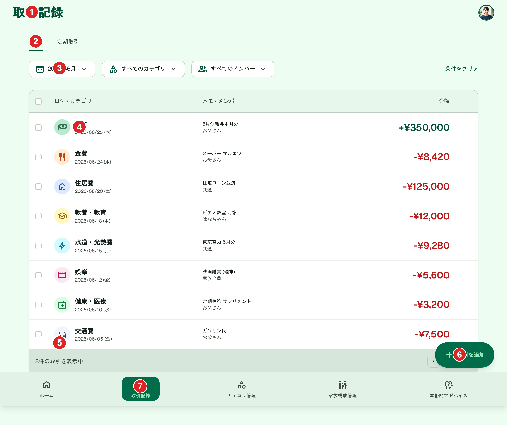
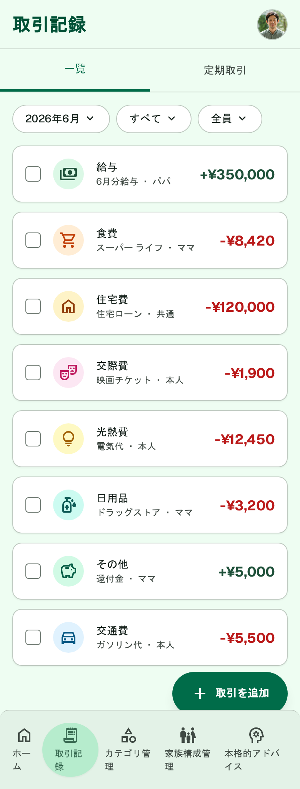
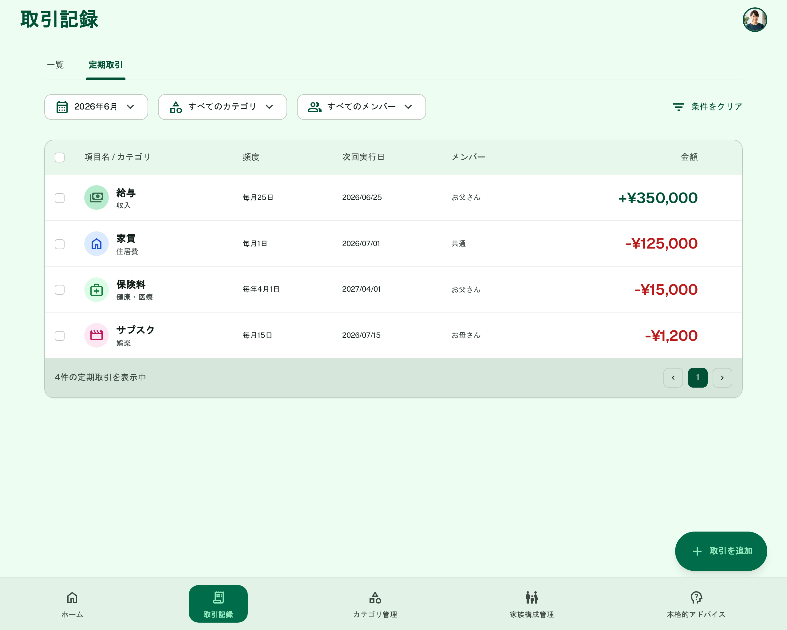
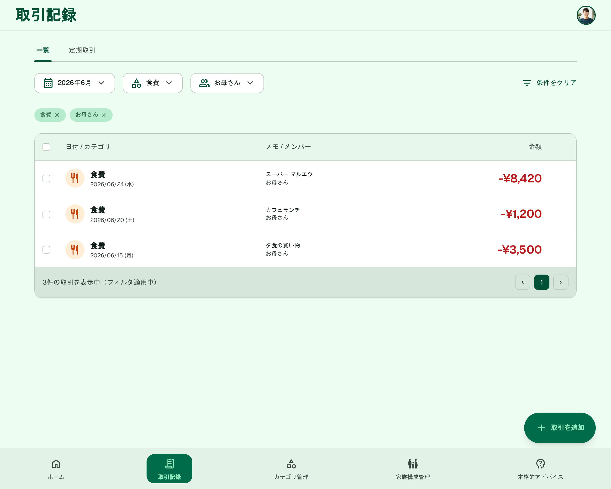
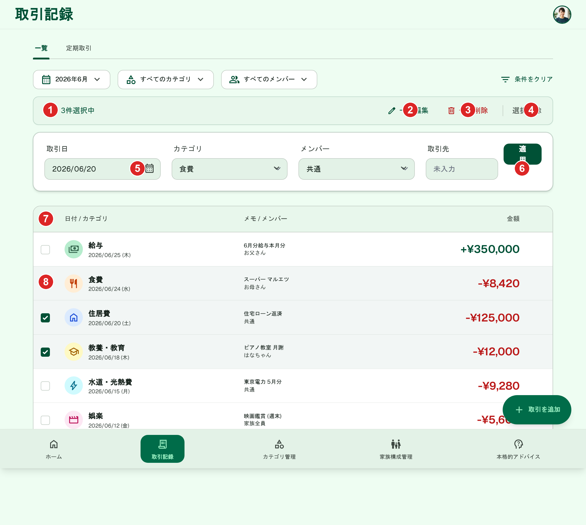
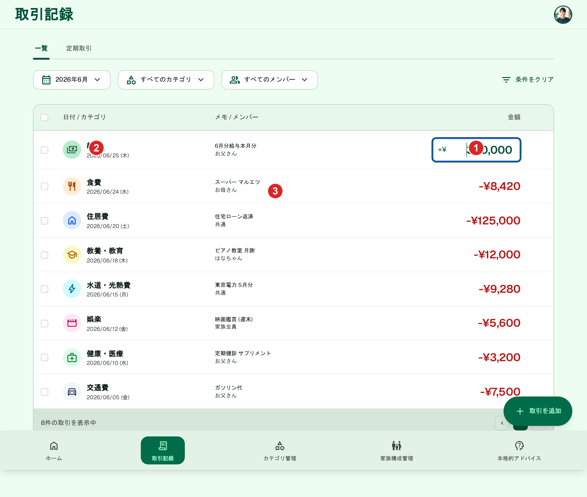

# 取引記録（一覧）

[機能仕様](../specs/features/transactions.md)に対応する画面（`/transactions`、`/transactions/recurring`）。一覧（一覧・定期取引タブ）を1画面として扱う。新規作成・編集・削除は[transactions-create.md](./transactions-create.md)・[transactions-edit.md](./transactions-edit.md)・[transactions-delete.md](./transactions-delete.md)を参照。

## 関連画面

| 遷移元 | 遷移先 |
|---|---|
| 下部固定ナビゲーション（どこからでも） | `/transactions`（「取引記録」タブ、一覧表示） |
| 一覧画面の「定期取引」タブ | `/transactions/recurring` |
| 一覧画面・どこからでものFAB「+ 取引を追加」 | `/transactions/new`（[transactions-create.md](./transactions-create.md)、単発/定期はフォーム内タブで切替） |
| 一覧画面の行 | 取引編集Dialog（[transactions-edit.md](./transactions-edit.md#単体編集)） |
| 一覧画面の削除アイコン | 取引削除確認（[transactions-delete.md](./transactions-delete.md)） |

全体の遷移図は[architecture/screen-flow.md](../architecture/screen-flow.md)を参照。

## 関連API

| メソッド | パス | 用途 |
|---|---|---|
| GET | `/api/transactions` | 取引一覧取得（`yearMonth`・`categoryId`・`familyMemberId`でフィルタ可） |
| PATCH | `/api/transactions/bulk` | 複数取引の一括編集（取引日・カテゴリ・家族メンバーのうち変更したい項目のみ） |

新規作成・編集・削除のAPIは各CRUDファイルを参照。詳細な仕様（バリデーション・権限ルール・業務フロー）は[機能仕様](../specs/features/transactions.md)を参照。

## 採番済みスクリーンショット

### 一覧（PC版）

Stitch Screen ID: `screens/4d5b89063d3d47779acd0d66eedfd024`（タイトル「取引記録 - かけぼ (PC版・一覧)」）

### 一覧（SP版）

Stitch Screen ID: `screens/c8163bb42e964e6eb127a5812298b056`（タイトル「取引記録 - かけぼ (モバイル版・一覧)」）

### 状態パターン（タブ切替・フィルタ適用等）

#### 「定期取引」タブ（一覧画面、PC版）

Stitch Screen ID: `screens/79e419aac6a846068974c1feb0e4b2a7`（一覧PCを基準に`generate_variants`で生成）

変更点: 「一覧」タブから「定期取引」タブに切り替えた状態。テーブル列が「項目名/カテゴリ」「頻度」「次回実行日」「メンバー」「金額」に変わる。チェックボックス・円形カラーアイコン・行のスタイルは「一覧」タブと完全に統一されている。

#### フィルタ適用中（一覧画面、PC版）

Stitch Screen ID: `screens/1a540a5cb3f94189b584673a8ba9aea6`（一覧PCを基準に`generate_variants`で生成）

変更点: カテゴリ「食費」・家族メンバー「お母さん」でフィルタを適用した状態。選択済みのフィルタチップ（×アイコン付き）が表示され、「条件をクリア」ボタンが強調される。件数表示が「3件の取引を表示中（フィルタ適用中）」に変わる。

#### 複数選択中（選択中バー・一括編集パネル、PC版）

Stitch Screen ID: `screens/47976376e06d4c06b4c66ebaadd42ed5`（タイトル「取引記録 - 一括編集（案2: 視認性強化）」）。一覧PCを基準に`generate_variants`で生成

変更点: 行のチェックボックスで3件を選択した状態。フィルターの下に「N件選択中」バーが表示され、「一括編集」「一括削除」「選択解除」の3ボタンを配置（[業務フロー: 一括編集](../specs/features/transactions.md#業務フロー-一括編集誤登録の修正)参照）。「一括編集」を押した状態として、バー直下に取引日・カテゴリ・家族メンバー・取引先の入力欄+「適用」ボタンがインライン展開している（別Dialog・モーダルへの遷移はしない）。テーブルヘッダーに全選択用チェックボックスも追加されている。

##### 複数選択中の状態パーツ一覧

| No | 名称 | 説明 | 遷移先・挙動 |
|---|---|---|---|
| ① | 「N件選択中」表示 | 選択中バー左端 | - |
| ② | 「一括編集」ボタン | - | タップでバー直下に一括編集パネル（⑤⑥）をインライン展開/折りたたみ |
| ③ | 「一括削除」ボタン | - | タップで一括削除確認AlertDialogを表示（[transactions-edit.md](./transactions-edit.md#一括削除)参照） |
| ④ | 「選択解除」ボタン | - | タップで全行のチェックを解除し、選択中バー・一括編集パネルを非表示に戻す |
| ⑤ | 一括編集パネルの入力欄 | 取引日・カテゴリ・家族メンバー・取引先の4項目（すべて任意） | 行ごとのコンボボックスと同一コンポーネント。未入力の項目は変更しない |
| ⑥ | 「適用」ボタン | - | タップでチェック済みの行のみ入力した項目の値で上書き（`PATCH /api/transactions/bulk`） |
| ⑦ | テーブルヘッダーの全選択チェックボックス | - | 押下で表示中の全行を選択/解除 |
| ⑧ | 選択済み行のチェックボックス | チェック済みの行は背景が薄い緑になる | チェックで[一括編集](#業務フロー-一括編集誤登録の修正)の対象行に追加 |

#### セル単位インライン編集（PC版）

Stitch Screen ID: `screens/9373a5bfe0e4460e849dca02ba9b2a0a`（タイトル「取引記録 - インライン編集状態 (金額)」）。確定済み一覧PC（`screens/4d5b89063d3d47779acd0d66eedfd024`）を基準に`generate_variants`で生成（2026-06-23確定）。

変更点: 1行目（給与）の金額セルをクリックして編集中の状態。金額セルがフォーカスリング付きの入力欄（①、現在値`350,000`が入力済み）に変わる。同じ行の他のセル（②、日付・カテゴリ・メモ・メンバー）、および他の行（③）は通常表示のまま変更されない。ヘッダー・フィルター・下部固定ナビゲーションも変更なし。

##### セル単位インライン編集の状態パーツ一覧

| No | 名称 | 説明 | 遷移先・挙動 |
|---|---|---|---|
| ① | 編集中の金額セル | フォーカスリング付きの入力欄に変わり、現在値が入力済み | 入力確定（Enterまたはフォーカスアウト）で即座に`PATCH /api/transactions/:id`を呼び該当フィールドのみ更新（[業務フロー: 取引のインライン修正（セル単位）](../specs/features/transactions.md#業務フロー-取引のインライン修正セル単位)参照） |
| ② | 同じ行の他のセル | 通常表示のまま変更なし | - |
| ③ | 他の行 | 通常表示のまま変更なし | - |

## パーツ一覧

### 一覧画面（PC版、`transactions-pc-numbered.png`基準）

| No | 名称 | 説明 | 遷移先・挙動 |
|---|---|---|---|
| ① | ヘッダー | 画面タイトル「取引記録」+ユーザーアバター。通知アイコンなし | アバタータップでプロフィール編集モーダル等 |
| ② | タブ（一覧/定期取引） | 下線型タブ。「一覧」がアクティブ | 「定期取引」タップで`/transactions/recurring`、テーブル列が変わる（[状態パターン](#状態パターンタブ切替フィルタ適用等)参照） |
| ③ | フィルター | 期間（月選択）・カテゴリ・家族メンバーの3軸+「条件をクリア」 | 複数フィルターはAND条件で組み合わせ可能。適用後の見た目は[状態パターン](#状態パターンタブ切替フィルタ適用等)参照 |
| ④ | データテーブル行 | チェックボックス+円形カラーアイコン+メインテキスト(カテゴリ)/サブテキスト(詳細・メンバー)+金額(支出=赤・収入=緑) | チェックボックスで複数選択→選択中バー・一括編集パネル表示（[状態パターン: 複数選択中](#複数選択中選択中バー一括編集パネルpc版)参照、詳細は[transactions-edit.md](./transactions-edit.md)）。「メモ」は[詳細に改名](../specs/features/transactions.md#詳細列旧メモについて)（[今後反映予定の変更](#今後反映予定の変更モックアップ未更新)参照） |
| ⑤ | 件数表示・ページネーション | 「N件の取引を表示中」+ページ送り | - |
| ⑥ | FAB | 「+ 取引を追加」横長ピル形状ボタン | タップで`/transactions/new`へ遷移（[transactions-create.md](./transactions-create.md)、[common-components.md](./common-components.md)のFAB定義参照） |
| ⑦ | 下部固定ナビゲーション | 5項目（ホーム・取引記録・カテゴリ管理・家族構成管理・本格的アドバイス）。「取引記録」がアクティブ | 各タブへ遷移 |

## 状態一覧

正常表示以外の状態をここにまとめる。タブ切替・フィルタ適用等の状態パターンは上記の[状態パターン](#状態パターンタブ切替フィルタ適用等)節にスクリーンショット付きで記載済み。

| 状態 | 表示内容 |
|---|---|
| 空状態 | 選択中のフィルターに該当する取引が1件もない場合、「この月の取引はまだありません」+「取引を追加」ボタンを表示（[機能仕様](../specs/features/transactions.md#一覧表示フィルター)参照、本モックアップでは未生成） |
| 一括編集パネル | チェックボックスで複数選択した際に表示される、取引日・カテゴリ・家族メンバー・取引先の一括変更パネル。[状態パターン: 複数選択中](#複数選択中選択中バー一括編集パネルpc版)で生成済み。詳細は[transactions-edit.md](./transactions-edit.md#一括編集)（[業務フロー](../specs/features/transactions.md#業務フロー-一括編集誤登録の修正)参照） |
| セル単位インライン編集 | 行のセル（金額等）をクリックすると入力欄に変わり、即座に`PATCH /api/transactions/:id`で該当フィールドのみ更新する軽量編集手段（[業務フロー: 取引のインライン修正（セル単位）](../specs/features/transactions.md#業務フロー-取引のインライン修正セル単位)参照、2026-06-23決定）。[状態パターン: セル単位インライン編集](#セル単位インライン編集pc版)で生成・確定済み |
| 一括削除確認 | 選択中バーの「一括削除」押下で表示するAlertDialog。詳細は[transactions-edit.md](./transactions-edit.md#一括削除)（本モックアップでは未生成、[業務フロー](../specs/features/transactions.md#業務フロー-一括削除)参照） |
| エラー状態 | [frontend-conventions.mdのエラーハンドリング方針](../architecture/decisions/frontend-conventions.md#フロントエンドのエラーハンドリング方針)を参照。一覧の初回取得失敗はコンテンツ差し替え+再試行、一括削除等のフォームを伴わない操作の失敗はSonnerトースト |
| ローディング状態 | [frontend-conventions.md](../architecture/decisions/frontend-conventions.md#フロントエンドのエラーハンドリング方針)を参照。初回取得中は一覧部分をスケルトン表示 |

## レスポンシブ差分

- SP版はフィルター（期間・カテゴリ・メンバー）が3つ横並びのドロップダウンとして表示され、PC版より幅が縮小される（[transactions-sp.png](./screenshots/transactions-sp.png)参照）
- SP版・PC版ともにテーブル行の構成（チェックボックス+円形カラーアイコン+メイン/サブテキスト+金額）は同一

## 採用した方向性

- **タブ構成**: 仕様通り「一覧」「定期取引」のタブを画面上部に下線型で配置（[transactions.md](../specs/features/transactions.md#画面構成-取引記録と定期取引の関係)参照）。「定期取引」タブは`generate_variants`で一覧タブから生成し、テーブル行・タブのスタイルを完全に統一した（[style-guide.mdの画面パターン・状態デザインの方針](./style-guide.md#画面パターン状態デザインの方針2026-06-22決定)参照）
- **フィルター**: 月切り替え・カテゴリ・家族メンバーの3つの絞り込みをタブ下に横並びで配置。適用中は選択済みチップ+「条件をクリア」強調で表現
- **データテーブル行**: [common-components.md](./common-components.md)で確定したテーブル行コンポーネント（チェックボックス+円形カラーアイコン+メイン/サブテキスト+金額の赤緑表示）に統一。一覧・定期取引タブ・フィルタ適用状態のすべてでスタイルが一致することを確認済み
- **ナビゲーション**: [common-components.md](./common-components.md)で確定した共通パーツ（5項目日本語ラベル、通知アイコンなし、左サイドバーなし）に統一
- **FAB**: 「+ 取引を追加」フローティングボタン。タップ時の「手入力で作成」「レシートから作成」の2択表示は[common-components.md](./common-components.md)で確認済み

## 既存実装との差分

未実装のため差分なし。

## 仕様外要素（実装時は無視すること）

特になし。今回の再生成では紫/通知アイコン/左サイドバー/AIバナー/英語ラベルの混入は確認されなかった。

## 今後反映予定の変更（モックアップ未更新）

[取引先機能の仕様確定](../specs/features/transaction-parties.md)に伴う変更のうち、未反映のもの。

- **一覧画面のデータテーブル行**: サブテキストの「メモ」表記を「詳細」に改名（カラム名`memo`→`description`、[改名の経緯](../specs/features/transactions.md#詳細列旧メモについて)参照）。一括編集パネルへの「取引先」追加は[状態パターン: 複数選択中](#複数選択中選択中バー一括編集パネルpc版)で反映済み

## 更新履歴

| 日付 | 変更内容 |
|---|---|
| 2026-06-22 | 全画面作り直し方針のもと、一覧（PC/SP）・定期取引タブ・フィルタ適用状態を再生成し確定。状態パターンは`generate_variants`で基準スクリーンから生成し、テーブル行・タブのスタイル不整合（旧版で発生）を解消。`_template.md`の新フォーマット（関連画面・関連API・採番済みスクリーンショット・パーツ一覧・状態一覧・レスポンシブ差分）に合わせて全面リライト |
| 2026-06-22（2回目） | 取引先機能の追加に伴い、「メモ」→「詳細」改名・一括編集対象の変更をテキストで記録（[今後反映予定の変更](#今後反映予定の変更モックアップ未更新)）。モックアップ自体の再生成は別スレッドで実施予定 |
| 2026-06-22（3回目） | 一覧・新規作成・編集・削除が1ファイルに混在し読みづらいとのユーザー指摘を受け、`transactions.md`を分割。本ファイルは一覧部分のみを担当（[transactions-create.md](./transactions-create.md)・[transactions-edit.md](./transactions-edit.md)・[transactions-delete.md](./transactions-delete.md)に分割） |
| 2026-06-23 | `/grill-me`セッション追加タスク4に対応。確定済み一覧PCを基準に`generate_variants`で「複数選択中」状態パターン（テーブルヘッダー全選択チェックボックス・「N件選択中」バー・一括編集パネルのインライン展開）を新規生成（`screens/47976376e06d4c06b4c66ebaadd42ed5`） |
| 2026-06-23（2回目、自動再開・最終） | `/update-docs`で確定したセル単位インライン編集（[業務フロー](../specs/features/transactions.md#業務フロー-取引のインライン修正セル単位)）の新規状態パターンを、確定済み一覧PC（`screens/4d5b89063d3d47779acd0d66eedfd024`）を基準に`generate_variants`で2回試行したが、いずれもタイムアウトし`list_screens`でも新しい候補を確認できなかった。今回のセッションでは未確定のまま終了。次回セッションで同基準スクリーンを使って再試行すること |
| 2026-06-23（3回目、最終） | ユーザー依頼により保留タスクの再試行を実施。同基準スクリーン（`screens/4d5b89063d3d47779acd0d66eedfd024`）でさらに3回`generate_variants`を試行したが、すべてタイムアウトし`list_screens`の件数（165件）も変化しなかった。同セッションで先行して試したタスクA（取引登録フォーム）・タスクC（取引編集Dialog）は2回目の試行で成功しており、タスクDのみ繰り返し失敗する状態。プロンプト内容ではなくStitch側の一時的な不調と考えられるため、次回セッションで同条件のまま再試行すること |
| 2026-06-23（4回目） | 続けて同基準スクリーンで3回再試行したが、再びすべてタイムアウトし`list_screens`の件数（165件）も変化しなかった。同セッション内でのタスクDの累計試行回数は8回（自動再開時2回+今回6回）。今回のセッションでは未確定のまま終了 |
| 2026-06-23（5回目、タスクD確定） | ユーザーから「もう一回確認してもらえますか」と再試行依頼を受け再開。同基準スクリーン（`screens/4d5b89063d3d47779acd0d66eedfd024`）で再試行したところ8件の候補（`screens/9373a5bfe0e4460e849dca02ba9b2a0a`等、いずれもタイトル「取引記録 - インライン編集状態 (金額)」）が一括生成された。1行目（給与）の金額セルがフォーカスリング付き入力欄に変わり、現在値が入力済み、他のセル・他の行は通常表示のままという要件をすべて満たす`screens/9373a5bfe0e4460e849dca02ba9b2a0a`を採用し確定（タスクDの累計試行回数は9回目で成功）。同セッション内のタスクA再修正・コンボボックスドロップダウン状態と合わせて、Stitchの不調は時間帯依存・一時的なものであり、プロンプト自体は妥当だったことが確認された |
