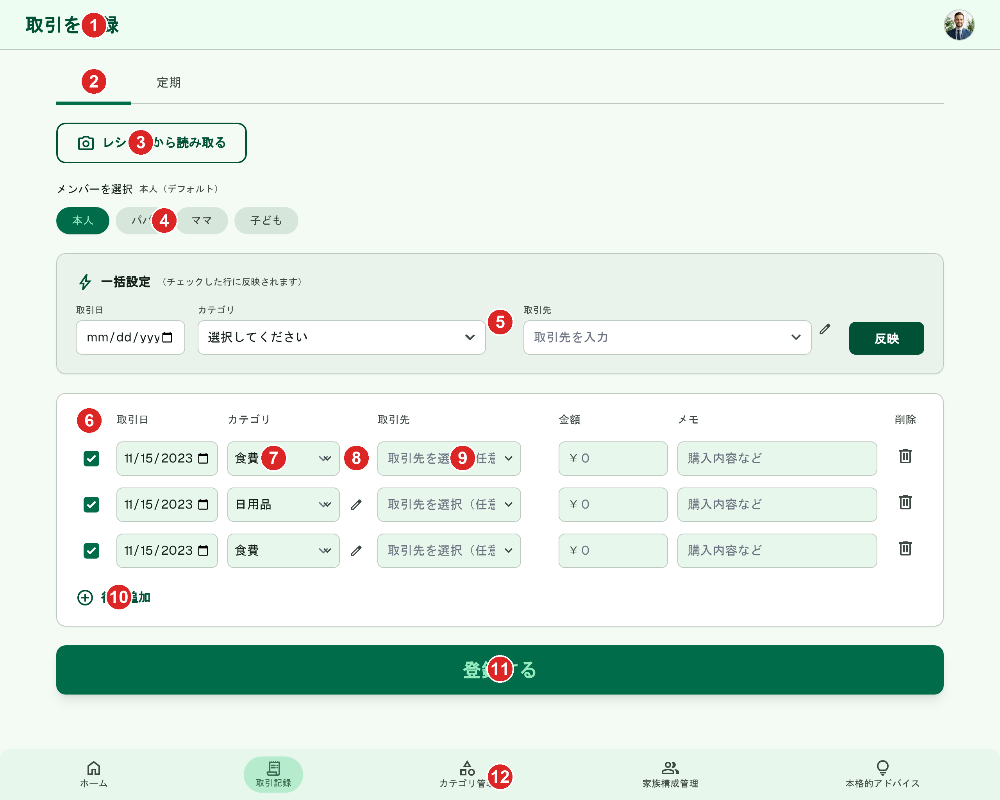
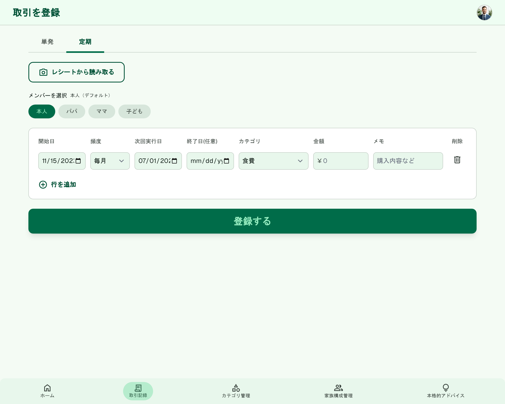
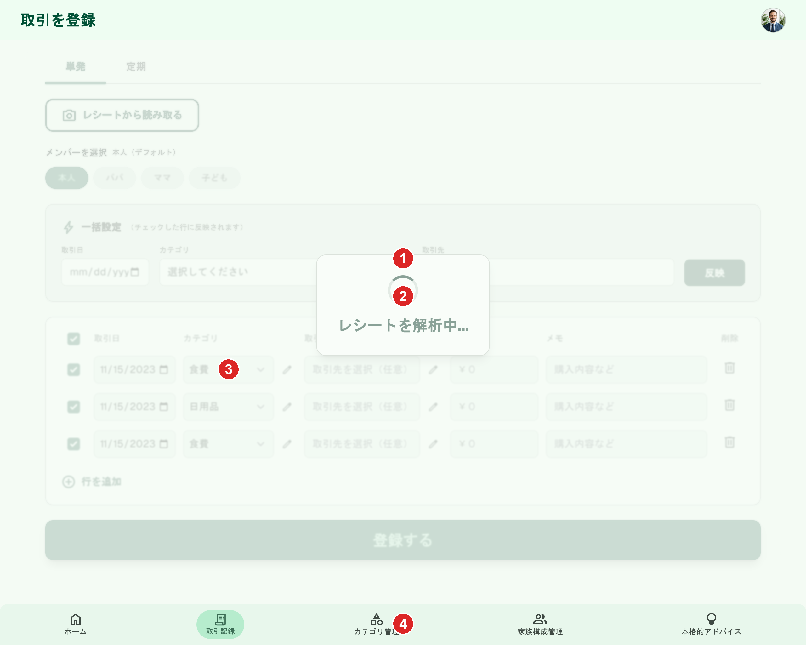
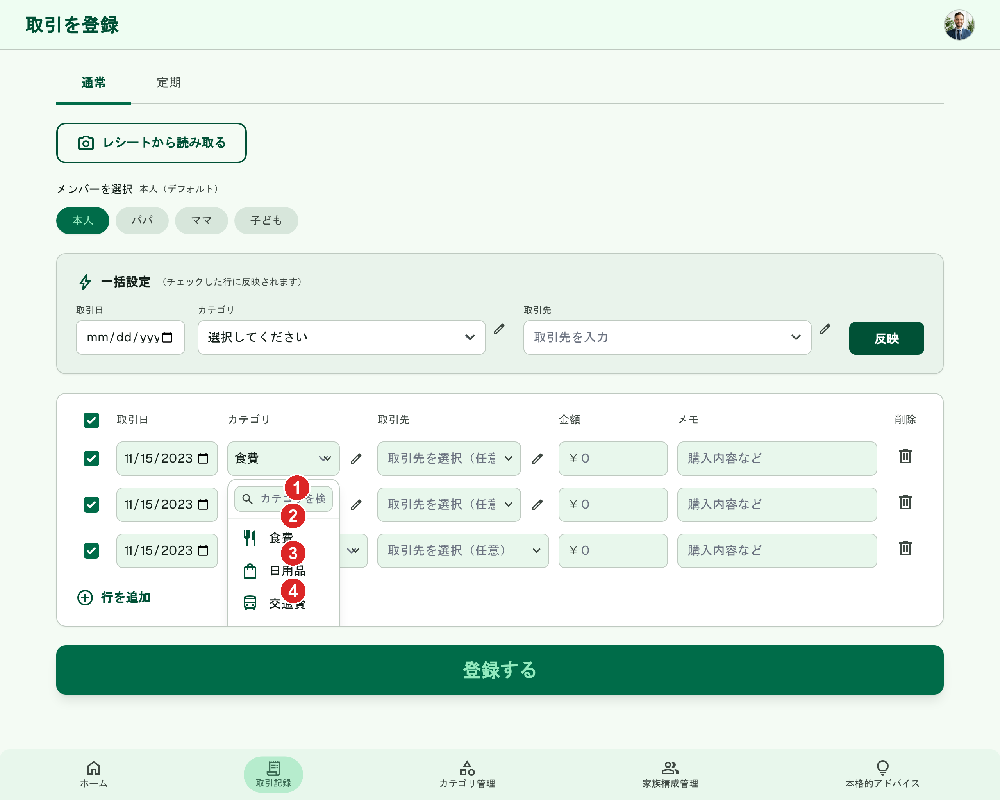

# 取引記録（新規作成）

[機能仕様](../../specs/features/transactions.md)に対応する登録フォーム（`/transactions/new`）。単発・定期モードをフォーム内タブで切り替える。[transactions/list.md](./list.md)のFAB「+ 取引を追加」から開く。

## 関連画面

| 遷移元                                                               | 遷移先                                                                                                   |
| -------------------------------------------------------------------- | -------------------------------------------------------------------------------------------------------- |
| [transactions/list.md](./list.md)・どこからでものFAB「+ 取引を追加」 | `/transactions/new`（単発/定期はフォーム内タブで切替）                                                   |
| 「レシートから読み取る」ボタン                                       | レシートスキャンフロー（[ai.md](../../specs/features/ai.md#1-レシート読み取り自動入力receipt_scan)参照） |

全体の遷移図は[architecture/screen-flow.md](../../architecture/screen-flow.md)を参照。

## 関連API

| メソッド | パス                          | 用途                                                     |
| -------- | ----------------------------- | -------------------------------------------------------- |
| POST     | `/api/transactions`           | 取引新規作成（配列を受け取るバッチ作成、単発モード専用） |
| POST     | `/api/recurring-transactions` | 定期取引新規作成（定期モード専用、配列バッチ作成）       |

詳細な仕様（バリデーション・権限ルール・業務フロー）は[機能仕様](../../specs/features/transactions.md)を参照。

## 採番済みスクリーンショット

### 単発モード（PC版）

Stitch Screen ID: `screens/4115897f2ab34d53acce3f1851d3199b`（タイトル「取引を登録 - 通常取引 (アイコン表示ロジック修正版)」）。確定済みの旧版（`screens/f65f533d416441bb9039e1a72ba27587`）を基準に`generate_variants`で、カテゴリ（選択済み）に鉛筆アイコンを表示・取引先（未選択）に鉛筆アイコンを非表示にするルールを3行すべてで一貫させた（2026-06-23、タスクA再修正で確定）

### 状態パターン

#### 「定期」モード（PC版）

Stitch Screen ID: `screens/3a8cf62fd3364067a4775f79bb66362b`（登録フォーム単発PCを基準に`generate_variants`で生成）

変更点: 「通常」タブ（表示文言、[パーツ一覧②](#単発モードpc版transactions-form-single-pc-numbered-png基準)参照）から「定期」タブに切り替えた状態。行の入力項目が「開始日」「頻度」（毎月/毎週/毎年）「次回実行日」「終了日（任意）」「カテゴリ」「金額」「メモ」に変わる。メンバーチップ・レシート連携ボタン・「登録する」ボタン・行構成のスタイルは単発モードと完全に統一されている。

**2026-06-23時点で古い情報**: この定期モードのスクリーンショットは、単発モードに取引先導線（一括設定フォーム・行チェックボックス・カテゴリ編集アイコン・取引先コンボボックス）を追加する前の旧版を基準に生成されたもの。定期取引には取引先の概念がないため反映は不要だが、行チェックボックス等の見た目の統一が取れていない。次回定期モードを再生成する際は、確定済みの新しい単発モード（`screens/73a90c5268e54ffebde09d4829d1a40c`）を基準にすること。

#### レシート解析中（ローディング状態、PC版）

Stitch Screen ID: `screens/e2bc211d794643ed9a63e6bd4d639091`（タイトル「取引を登録 - レシート解析中 (ローディング状態)」）。単発モードPC版（`screens/73a90c5268e54ffebde09d4829d1a40c`）を基準に`generate_variants`（`creativeRange: REFINE`, `aspects: [LAYOUT, TEXT_CONTENT]`）で生成。

変更点: ヘッダー・下部固定ナビゲーションを除く本体（一括設定エリア・商品行・登録するボタン）に半透明の白いオーバーレイを重ね、中央にスピナー+「レシートを解析中...」テキストを表示。背後の入力欄・ボタンはグレーアウトして操作不可に見える（[ai.mdの解析中の表示](../../specs/features/ai.md#1-レシート読み取り自動入力receipt_scan)に対応）。**この基準スクリーンはタスクA（タブ表示「通常」化・コンボボックス見た目統一）の反映前のバージョン**のため、タブは「単発」のまま、コンボボックス見た目も未統一、未選択行にも鉛筆アイコンが残っている（[仕様外要素](#仕様外要素実装時は無視すること)参照）。

#### カテゴリ選択ドロップダウン表示状態（PC版）

Stitch Screen ID: `screens/594ffdac7aa34d26ad22c48d918b1054`（タイトル「取引を登録 - カテゴリ選択ドロップダウン表示状態 (PC版)」）。タスクA確定済み単発モードPC版（`screens/f65f533d416441bb9039e1a72ba27587`）を基準に`generate_variants`で生成。

変更点: 2行目のカテゴリコンボボックスをクリックして候補ドロップダウンが開いた状態。ポップオーバー内に検索用テキスト入力欄（①）+アイコン付きの候補リスト（②食費、③日用品、④交通費）を表示。白いカード+軽いシャドウで他要素の上に重なって見える。**末尾の「+ 新しいカテゴリを追加」導線が表現されていない**（[仕様外要素](#仕様外要素実装時は無視すること)参照、次回再生成時に追加予定）。取引先側のドロップダウン（「+ 新しい取引先を追加」含む）は未生成。

## パーツ一覧

### 単発モード（PC版、`transactions-form-single-pc-numbered.png`基準）

| No  | 名称                              | 説明                                                                                                                                                                                                                                                                                                                                              | 遷移先・挙動                                                                                                                                                                                                                                                                                                                                                                                                                                                       |
| --- | --------------------------------- | ------------------------------------------------------------------------------------------------------------------------------------------------------------------------------------------------------------------------------------------------------------------------------------------------------------------------------------------------- | ------------------------------------------------------------------------------------------------------------------------------------------------------------------------------------------------------------------------------------------------------------------------------------------------------------------------------------------------------------------------------------------------------------------------------------------------------------------ |
| ①   | ヘッダー                          | 画面タイトル「取引を登録」+ユーザーアバター                                                                                                                                                                                                                                                                                                       | -                                                                                                                                                                                                                                                                                                                                                                                                                                                                  |
| ②   | モード切替タブ（通常/定期）       | 下線型タブ。**表示文言は「通常」/「定期」**（2026-06-23決定。仕様書`transactions.md`では「単発」と表記されているが、画面表示としては「単発」を避け「通常」を採用。内部のモード名・API呼称は引き続き「単発」のままでよい）。「通常」がアクティブ。**モックアップにも反映済み**（2026-06-23、タスクA確定）                                          | 「定期」タップで入力項目が変わる（[状態パターン](#状態パターン)参照）。送信ボタンはモードごとに別物で、単発モードは`POST /api/transactions`のみ、定期モードは`POST /api/recurring-transactions`のみを呼ぶ                                                                                                                                                                                                                                                          |
| ③   | レシートから読み取るボタン        | カメラアイコン付きアウトラインボタン                                                                                                                                                                                                                                                                                                              | タップでレシートスキャンフロー（[ai.md](../../specs/features/ai.md#1-レシート読み取り自動入力receipt_scan)参照）。明細ごとに複数行を一括下書き。**画像入力はカメラ起動・ファイル選択（アップロード）の両方に対応**（`<input type="file" accept="image/*" capture>`相当、ボタン自体は1つで両方を呼び出せる、2026-06-23決定）。モックアップ上はボタン1つの見た目のみで両方法の区別は表現されていない                                                                 |
| ④   | 家族メンバーチップ                | 「本人」「パパ」「ママ」「子ども」。選択中はプライマリグリーンの塗り                                                                                                                                                                                                                                                                              | フォーム全体で共通の選択（1人）。デフォルトメンバー選択時は「（デフォルト）」と注記                                                                                                                                                                                                                                                                                                                                                                                |
| ⑤   | 一括設定フォーム                  | 「取引日」「カテゴリ」「取引先」の3項目（すべて任意）+「反映」ボタン。「チェックした行に反映されます」と補足表示                                                                                                                                                                                                                                  | 「反映」タップで、チェック済みの行のみ入力した項目の値で上書き（未入力の項目は変更しない）。カテゴリ・取引先欄は行ごとのコンボボックス（⑧⑨）と**完全に同一のコンポーネント**（[一括設定の仕様](../../specs/features/transactions.md#一括設定全行への反映)参照）。新規作成（「+ 新しいカテゴリ/取引先を追加」）に加え、**値を選択した状態では鉛筆アイコンによる既存編集も同様に行える**（未選択時は⑧⑨と同じく非表示、2026-06-23決定。**モックアップにも反映済み**） |
| ⑥   | 行の選択チェックボックス          | 各行の先頭。デフォルト全行チェック済み                                                                                                                                                                                                                                                                                                            | [一括設定](#パーツ一覧)の対象行を絞り込む。行見出し部分の全選択チェックボックスは本モックアップでは明示的に表現されていない（[仕様外要素](#仕様外要素実装時は無視すること)参照）                                                                                                                                                                                                                                                                                   |
| ⑦   | 商品行（複数行）                  | 取引日・カテゴリ・取引先・金額・詳細（旧メモ）・削除アイコン                                                                                                                                                                                                                                                                                      | 新しい行は直前の行と同じ取引日を引き継ぐ。最初の行のみデフォルトは今日                                                                                                                                                                                                                                                                                                                                                                                             |
| ⑧   | カテゴリ横の編集アイコン          | 各行のカテゴリコンボボックス右側の鉛筆アイコン。**未選択時は非表示**（2026-06-23決定、モックアップにも反映済み）。コンボボックスの見た目は右端にシェブロンを表示する検索可能な形に統一                                                                                                                                                            | タップで[カテゴリ編集Dialog](../categories/edit.md)と同じDialogを開く（即時反映、`PUT /api/categories/:id`）                                                                                                                                                                                                                                                                                                                                                       |
| ⑨   | 取引先コンボボックス+編集アイコン | カテゴリの直後、金額の前に配置。プレースホルダー「取引先を選択（任意）」。右側に名称変更用の鉛筆アイコン。**未選択時は非表示**（2026-06-23決定、タスクA再修正で3行すべて一貫して反映済み）。コンボボックスの見た目はカテゴリ（⑧）と統一済み。鉛筆アイコンの表示・非表示によらず列幅は一定（アイコン用のスペースをコンボボックスの外側に常に確保） | 選択中のカテゴリの`typeCode`に応じて候補を絞り込み。末尾に「+ 新しい取引先を追加」（[新規作成（インライン・遅延作成）](../../specs/features/transaction-parties.md#新規作成インライン遅延作成)参照、送信時に同一トランザクションで作成）。編集アイコンは[取引先編集Dialog](../transaction-parties/edit.md)と同じ簡易UIを開く（即時反映）                                                                                                                           |
| ⑩   | 行を追加ボタン                    | -                                                                                                                                                                                                                                                                                                                                                 | タップで行を1行追加                                                                                                                                                                                                                                                                                                                                                                                                                                                |
| ⑪   | 登録するボタン                    | 緑の塗りボタン                                                                                                                                                                                                                                                                                                                                    | タップで行数分の`transactions`をまとめて作成し、一覧を再表示                                                                                                                                                                                                                                                                                                                                                                                                       |
| ⑫   | 下部固定ナビゲーション            | 「取引記録」がアクティブ                                                                                                                                                                                                                                                                                                                          | 各タブへ遷移                                                                                                                                                                                                                                                                                                                                                                                                                                                       |

### レシート解析中（PC版、`transactions-form-receipt-scanning-pc-numbered.png`基準）

| No  | 名称                                     | 説明                                                                                                   |
| --- | ---------------------------------------- | ------------------------------------------------------------------------------------------------------ |
| ①   | 半透明オーバーレイ                       | ヘッダー・下部固定ナビゲーションを除く本体（一括設定エリア〜登録するボタン）に重ねる白っぽい半透明の層 |
| ②   | スピナー+「レシートを解析中...」テキスト | オーバーレイ中央に配置                                                                                 |
| ③   | グレーアウトされた入力欄・ボタン         | オーバーレイ下の商品行・一括設定・登録するボタンは操作不可に見える見た目                               |
| ④   | ヘッダー・下部固定ナビゲーション         | オーバーレイの対象外。通常表示のまま操作可能                                                           |

### カテゴリ選択ドロップダウン表示状態（PC版、`transactions-form-category-dropdown-pc-numbered.png`基準）

| No  | 名称                   | 説明                                                                                                                                                    |
| --- | ---------------------- | ------------------------------------------------------------------------------------------------------------------------------------------------------- |
| ①   | 検索用テキスト入力欄   | ポップオーバー上部、虫眼鏡アイコン付き。入力で候補リストを絞り込む                                                                                      |
| ②   | カテゴリ候補（食費）   | アイコン付きリスト項目                                                                                                                                  |
| ③   | カテゴリ候補（日用品） | 同上                                                                                                                                                    |
| ④   | カテゴリ候補（交通費） | 同上。**この下に「+ 新しいカテゴリを追加」導線が続く想定だが、本モックアップでは表現されていない**（[仕様外要素](#仕様外要素実装時は無視すること)参照） |

## 状態一覧

| 状態           | 表示内容                                                                                                                                                                                                                                       |
| -------------- | ---------------------------------------------------------------------------------------------------------------------------------------------------------------------------------------------------------------------------------------------- |
| レシート解析中 | [状態パターン: レシート解析中](#レシート解析中ローディング状態pc版)参照。[ai.mdの解析中の表示](../../specs/features/ai.md#1-レシート読み取り自動入力receipt_scan)に対応                                                                        |
| エラー状態     | [frontend-conventions.mdのエラーハンドリング方針](../../architecture/decisions/frontend-conventions.md#フロントエンドのエラーハンドリング方針)を参照。フォーム送信失敗は`Alert`をフォーム内に表示（400はフィールドごと、それ以外は汎用エラー） |

## レスポンシブ差分

SP版の登録フォームは未生成。

## 採用した方向性

- **登録フォーム**: 「単発」「定期」をフォーム内タブで切り替える構成（[transactions.md](../../specs/features/transactions.md#画面構成-取引記録と定期取引の関係)参照）。フォームは完全に別物として実装し、送信ボタンもモードごとに別のAPIのみを呼ぶ仕様をモックアップ上でも反映（タブ切替で入力項目自体が変わる）
- **タブの表示文言は「通常」**: 仕様書の「単発」という呼称はそのまま画面に出すと意味が伝わりにくい・硬い印象があるとのユーザー指摘により、画面表示のみ「通常」に変更（2026-06-23決定、モックアップにも反映済み）。内部のモード区分・API呼称（`単発モード専用`等）は仕様書通り「単発」を維持し、表示文言とは分離する
- **取引先コンボボックスの見た目をカテゴリと統一**: 仕様（[transaction-parties.md](../../specs/features/transaction-parties.md)・[transactions.md](../../specs/features/transactions.md)）はカテゴリ・取引先双方を「コンボボックス」と明記しているが、当初のモックアップではカテゴリが閉じたセレクト風、取引先がテキスト入力風に見え、見た目が不統一だった（Stitchの描画上の不整合、意図した差ではない）。**2026-06-23決定: 両方とも検索可能なコンボボックス（右端にシェブロンを表示）に統一する**。タスクA確定により反映済み
- **複数行入力**: 仕様通り、商品行を「+ 行を追加」で増やせる構成。家族メンバーはフォーム全体で共通の1選択（メンバーチップ）
- **ナビゲーション**: [common-components.md](../common-components.md)で確定した共通パーツに統一
- **一括設定フォーム**: [一括設定（全行への反映）](../../specs/features/transactions.md#一括設定全行への反映)の仕様通り、フォーム上部に取引日・カテゴリ・取引先の3項目+「反映」ボタンを配置。「チェックした行に反映されます」という補足文言で、チェック済み行のみが対象になる挙動を明示した
- **取引先コンボボックス・編集アイコン**: [取引登録フォームとの連携](../../specs/features/transaction-parties.md#取引登録フォームとの連携)・[既存の編集（即時反映）](../../specs/features/transaction-parties.md#既存の編集即時反映)に対応。カテゴリの直後に配置し、選択中カテゴリのタイプで候補が絞り込まれることを示した

## 既存実装との差分

未実装のため差分なし。

## 仕様外要素（実装時は無視すること）

- 行見出し部分の全選択チェックボックス（[一括設定の仕様](../../specs/features/transactions.md#追加フォームの構造単発複数行入力)に記載の「行見出し部分に全選択チェックボックスも置く」）が本モックアップでは明示的に表現されていない。実装時は仕様の通り、行見出しに全選択/全解除用のチェックボックスを追加する
- 「メモ」のラベルが残っている。仕様上は「詳細」に改名予定（[取引記録の仕様](../../specs/features/transactions.md#バリデーション)参照）だが、今回の取引先導線追加の生成では文言変更まで反映されなかった
- レシート解析中（`screens/e2bc211d794643ed9a63e6bd4d639091`）は、タスクA確定前の旧基準スクリーン（`screens/73a90c5268e54ffebde09d4829d1a40c`）から生成したため、タブ表示「単発」・コンボボックス見た目不統一・未選択行への鉛筆アイコン表示がそのまま残っている。新しい基準（`screens/4115897f2ab34d53acce3f1851d3199b`）で再生成すれば解消する見込み（未着手）
- コンボボックス押下時の選択肢ドロップダウン表示（`screens/594ffdac7aa34d26ad22c48d918b1054`）は検索欄・候補リスト（アイコン付き）まで生成できたが、**末尾の「+ 新しいカテゴリを追加」導線が表現されていない**。新規作成導線は[新規作成（インライン・遅延作成）](../../specs/features/transactions.md#カテゴリの新規追加インライン遅延作成)の通りコンボボックス内の末尾に置く仕様のため、次回再生成時に追加を反映する。**2026-06-23時点で複数回試行したが、これはタイムアウトではなくStitch側の解釈の問題と判明**: 計13回試行（タイムアウト5回+生成成功だが内容不適合8回）したが、生成された候補は「変更なしの完全な重複」または「候補リストの4件目に別カテゴリ（娯楽費）を追加しただけ」のいずれかで、要求した「区切り線+アクションリンク行（候補項目ではない別種の行）」は一度も生成されなかった。プロンプトを2パターン（通常の指示・候補追加と明確に区別する指示）試したが結果は変わらず。次回再試行する場合は、`edit_screens`による直接編集や、別の基準スクリーン・より具体的な参考画像の提示を検討すること

以下は2026-06-23のタスクA確定・再修正（`screens/4115897f2ab34d53acce3f1851d3199b`）により**解消済み**の旧課題（記録として残す）:

- ~~一括設定フォーム（パーツ⑤）のカテゴリ・取引先欄に鉛筆（既存編集）アイコンがなかった~~ → 行ごとのコンボボックスと同一コンポーネントとして鉛筆アイコンを追加済み
- ~~タブの表示文言が「単発」のままだった~~ → 「通常」に変更済み
- ~~カテゴリコンボボックスと取引先コンボボックスの見た目が不統一だった~~ → 両方とも検索可能なコンボボックスの見た目に統一済み
- ~~取引先コンボボックスが未選択の行にも鉛筆アイコンが表示されていた~~ → 3行すべてで「選択時のみ表示」に統一済み（タスクA再修正、2026-06-23）
- ~~カテゴリ・取引先の鉛筆アイコンの表示/非表示が行ごとに不統一だった（同じ選択状態でも行によりランダムに表示が変わる、最初の再修正版で発生）~~ → 全行で選択状態に基づき一貫して表示/非表示するよう修正済み
- ~~鉛筆アイコンの表示・非表示でコンボボックスの列幅が変わってしまう~~ → アイコン用のスペースをコンボボックスの外側（列の隙間）に常に確保し、表示・非表示によらず列幅が一定になるよう修正済み

## 更新履歴

| 日付                                   | 変更内容                                                                                                                                                                                                                                                                                                                                                                                                                                                                                                                                                                                                                                                                                                                                                                                                                                                                                                          |
| -------------------------------------- | ----------------------------------------------------------------------------------------------------------------------------------------------------------------------------------------------------------------------------------------------------------------------------------------------------------------------------------------------------------------------------------------------------------------------------------------------------------------------------------------------------------------------------------------------------------------------------------------------------------------------------------------------------------------------------------------------------------------------------------------------------------------------------------------------------------------------------------------------------------------------------------------------------------------- |
| 2026-06-22                             | 全画面作り直し方針のもと、登録フォーム（単発/定期）を再生成し確定。`_template.md`の新フォーマットに合わせて全面リライト                                                                                                                                                                                                                                                                                                                                                                                                                                                                                                                                                                                                                                                                                                                                                                                           |
| 2026-06-22（2回目）                    | 取引先機能の追加に伴い、取引先項目・カテゴリ編集アイコンの変更をテキストで記録（今後反映予定の変更として記録、モックアップ未更新）                                                                                                                                                                                                                                                                                                                                                                                                                                                                                                                                                                                                                                                                                                                                                                                |
| 2026-06-22（3回目）                    | 一覧・新規作成・編集・削除が1ファイルに混在し読みづらいとのユーザー指摘を受け、`transactions.md`から分割して新規作成                                                                                                                                                                                                                                                                                                                                                                                                                                                                                                                                                                                                                                                                                                                                                                                              |
| 2026-06-23                             | `/grill-me`セッション追加タスク3に対応。確定済みPC版を基準に`generate_variants`で行チェックボックス・一括設定フォーム・カテゴリ編集アイコン・取引先コンボボックスを追加して再確定（`screens/73a90c5268e54ffebde09d4829d1a40c`）。テキストのみで記録していた「今後反映予定の変更」節を削除し、未反映点は仕様外要素に記録                                                                                                                                                                                                                                                                                                                                                                                                                                                                                                                                                                                           |
| 2026-06-23（2回目）                    | ユーザー指摘を受けて3点を決定: ①未選択時のカテゴリ・取引先編集アイコンは非表示にする（新規作成は「+ 新しいカテゴリ/取引先を追加」のみに統一）、②一括設定フォームのカテゴリ・取引先欄は行ごとのコンボボックスと完全に同一コンポーネントとし、既存編集（鉛筆アイコン）も同様に使えるようにする、③レシート読み取りの画像入力はカメラ起動・アップロードの両方に対応する（`ai.md`側の仕様反映は`/update-docs`待ち）。いずれもモックアップ自体は未反映のため次回再生成時に反映する                                                                                                                                                                                                                                                                                                                                                                                                                                      |
| 2026-06-23（3回目）                    | さらに2点を決定: ④モード切替タブの画面表示文言を「単発」から「通常」に変更（内部のモード区分・API呼称は「単発」を維持）、⑤取引先コンボボックスがテキスト入力風に見え、カテゴリ（閉じたセレクト風）と見た目が不統一だったため、両方とも検索可能なコンボボックスの見た目に統一する。いずれもモックアップ自体は未反映のため次回再生成時に反映する                                                                                                                                                                                                                                                                                                                                                                                                                                                                                                                                                                    |
| 2026-06-23（4回目、自動再開）          | `/update-docs`で確定した仕様変更（タブ表示「通常」化・コンボボックス統一・一括設定の既存編集対応・レシート解析中オーバーレイ）の再生成を自動再開。レシート解析中（タスクB）は単発モードPC版（`screens/73a90c5268e54ffebde09d4829d1a40c`）を基準に`generate_variants`で生成し確定（`screens/e2bc211d794643ed9a63e6bd4d639091`）。単発モードPC版本体の修正（タスクA: タブ表示・コンボボックス統一・鉛筆アイコン未選択時非表示・一括設定への鉛筆アイコン追加）は5回試行してもStitchがタイムアウトし続け生成確認できなかったため一旦保留。タスクBを先に完了させた                                                                                                                                                                                                                                                                                                                                                     |
| 2026-06-23（5回目、自動再開・最終）    | タスクAをさらに2回再試行したが、合計7回（自動再開後）すべてタイムアウトし、`list_screens`でも新しい候補（151件のまま）を一度も確認できなかった。今回のセッションではタスクA未確定のまま終了。上記108〜111行目の仕様外要素の決定事項は有効なまま、次回セッションで`screens/73a90c5268e54ffebde09d4829d1a40c`を基準に同条件で再試行すること                                                                                                                                                                                                                                                                                                                                                                                                                                                                                                                                                                         |
| 2026-06-23（6回目、タスクA確定）       | ユーザー依頼により保留タスクの再試行を実施。`screens/73a90c5268e54ffebde09d4829d1a40c`を基準に`generate_variants`で2回試行し、2回目で7件の候補（`screens/cfd2485425914a26bd7663b774cb7228`等）が一括生成された。タブ表示「通常」化・コンボボックス見た目統一（シェブロン表示）・鉛筆アイコンの未選択時非表示・一括設定欄への鉛筆アイコン追加の4点をすべて満たす`screens/f65f533d416441bb9039e1a72ba27587`（「通常取引 (UI洗練版)」）を採用し確定。レシート解析中（`screens/e2bc211d794643ed9a63e6bd4d639091`）はこの新基準での再生成が未着手のため、仕様外要素に記録                                                                                                                                                                                                                                                                                                                                              |
| 2026-06-23（7回目）                    | ユーザーから指摘を受け、確定済み`screens/f65f533d416441bb9039e1a72ba27587`を再確認したところ、取引先コンボボックスが未選択の行にも鉛筆アイコンが残っていることが判明（タスクA確定時の確認漏れ）。また鉛筆アイコンの表示/非表示で列幅がズレる問題も指摘され、アイコン分のスペースを常に確保する方針で修正することを決定。同基準で`generate_variants`を3回試行したがすべてタイムアウトし未確定。加えて、コンボボックス押下時の選択肢ドロップダウン表示+新規登録導線の新規状態パターンも同基準で3回試行したが同様にすべてタイムアウトし未確定。両方とも[仕様外要素](#仕様外要素実装時は無視すること)に記録し、次回セッションで`screens/f65f533d416441bb9039e1a72ba27587`を基準に再試行すること                                                                                                                                                                                                                       |
| 2026-06-23（8回目、タスクA再修正確定） | ユーザーから「もう一回確認してもらえますか」と再試行依頼を受け再開。`screens/f65f533d416441bb9039e1a72ba27587`を基準に再試行し、`screens/9114f6b60ccb439d889d1abb5f44413d`・`screens/4c558f13872c43859bb0d43f60355a2f`の2件が生成されたが、いずれも鉛筆アイコンの表示/非表示が行ごとに不統一（同じ選択状態でも行によりランダムに変わる）という新たな不具合があり不採用。`4c558f13872c43859bb0d43f60355a2f`を基準に統一を指示する`generate_variants`を再試行したところ`screens/4115897f2ab34d53acce3f1851d3199b`が生成され、3行すべてでカテゴリ（選択済み）=鉛筆表示・取引先（未選択）=鉛筆非表示が一貫していることを確認、列幅も一定のため採用・確定。同時に、コンボボックス押下時のドロップダウン表示状態（`screens/594ffdac7aa34d26ad22c48d918b1054`）も生成された。検索欄・アイコン付き候補リストは良好だが「+ 新しいカテゴリを追加」導線が欠けているため、仕様外要素に記録し次回再生成時に追加予定            |
| 2026-06-23（9回目、最終）              | 残課題として指摘された「+ 新しいカテゴリを追加」導線を`screens/594ffdac7aa34d26ad22c48d918b1054`に追加する`generate_variants`を5回試行したが、いずれもタイムアウトし`list_screens`の件数（180件）も一度も変化しなかった。今回のセッションでは未確定のまま終了。次回セッションで同基準スクリーンを使って再試行すること                                                                                                                                                                                                                                                                                                                                                                                                                                                                                                                                                                                             |
| 2026-06-23（10回目）                   | ユーザーから「もう一回確認してもらえますか」と再試行依頼を受け再開。1回目の試行で7件の候補（`screens/44958c2bff724cc699f3e4f2f6207c5b`等、タイトルはいずれも「新規追加導線あり/追加」）が生成されたが、画像をMD5比較したところ大半が変更前と完全に同一（無変更）で、一部（`screens/9caa4eed5d8a4c559773a645c3cb2a81`・`screens/36a0ea950217412590fa9c357e1a22be`）は候補リストの4件目に「娯楽費」という別カテゴリを追加しただけで、要求した「区切り線+アクションリンク行」にはなっていなかった。プロンプトを改良し「候補の4件目ではなくアクションリンク行を追加する」ことを明示して再試行（`screens/5adbc1fd5fe24e178ce9129b0609edaf`）したが、これも変更前と完全に同一画像だった。今回のセッションでは合計13回（累計）試行してもこの編集内容を正しく反映できないことが分かり、タイムアウト以外の要因（Stitchがこの種の「候補リストの末尾に異種の行を追加する」編集を苦手とする可能性）が濃厚なため一旦保留とする |
