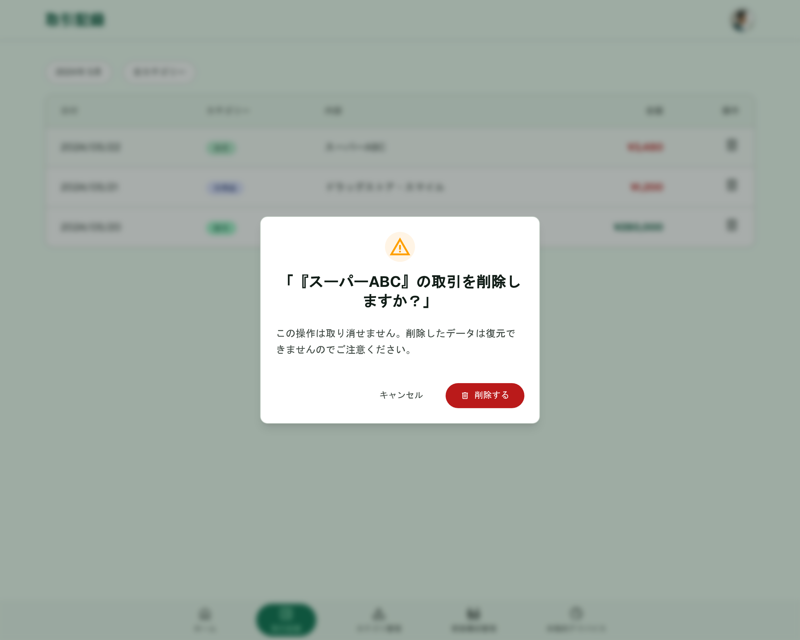

# 取引記録（削除）

[機能仕様](../../specs/features/transactions.md)に対応する取引削除確認AlertDialog。[transactions/list.md](./list.md)一覧の削除アイコンから開く。見た目の共通フレームワークは[modals.md](../modals.md#alertdialog共通構成カテゴリ削除確認家族メンバー削除確認取引削除確認)を参照。

## 関連画面

| 遷移元                                              | 遷移先                                               |
| --------------------------------------------------- | ---------------------------------------------------- |
| [transactions/list.md](./list.md)一覧の削除アイコン | 取引削除確認AlertDialog（同画面上にAlertDialog表示） |

全体の遷移図は[architecture/screen-flow.md](../../architecture/screen-flow.md)を参照。

## 関連API

| メソッド | パス                    | 用途                           |
| -------- | ----------------------- | ------------------------------ |
| DELETE   | `/api/transactions/:id` | 取引物理削除（自分の取引のみ） |

詳細な仕様は[機能仕様](../../specs/features/transactions.md)を参照。

## 採番済みスクリーンショット

すべてPC版。SP版は未生成（[仕様外要素](#仕様外要素実装時は無視すること)参照）。

Stitch Screen ID: `screens/439b75d3bf764c02bff7ce032f1b8d6d`

## パーツ一覧

共通の枠組み（警告アイコン・フッターのボタン配置）は[modals.mdのAlertDialog共通構成](../modals.md#alertdialog共通構成カテゴリ削除確認家族メンバー削除確認取引削除確認)を参照。

| 名称     | 説明                                                       |
| -------- | ---------------------------------------------------------- |
| タイトル | 対象名を含む確認文                                         |
| 本文     | 取り消し不可の注意（取引は論理削除ではなく物理削除のため） |

## 状態一覧

特になし（確認ダイアログのため空状態は発生しない）。

## レスポンシブ差分

SP版は未生成のため記載なし（[仕様外要素](#仕様外要素実装時は無視すること)参照）。

## 採用した方向性

AlertDialog（削除確認系）の統一構成: アンバー系の警告アイコン、対象名入りタイトル、削除の影響範囲の説明文、「キャンセル」+赤系「削除する」を右寄せ配置（[modals.md](../modals.md#採用した方向性)参照）。取引は物理削除であるため、本文では他2画面（カテゴリ・家族メンバー）と異なり「取り消し不可」の注意を強調する。

## 既存実装との差分

未実装のため差分なし。

## 仕様外要素（実装時は無視すること）

- 背景に表示されている下層画面は、Stitchが生成時に参照した旧バージョンであることが多く、実装時の背景画面は[transactions/list.md](./list.md)の確定モックアップを参照すること
- SP（モバイル）版は未生成。実装時にshadcn/uiのAlertDialogのレスポンシブ挙動に委ねてよい

## 更新履歴

| 日付       | 変更内容                                                                                            |
| ---------- | --------------------------------------------------------------------------------------------------- |
| 2026-06-22 | 全画面作り直し方針のもと再生成し確定。`modals.md`に集約していた内容から分割し、本ファイルとして独立 |
