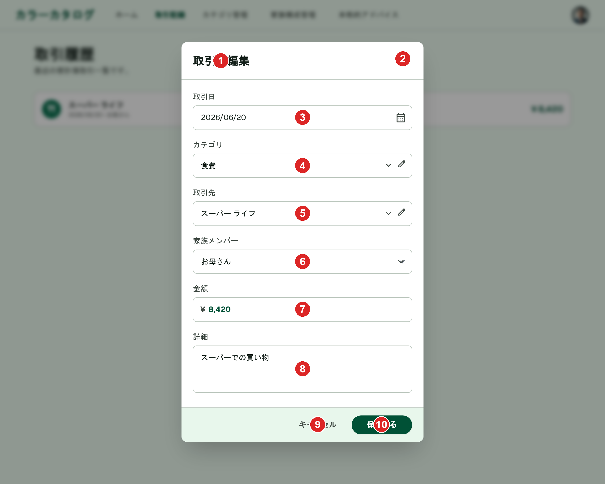
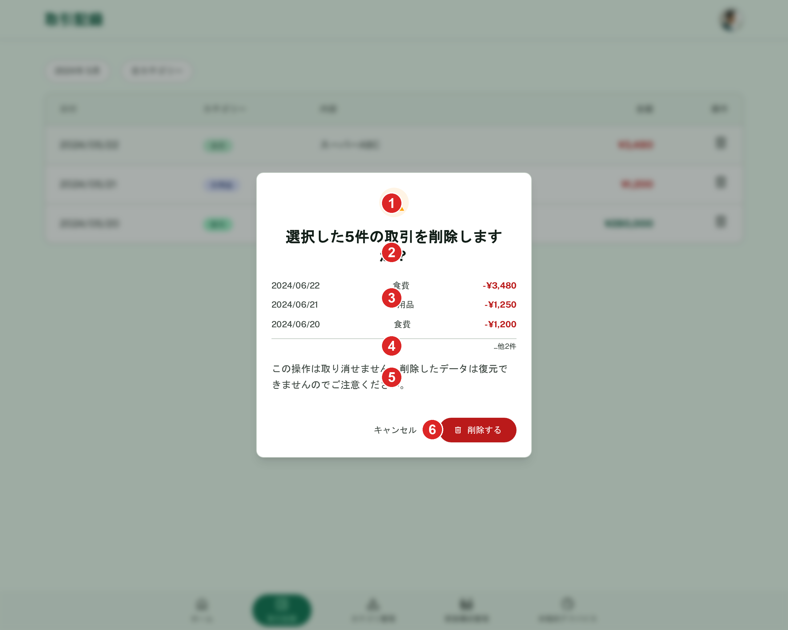

# 取引記録（編集）

[機能仕様](../../specs/features/transactions.md)に対応する取引編集UI。単体編集（[取引編集Dialog](#単体編集)）・一括削除確認（[一括削除](#一括削除)）はモックアップ生成済み。一括編集（インライン展開パネル）は[transactions-list.mdの状態パターン: 複数選択中](./list.md#複数選択中選択中バー一括編集パネルpc版)で表現済み。

## 関連画面

| 遷移元                                                    | 遷移先                                                                                                                          |
| --------------------------------------------------------- | ------------------------------------------------------------------------------------------------------------------------------- |
| [transactions/list.md](./list.md)一覧画面の行             | 取引編集Dialog（[単体編集](#単体編集)）                                                                                         |
| [transactions/list.md](./list.md)選択中バーの「一括編集」 | 一括編集パネル（[一括編集](#一括編集)、[業務フロー](../../specs/features/transactions.md#業務フロー-一括編集誤登録の修正)参照） |
| [transactions/list.md](./list.md)選択中バーの「一括削除」 | 一括削除確認AlertDialog（[業務フロー](../../specs/features/transactions.md#業務フロー-一括削除)参照）                           |

全体の遷移図は[architecture/screen-flow.md](../../architecture/screen-flow.md)を参照。

## 関連API

| メソッド | パス                     | 用途                                                                                 |
| -------- | ------------------------ | ------------------------------------------------------------------------------------ |
| PUT      | `/api/transactions/:id`  | 取引編集（自分の取引のみ）                                                           |
| PATCH    | `/api/transactions/bulk` | 複数取引の一括編集（取引日・カテゴリ・家族メンバー・取引先のうち変更したい項目のみ） |
| DELETE   | `/api/transactions/bulk` | 複数取引の一括物理削除（`ids`配列）                                                  |

詳細な仕様（バリデーション・権限ルール・業務フロー）は[機能仕様](../../specs/features/transactions.md)を参照。

## 採番済みスクリーンショット

### 単体編集（取引編集Dialog、PC版）

Stitch Screen ID: `screens/861a57687a7646deb54ea17de37d094f`（タイトル「取引編集ダイアログ - コンボボックス対応版 (PC)」）。確定済みの旧版（`screens/5c3994a79a1449c78f8e09d7a5a89304`）を基準に`generate_variants`（`creativeRange: REFINE`, `aspects: [LAYOUT, TEXT_CONTENT]`）でカテゴリ・取引先コンボボックスの見た目統一（シェブロン表示）を反映（2026-06-23、タスクC確定）。SP版は未生成。

### 一括削除確認（AlertDialog、PC版）

Stitch Screen ID: `screens/97b946ed46d14143aa79840dd0eb6c78`（タイトル「一括削除確認ダイアログ - PC版」）。確定済みの[取引削除確認AlertDialog](./delete.md)（`screens/439b75d3bf764c02bff7ce032f1b8d6d`）を基準に`generate_variants`で生成。SP版は未生成。

## パーツ一覧

### 単体編集

[カテゴリ編集・家族メンバー編集](../categories/edit.md)と同じDialogパターンを踏襲する（一覧から離脱しない。`/transactions/:id/edit`のような別ページには分けない）。

| No  | 名称                   | 説明                                                                                                                                               | 遷移先・挙動                                                                                                                                                                                                                                                                                                                                                                                                                                                                                                            |
| --- | ---------------------- | -------------------------------------------------------------------------------------------------------------------------------------------------- | ----------------------------------------------------------------------------------------------------------------------------------------------------------------------------------------------------------------------------------------------------------------------------------------------------------------------------------------------------------------------------------------------------------------------------------------------------------------------------------------------------------------------- |
| ①   | タイトル「取引を編集」 | -                                                                                                                                                  | -                                                                                                                                                                                                                                                                                                                                                                                                                                                                                                                       |
| ②   | 閉じる×アイコン        | -                                                                                                                                                  | -                                                                                                                                                                                                                                                                                                                                                                                                                                                                                                                       |
| ③   | 取引日                 | デートピッカー、既存値が入力済み                                                                                                                   | -                                                                                                                                                                                                                                                                                                                                                                                                                                                                                                                       |
| ④   | カテゴリ               | コンボボックス（既存値入力済み）+横に編集アイコン。右端にシェブロンを表示する検索可能なコンボボックスの見た目に統一済み（2026-06-23、タスクC確定） | **既存の選択肢からのみ**選べる（[新規追加（インライン・遅延作成）](../../specs/features/transactions.md#カテゴリの新規追加インライン遅延作成)はこのDialogでは不可）。編集アイコンタップで[既存カテゴリの編集（インライン・即時反映）](../../specs/features/transactions.md#既存カテゴリ取引先の編集インライン即時反映)と同じDialogを開き`PUT /api/categories/:id`を呼べる。選択中の値が論理削除済みの場合はグレー文字＋「(削除済み)」ラベルで表示する（[style-guide.md](../style-guide.md#論理削除済み項目の表示)参照） |
| ⑤   | 取引先                 | コンボボックス（既存値入力済み）+横に編集アイコン。④と同様にシェブロン付きの見た目に統一済み                                                       | カテゴリと同様、既存の選択肢からのみ選べる（新規追加不可）。編集アイコンで即時反映の名称変更ができる。論理削除済みの場合の表示は④と同様                                                                                                                                                                                                                                                                                                                                                                                 |
| ⑥   | 家族メンバー           | セレクト、既存値が選択済み                                                                                                                         | 論理削除済みの場合の表示は④と同様                                                                                                                                                                                                                                                                                                                                                                                                                                                                                       |
| ⑦   | 金額                   | 数値入力、既存値が入力済み                                                                                                                         | -                                                                                                                                                                                                                                                                                                                                                                                                                                                                                                                       |
| ⑧   | 詳細                   | テキスト入力（任意）、既存値が入力済み                                                                                                             | -                                                                                                                                                                                                                                                                                                                                                                                                                                                                                                                       |
| ⑨   | 「キャンセル」ボタン   | グレーテキストボタン                                                                                                                               | -                                                                                                                                                                                                                                                                                                                                                                                                                                                                                                                       |
| ⑩   | 「保存する」ボタン     | エメラルドグリーンの塗りボタン                                                                                                                     | タップで`PUT /api/transactions/:id`                                                                                                                                                                                                                                                                                                                                                                                                                                                                                     |

新規にカテゴリ・取引先が必要な場合は、先にカテゴリ管理画面（[categories/list.md](../categories/list.md)）で作成してから、このDialogで選択する。

### 一括編集

[transactions/list.md](./list.md)のパーツ一覧で定義する「選択中バー」の「一括編集」ボタンを押すと、バーの直下に入力欄がインライン展開する（モーダルには遷移しない。対象行を見ながら入力できる）。モックアップは[transactions-list.mdの状態パターン: 複数選択中](./list.md#複数選択中選択中バー一括編集パネルpc版)で生成済み。

| 項目         | 入力方法                                                     |
| ------------ | ------------------------------------------------------------ |
| 取引日       | デートピッカー（未入力可。未入力の項目は対象行を変更しない） |
| カテゴリ     | コンボボックス（未入力可）                                   |
| 家族メンバー | セレクト（未入力可）                                         |
| 取引先       | コンボボックス（未入力可）                                   |

金額・詳細は対象外（[業務フロー: 一括編集](../../specs/features/transactions.md#業務フロー-一括編集誤登録の修正)参照）。

### 一括削除

[modals.md](../modals.md)のAlertDialog共通構成（警告アイコン+タイトル+本文+「キャンセル」/「削除する」）を踏襲し、タイトルに件数を含める（例:「選択した5件の取引を削除しますか？」）。

| No  | 名称                       | 説明                                                                                                                 |
| --- | -------------------------- | -------------------------------------------------------------------------------------------------------------------- |
| ①   | 警告アイコン               | アンバー系の三角に!アイコン                                                                                          |
| ②   | タイトル                   | 件数を含む確認文                                                                                                     |
| ③   | 対象取引の簡易リスト       | 日付・カテゴリ・金額のみ（家族メンバー・取引先・詳細は省略）を**最大3件まで**表示（例: `2024/06/22　食費　−¥3,480`） |
| ④   | 「...他N件」表示           | 4件以上選択時、3件目の下に表示。件数のみでは選択を取り違えていないか確認しづらいため                                 |
| ⑤   | 本文（取り消し不可の注意） | 「この操作は取り消せません。削除したデータは復元できませんのでご注意ください。」                                     |
| ⑥   | フッターボタン             | 「キャンセル」+赤系「削除する」を右寄せ配置。タップで`DELETE /api/transactions/bulk`                                 |

## 状態一覧

| 状態             | 表示内容                                                                                                                                                                                                                                              |
| ---------------- | ----------------------------------------------------------------------------------------------------------------------------------------------------------------------------------------------------------------------------------------------------- |
| 単体編集         | 確定済み（[パーツ一覧](#単体編集)参照）。Stitchモックアップ生成済み                                                                                                                                                                                   |
| 一括編集パネル   | 確定済み（[パーツ一覧](#一括編集)参照）。Stitchモックアップ生成済み（[transactions/list.md](./list.md#複数選択中選択中バー一括編集パネルpc版)）                                                                                                       |
| 一括削除確認     | 確定済み（[パーツ一覧](#一括削除)参照）。Stitchモックアップ生成済み                                                                                                                                                                                   |
| エラー状態       | [frontend-conventions.mdのエラーハンドリング方針](../../architecture/decisions/frontend-conventions.md#フロントエンドのエラーハンドリング方針)を参照。単体編集Dialogはフォーム送信のため`Alert`、一括削除はフォームを伴わない操作のためSonnerトースト |
| ローディング状態 | [frontend-conventions.md](../../architecture/decisions/frontend-conventions.md#フロントエンドのエラーハンドリング方針)を参照。保存・削除ボタンはスピナー付き`disabled`状態                                                                            |

## レスポンシブ差分

SP版は未生成。実装時にshadcn/uiのDialog/AlertDialogのレスポンシブ挙動に委ねてよい。

## 採用した方向性

- **単体編集はDialog**: カテゴリ・家族メンバー編集と一貫性を持たせ、一覧から離脱せず編集できることを優先した。項目数（6項目）もカテゴリ編集（名前・タイプ・アイコン・色・親カテゴリ）と同程度かそれ以下のため、別ページに分けるほどの複雑さはないと判断
- **単体編集Dialogでの新規作成は不可**: 一覧から既存取引を修正するという限定された操作に保つため。`PUT /api/transactions/:id`のリクエストスキーマを拡張する必要もない
- **一括編集はインライン展開**: 対象行を画面外に追いやらず、選択内容を確認しながら入力できることを優先（[transactions/list.md](./list.md#採用した方向性)参照）
- **一括削除の簡易リストを最大3件に制限**: 件数表示だけでは選択を取り違えていないか確認しづらいため対象を可視化する一方、選択件数が多い場合にダイアログが画面外に伸びすぎないよう3件で打ち切り、「...他N件」で残りを示す

## 既存実装との差分

未実装のため差分なし。

## 仕様外要素（実装時は無視すること）

- 単体編集Dialog・一括削除確認AlertDialogいずれも、背景に表示されている下層画面はStitchが生成時に参照した旧バージョン。実装時の背景画面は[transactions/list.md](./list.md)の確定モックアップを参照すること
- SP（モバイル）版は両方とも未生成。実装時にshadcn/uiのDialog/AlertDialogのレスポンシブ挙動に委ねてよい
- ~~カテゴリ・取引先（パーツ④⑤）の見た目が、シェブロン等の「検索可能なコンボボックス」らしさのないテキスト入力風になっていた~~ → タスクC確定（`screens/861a57687a7646deb54ea17de37d094f`）により解消済み

## 更新履歴

| 日付                                | 変更内容                                                                                                                                                                                                                                                                                                                                                                                           |
| ----------------------------------- | -------------------------------------------------------------------------------------------------------------------------------------------------------------------------------------------------------------------------------------------------------------------------------------------------------------------------------------------------------------------------------------------------- |
| 2026-06-22                          | 一覧・新規作成・編集・削除が1ファイルに混在し読みづらいとのユーザー指摘を受け、`transactions.md`から分割して新規作成。編集UI自体は元から未確定・未生成のため、その状態のまま引き継いだ                                                                                                                                                                                                             |
| 2026-06-22（2回目）                 | `/grill-me`での解像度確認により、単体編集（Dialog・新規作成不可・既存編集アイコン残置）・一括編集（インライン展開）・一括削除（AlertDialog、新規業務フロー）の方針を確定。Stitchモックアップ自体の生成は別途GOサイン後に実施                                                                                                                                                                       |
| 2026-06-23                          | `/grill-me`セッション追加タスク5に対応。単体編集Dialogをカテゴリ新規追加Dialog確定版を基準に`generate_variants`で生成し確定（`screens/5c3994a79a1449c78f8e09d7a5a89304`）。一括削除確認AlertDialogを取引削除確認確定版を基準に生成し確定（`screens/97b946ed46d14143aa79840dd0eb6c78`）。一括編集パネルは[transactions/list.md](./list.md)のタスク4で生成済みのため、本ファイルから参照する形に変更 |
| 2026-06-23（2回目）                 | ユーザー指摘を受け、カテゴリ・取引先（④⑤）の見た目がコンボボックスらしくないテキスト入力風になっている点を仕様外要素に追加。検索可能なコンボボックスへの統一を決定（[transactions-create.mdの同決定](./create.md#採用した方向性)と合わせる）。次回モックアップ再生成時に反映する                                                                                                                   |
| 2026-06-23（3回目、自動再開・最終） | `screens/5c3994a79a1449c78f8e09d7a5a89304`を基準にコンボボックス見た目統一の`generate_variants`を2回試行したが、いずれもタイムアウトし`list_screens`でも新しい候補を確認できなかった。今回のセッションでは未確定のまま終了。115行目の決定事項は有効なまま、次回セッションで同基準スクリーンを使って再試行すること                                                                                  |
| 2026-06-23（4回目、タスクC確定）    | ユーザー依頼により保留タスクの再試行を実施。`screens/5c3994a79a1449c78f8e09d7a5a89304`を基準に`generate_variants`で再試行し、8件の候補が一括生成された。カテゴリ・取引先ともにシェブロン+鉛筆アイコン付きの検索可能なコンボボックス見た目になっている`screens/861a57687a7646deb54ea17de37d094f`（「コンボボックス対応版 (PC)」）を採用し確定                                                       |
