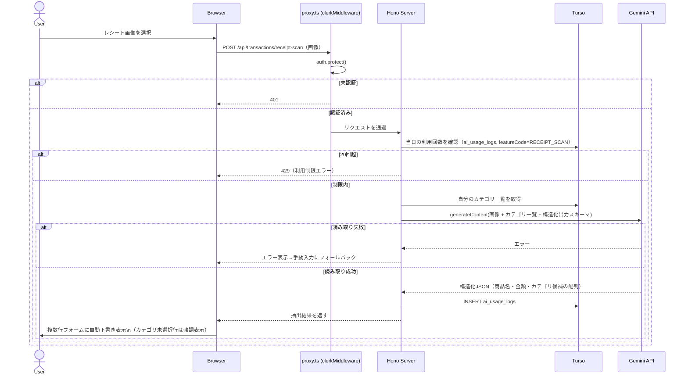
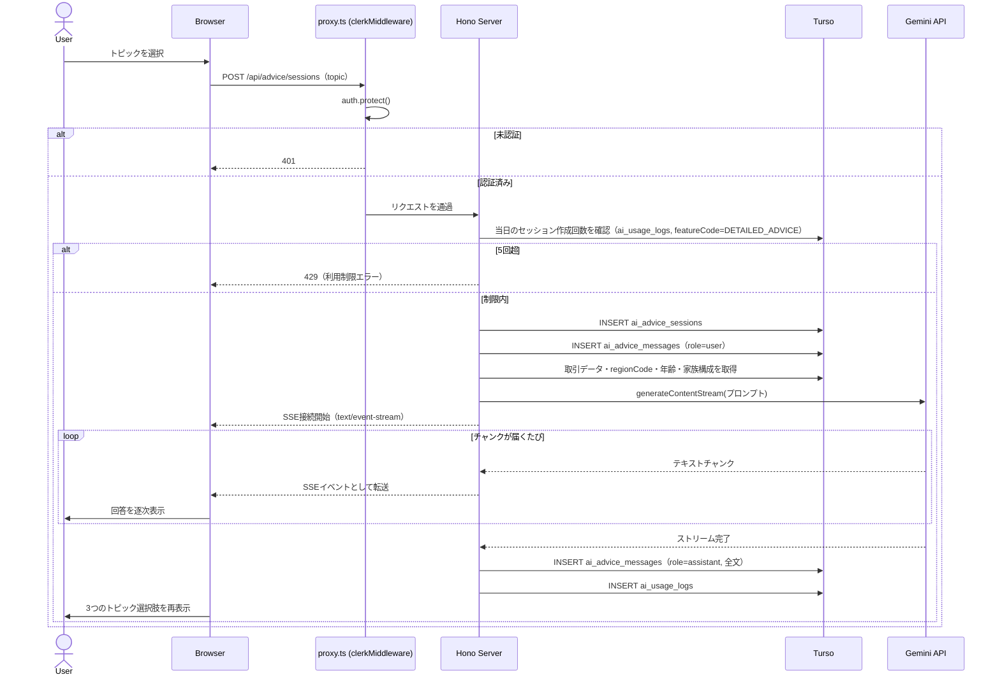

# AI機能

Google Gemini APIを利用する3つの機能。採用理由・全体方針は[stack.md](../../architecture/decisions/stack.md#ai-google-gemini-api)を参照。専用の独立画面は持たず、それぞれ関連する既存画面に組み込む。

| featureCode | 機能 | 組み込み先 |
|---|---|---|
| `RECEIPT_SCAN`(1) | レシート読み取り・自動入力 | [取引記録](./transactions.md)の登録フォーム（「単発」） |
| `EXPENSE_ANALYSIS`(2) | 簡易支出分析 | [ダッシュボード](./dashboard.md)の一部 |
| `DETAILED_ADVICE`(3) | 本格的アドバイス | 独立画面（`(app)/advice`） |

## 1. レシート読み取り・自動入力（`RECEIPT_SCAN`）

[取引記録の登録フォーム（単発）](./transactions.md#追加フォームの構造単発複数行入力)に「レシートから読み取る」ボタンを設け、画像をGemini APIに送信して複数行フォームを自動下書きする。

**画像入力**: カメラ起動・ファイル選択（アップロード）の両方に対応する（`<input type="file" accept="image/*" capture>`相当。ボタンは1つで、スマートフォンではOSの選択メニュー経由でカメラ起動・ギャラリー選択のどちらも呼び出せる。2026-06-23決定）。

レシート読み取りはこのアプリの強みのため、[「+取引を追加」フローティングボタン](../../architecture/overview.md#app-レイアウト構成)から「手入力で記録」と同じ優先度で選べるようにする。FABタップ時に「手入力で記録」「レシートで記録」の2択を表示し、「レシートで記録」を選ぶと単発フォームをレシート読み取りUIが開いた状態で表示する（フォーム自体は共通で、入口だけ2つある）。

**抽出する内容:**
- レシートが複数商品の明細を含む場合、**商品ごとに複数行を一括下書きする**（取引記録の複数行入力フォームをそのまま活用）
- 各行: 商品名→メモ、金額→amount、レシートの日付→取引日（全行共通）
- **カテゴリも提案する**: そのユーザーが選択可能なカテゴリ一覧（システムデフォルト+自分のカテゴリ）をプロンプトに含め、Geminiの構造化出力機能で「存在するカテゴリの中から選ぶ」ように制約する。商品名から判断できない場合は未選択のままにする
- 下書き結果はそのままフォームに反映されるだけで、**取引としては未確定**。ユーザーが内容（特にカテゴリ）を確認・修正してから登録ボタンを押す
- 出力は構造化JSON（複数行+カテゴリ）のため、ストリーミングはせず**一括表示**とする（不完全なJSONを画面に流すメリットが薄い）
- カテゴリは[取引記録のバリデーション](./transactions.md#バリデーション)で必須のため、AIが提案できずに**未選択のままの行は、送信前に分かるよう枠を強調表示する**（送信ボタンを押してから初めてバリデーションエラーで気づく、という体験を避ける）

**解析中:** 画像送信後、結果が返るまで登録フォーム全体を覆う半透明のローディングオーバーレイ（「レシートを解析中...」+スピナー）を表示し、フォームの入力・送信ボタンを`disabled`にする（[一括表示](#1-レシート読み取り自動入力receipt_scan)のためストリーミング表示はせず、結果が揃うまでフォームの操作自体をブロックする。2026-06-23決定）。

**エラー時:** Geminiが画像を読み取れない場合（不鮮明・非対応形式等）はエラーを表示し、通常の手動入力にフォールバックする。

**利用制限:** 1日あたり20回まで（`ai_usage_logs`で当日のカウントを判定）。



## 2. 簡易支出分析（`EXPENSE_ANALYSIS`）

[ダッシュボード](./dashboard.md)はメンバーごとにスライドで切り替える構成（[詳細](./dashboard.md)参照）であり、簡易支出分析も**スライドに連動してメンバーごとに生成・表示する**短いコメント（例:「今月の支出は前月より15%増えています」）。

**キャッシュ方式:** スライド表示ごとにGeminiを呼び出すとコスト・レイテンシが大きいため、**メンバーごとに1日1回のみ生成し、`ai_usage_logs`に結果をキャッシュする**。

- `ai_usage_logs`に`content`（生成結果。text、nullable）・`family_member_id`（nullable。`EXPENSE_ANALYSIS`でのみ使用）カラムを追加し、ログテーブルとキャッシュを兼用する
- スライド表示時: 当日の`(userId, featureCode=EXPENSE_ANALYSIS, familyMemberId)`の`ai_usage_logs`行が存在するか確認
  - あれば: `content`をそのまま表示（Gemini呼び出しなし）
  - なければ: そのメンバーのその月の取引データ（合計・カテゴリ別集計など）をテキストでGeminiに送信し、結果を`content`に保存して表示
- 1〜2文程度の短いコメントで生成も速いため、ストリーミングはせず**一括表示**とする

## 3. 本格的アドバイス（`DETAILED_ADVICE`）

独立画面（`(app)/advice`）。居住地域・年齢・家族構成を考慮した評価・節約アドバイスを行う。

**初期選択肢（トピック）:**
1. 支出評価（同地域・同年代との比較）
2. 節約アドバイス
3. 家族構成を考慮した分析

**将来のチャット拡張を見据えたデータ構造:**

v1では「トピックを選ぶ→回答を1件もらう」だけだが、将来的に回答への追加質問（チャット形式）への拡張を想定し、最初から「セッション+メッセージ」の構造で保存する。

```
ai_advice_sessions: id, userId, topic, createdAt
ai_advice_messages: id, sessionId, role(user/assistant), content, createdAt
```

- トピック選択時: `ai_advice_sessions`を1件作成し、選択内容を`ai_advice_messages`にuserメッセージとして1件保存
- Geminiへのプロンプトには、取引データ・居住地域（`regionCode`）・年齢（`family_members`の本人の`birthday`から算出）・家族構成（`family_members`の続柄構成）を含める
- 応答は**SSE（`text/event-stream`）で逐次表示する**（Geminiの`generateContentStream`を使用）。長文になるため、一括表示だと待たされている感が強く、将来のチャット拡張（チャットUIは基本ストリーミング表示が前提）にも合わせやすい。ストリーム完了後、全文を`ai_advice_messages`にassistantメッセージとして1件保存する（チャンクごとのDB書き込みは行わない）
- v1では追加質問の入力UIは作らない（1トピック=1往復のみ）。将来追加質問欄を実装する場合も、同じ`ai_advice_messages`に新しい行を追加するだけで対応できる
- 回答を表示した後、画面下部に同じ3つのトピック選択肢を再表示する。別のトピック（または同じトピック）を選ぶと**新しいセッションが作られる**（既存セッションへの追記ではない）。これは将来のチャット拡張（同一セッションへの追加質問）とは別物なので混同しない

**利用制限:** 1日あたり5セッションまで（`ai_usage_logs`で当日のセッション作成回数を判定）。



## 共通方針

- Gemini APIはサーバーサイド（Honoハンドラ内）でのみ呼び出す（[stack.md](../../architecture/decisions/stack.md#ai-google-gemini-api)）
- すべての利用を`ai_usage_logs`に記録する（`featureCode`で区別）
