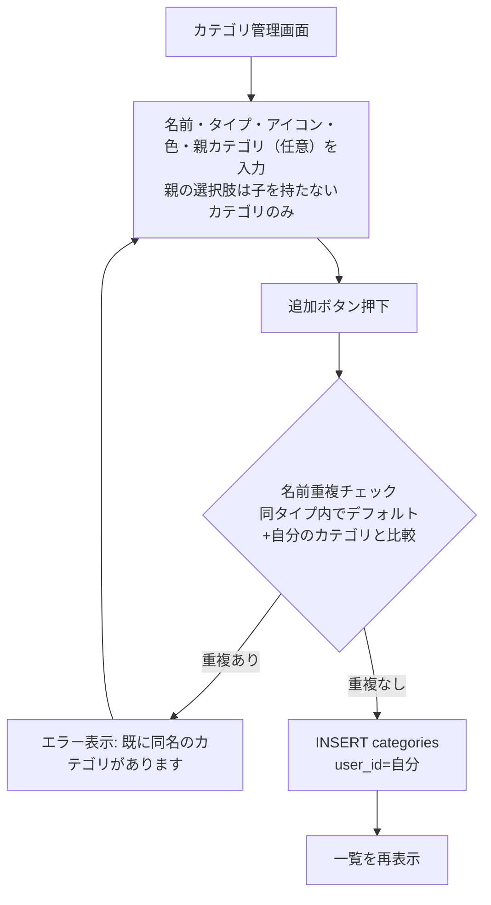
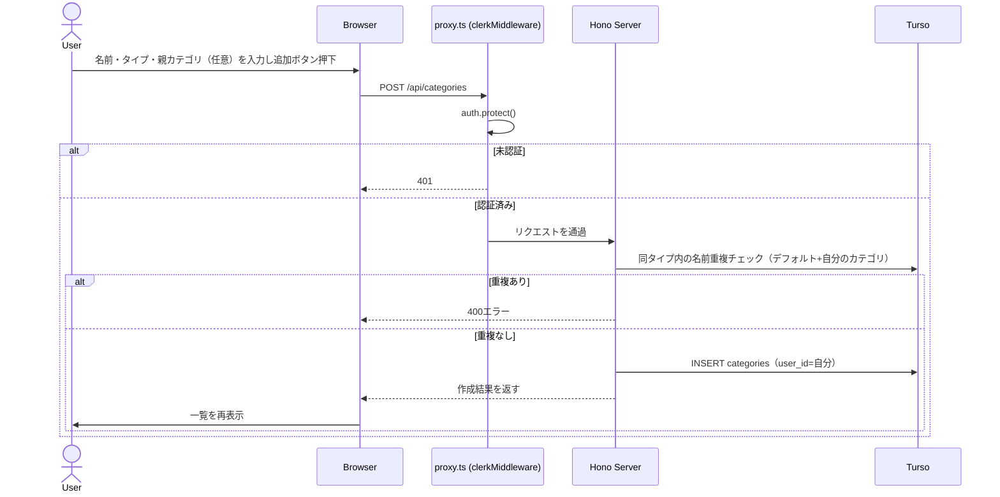
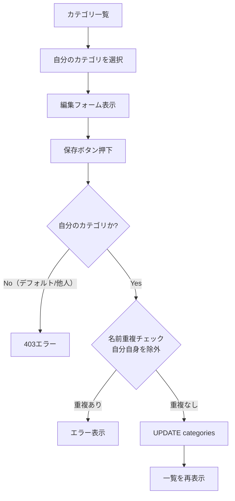
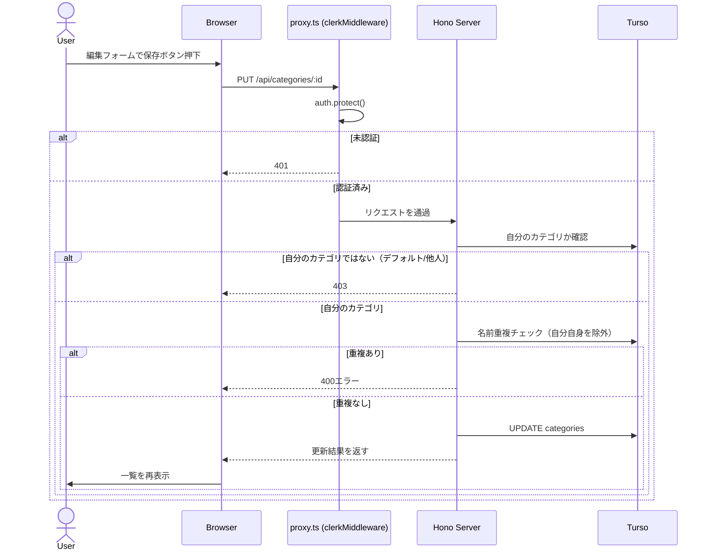
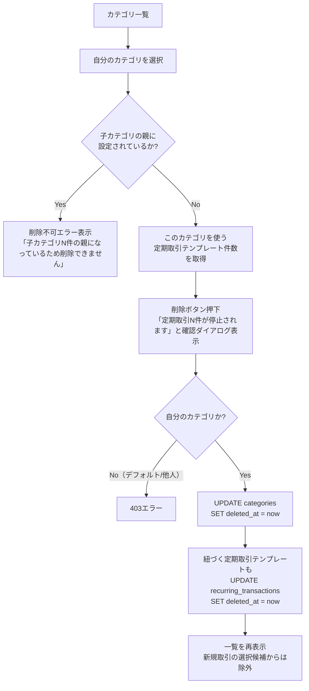
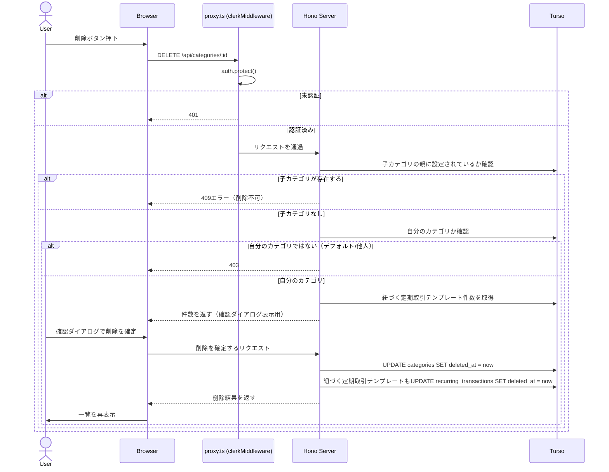
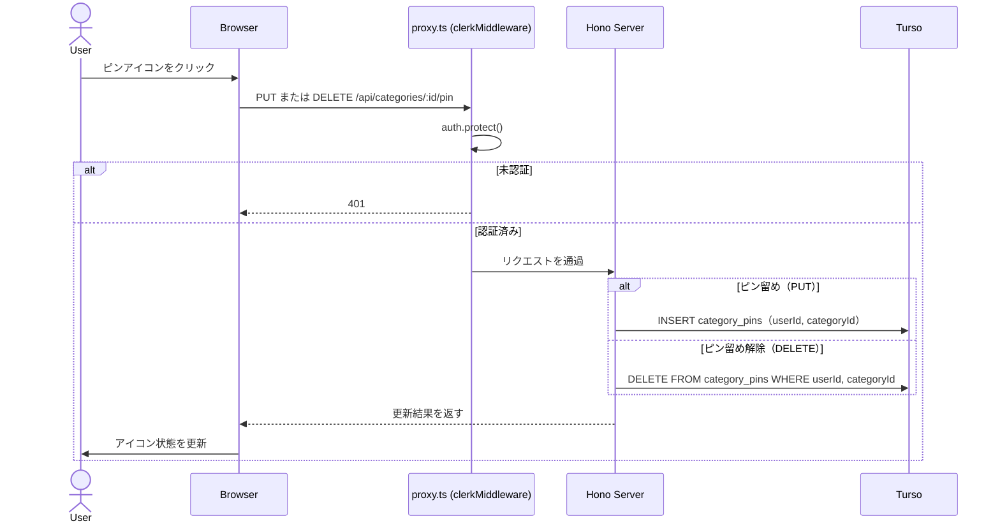

# カテゴリ管理

## 概要

取引記録（収入・支出）に紐づくカテゴリを管理する。`categories.user_id` が `NULL` のレコードはシステムデフォルトカテゴリとして全ユーザーに共通表示される。ユーザーは独自カテゴリの追加・編集・削除が可能（システムデフォルトは追加のみで編集・削除不可）。

**削除は論理削除（`deletedAt`）で行う**（`family_members` と同じパターン）。物理削除すると `transactions.category_id` が参照する行が消え、過去の取引のカテゴリ表示が壊れるため。論理削除済みのカテゴリは新規取引時の選択候補からは除外されるが、過去の取引・集計画面では引き続き元の名前で表示される（その取引が実際にそのカテゴリで記録された事実は変わらないため、「その他」への混在はしない）。

現状の `packages/db/src/schema/categories.ts` には `deletedAt`・`icon`・`color` カラムが存在しないため、実装時にマイグレーションで追加する（[tasks/categories.md](../../tasks/features/categories.md) 参照）。

## デフォルトカテゴリ（`userId = NULL`）

一般的な家計簿アプリの分類を仮定する。実装時にマイグレーションのseed dataとして投入する。

**支出（`CATEGORY_TYPE.EXPENSE`）**

食費・交通費・住居費・光熱費・通信費・医療費・被服費・日用品費・娯楽費・教育費・保険料・その他

このうち**住居費・食費・光熱費は、ユーザー作成時に初期状態でピン留め**（[カテゴリの固定表示](#カテゴリの固定表示ピン留め)参照）される。

**収入（`CATEGORY_TYPE.INCOME`）**

給与・ボーナス・副業・その他

## カテゴリアイコン・背景色

各カテゴリは一覧・グラフ上での視認性のため、アイコンと背景色を1つずつ持つ。いずれもユーザーが個々に作成するものではなく、**キュレーションされた候補から選ぶ**方式に統一する（自由なアップロード・RGB入力は持たない）。

### アイコン

- **データ構造**: `categories.icon`（必須、text）に[lucide-react](https://lucide.dev/)のアイコン名（例: `Utensils`）を保存する
- **選択方法**: カテゴリ作成・編集フォームに、用途に合うものをキュレーションした一覧（20〜30種程度。食費・交通費・住居費等の支出カテゴリ、給与・副業等の収入カテゴリでよく使われるアイコンを中心に選定）から選ぶピッカーUIを設置する。一覧外のlucide-reactアイコンは選択できない
- **デフォルト値**: フォームで未選択の場合は汎用アイコン（`Tag`）を自動設定する。バックエンドは常に値を受け取るため、`icon`をnullableにしない

### 背景色

- **データ構造**: `categories.color`（必須、text）にキュレーションした色のキー（例: `orange`）を保存する
- **選択方法**: 8〜10色程度のパステルカラースウォッチ（[style-guide.mdのカラーパレット](../../design/style-guide.md#カラーパレット)の範囲内。ビビッドカラー・収支/削除など既に意味を持つ色は対象外）から選ぶ。アイコンを選んだ時点で用途に合う色を自動でプリセットし（例: 食費系アイコン→オレンジ系）、ユーザーが任意で上書きできる
- **デフォルト値**: 上書きしなければ自動プリセットされた色をそのまま使う（`icon`と同様、`color`もnullableにしない）
- 同じアイコンを選んだ別カテゴリ同士でも、色を変えることで一覧上で見分けられるようにする狙い
- **ダッシュボードの円グラフの動的カラー生成（[dashboard.md](./dashboard.md#3-カテゴリ別グラフ円グラフ)、金額順位に応じて月ごとに変動）とは独立した別の仕組み**。こちらはカテゴリ自体に固定された見た目で、月によって変わらない

デフォルトカテゴリ（[食費・交通費等](#デフォルトカテゴリuserid--null)）にも、種目に合うアイコン・色をあらかじめ設定してseed dataに含める。

## カテゴリ数の上限について

ユーザーが作成できるカテゴリ数に上限は設けない。グラフの色が足りなくなる懸念があるが、これはカテゴリ管理側で件数を制限するのではなく、**ダッシュボードのグラフ表示側**で対応する（動的カラー生成 + 上位N件＋「その他」への集約表示。詳細は[dashboard.md](./dashboard.md#3-カテゴリ別グラフ円グラフ)で定義する）。

## カテゴリの固定表示（ピン留め）

[ダッシュボードのカテゴリ別円グラフ](./dashboard.md#3-カテゴリ別グラフ円グラフ)は金額上位5件+「その他」で表示するが、カテゴリの分け方は世帯ごとに異なる（例: 「光熱費」を1つにまとめるか「電気代」「ガス代」「水道代」に分けるか）ため、分け方が細かい世帯ほど重要なカテゴリが上位から漏れやすい。また月によって表示されるカテゴリが入れ替わると比較しづらい。

これに対応するため、ユーザーが任意のカテゴリを「常にグラフに表示する」よう固定できるようにする。ピン留めされたカテゴリは金額のランキングに関わらず必ず表示され、残りの枠を金額上位のカテゴリで埋める。

**データ構造について**: デフォルトカテゴリ（`user_id IS NULL`）は全ユーザーで1行を共有しているため、`categories`テーブルに直接`is_pinned`カラムを持たせると「あるユーザーがピン留めすると全ユーザーに反映される」という事故になる。ピン留めは「カテゴリ自体の属性」ではなく「ユーザーごとのカテゴリへの関心」なので、**別の中間テーブル`category_pins`で管理する**（お気に入り・いいね機能などで使われる典型的なパターン）。

```
category_pins: id, userId, categoryId, createdAt
（userId, categoryId）に一意制約
```

`is_pinned`というbooleanカラムは持たない。**「行が存在する=ピン留めしている」**というシンプルな方式とする（ピン留め: INSERT、ピン留め解除: DELETE）。ユーザー独自のカテゴリも、一貫性のため同じ仕組みでピン留めを管理する（カテゴリ側に`is_pinned`は持たせない）。

UI上のアイコンは**ピンアイコン**（線のみ/塗りの2状態）を使用する。「ピン留め」という機能名に対して星アイコンは意味的に合わないため（星は[家族構成管理のデフォルトメンバー](./family-members.md#業務フロー-デフォルトメンバー変更)のような「お気に入り・既定」を表す用途と区別する）。

- ピン留めは自分のカテゴリ・システムデフォルトカテゴリのどちらにも設定可能（カテゴリ一覧画面でトグル切り替え。[家族構成管理のデフォルトメンバー切り替え](./family-members.md#業務フロー-デフォルトメンバー変更)と同様、一覧画面のみで完結する）
- システムデフォルトカテゴリのうち**住居費・食費・光熱費は、ユーザー作成時（プロフィール設定完了時）にそのユーザー向けの`category_pins`が3件INSERTされ、初期状態でピン留み済みになる**。それ以外はユーザーが必要に応じて設定する
- ピン留めできる件数に上限は設けない（5件を超えてピン留めした場合、ダッシュボード側で「ピン留めカテゴリのみで5枠が埋まる」ケースの扱いは[dashboard.md](./dashboard.md#3-カテゴリ別グラフ円グラフ)を参照）

## 親カテゴリ（グラフ上のグルーピング）

光熱費のように、世帯によって「1つのカテゴリにまとめる」か「電気代・ガス代・水道代に分ける」かが異なるカテゴリがある。分けて記録する世帯ほど[カテゴリ別円グラフ](./dashboard.md#3-カテゴリ別グラフ円グラフ)で個々の金額が小さくなり、上位から漏れやすい・ピン留めの枠も多く消費してしまうという不公平が生まれる。

これに対応するため、カテゴリに`parent_id`（自己参照、**1階層のみ**）を持たせ、グラフ集計時は**子カテゴリの金額を親カテゴリに合算してから**ランキング・ピン留め判定を行う（例: 電気代・ガス代・水道代の親を「光熱費」に設定すると、グラフ上は「光熱費」1枠にまとまって表示される）。

- 親カテゴリ自身も通常のカテゴリとして直接取引登録に使える（分けたくない月だけ「光熱費」に直接登録するなど、柔軟に使える）
- 親には「子を持たないカテゴリ」のみ選択可能（2階層以上のネストは不可）。デフォルトカテゴリも親として選択できる
- 親と子は**同じ`typeCode`**（支出/支出、収入/収入）でなければならない
- **子カテゴリを持つ親カテゴリは削除できない**（[定期取引](./recurring-transactions.md)テンプレートのような自動カスケードは行わない。削除しようとした場合は「子カテゴリ（N件）の親として設定されているため削除できません。先に各子カテゴリの親設定を解除してください」とエラー表示する）。削除前にユーザー自身が「グルーピングをやめる（各子の`parentId`をNULLに変更）」か「子カテゴリ自体を削除する」かを明示的に選ぶ必要がある
- ピン留めとは別の仕組みとして併存する（親カテゴリで「複数カテゴリを1枠にまとめる」、ピン留めで「そのまとめたカテゴリを必ず表示する」という役割分担）

**発見しやすさへの配慮**: この機能はユーザーが「カテゴリを分けて作る→親を設定する」と能動的に気づいて使う必要があるため、専用のチュートリアルは作らない代わりに（[tasks/categories.md](../../tasks/features/categories.md#将来検討今回はスコープ外)参照）、**カテゴリ作成・編集フォームの「親カテゴリ」項目の近くに常設のヘルプテキストを表示する**（例:「既存のカテゴリを親に設定すると、グラフでは合算して1枠で表示されます（例: 電気代・ガス代・水道代→光熱費）」）。これにより、ユーザーがカテゴリを分けて作ろうとした瞬間にこの機能に気づける。

### 一覧での開閉表示

子カテゴリを持つ親カテゴリの行には、開閉トグル（▾/▸等）を表示する。初期状態は展開（子カテゴリが見える状態）。開閉状態はクライアント側のコンポーネント状態としてのみ保持し、サーバーには保存しない（ページの再読み込みでは常に展開状態にリセットされる）。

## カテゴリ一覧の取得

ユーザーに見えるカテゴリは「システムデフォルト（`userId IS NULL`）」+「自分が作成したカテゴリ（`userId = 自分`）」の合算。`typeCode`（支出/収入）でフィルタして取得する。

## 一覧の並び順

カテゴリ一覧は以下の順で表示する。

1. システムデフォルトカテゴリ（`userId IS NULL`）: [デフォルトカテゴリ](#デフォルトカテゴリuserid--null)の列挙順（固定）
2. 自分が作成したカテゴリ: 作成日時（`createdAt`）の昇順

[親カテゴリ](#親カテゴリグラフ上のグルーピング)を持つカテゴリは、子カテゴリを親の直下にグルーピング表示する（親自身の並びは上記ルールに従い、子同士の並びにも同じ昇順ルールを適用する）。

ユーザーによる並び替え・ソート切り替え機能は持たない（[将来検討](#将来検討スコープ外)参照）。

## 権限ルール

| 操作 | システムデフォルト | 自分のカテゴリ | 他ユーザーのカテゴリ |
|---|---|---|---|
| 参照 | 可 | 可 | 不可（そもそも取得対象に含まれない） |
| 追加 | - | 可 | - |
| 編集 | 不可 | 可 | 不可 |
| 削除（論理削除） | 不可 | 可 | 不可 |

## バリデーション

| 項目 | 規則 |
|---|---|
| 名前 | 必須・最大50文字 |
| タイプ | `CATEGORY_TYPE`（支出/収入）のいずれか・必須。**新規作成時のみ指定可、編集APIのリクエストスキーマには含めない**（[家族構成管理の続柄](./family-members.md#バリデーション)と同じ考え方。`transactions`はカテゴリの`typeCode`で支出/収入を判定するため、作成後にタイプを変更すると過去の取引の解釈が遡って変わってしまう事故を防ぐ） |
| 名前の重複 | 同一タイプ内で、システムデフォルト + 自分のカテゴリを含めて重複不可（編集時は自分自身を除外して判定） |
| 親カテゴリ（`parentId`） | 任意。選択可能なのは「子を持たない（`parentId IS NULL`かつ他のカテゴリの親になっていない）」カテゴリのみ。親と`typeCode`が一致している必要がある |
| アイコン（`icon`） | 必須。[キュレーションした一覧](#カテゴリアイコン背景色)に含まれるlucide-reactのアイコン名のいずれか |
| 背景色（`color`） | 必須。[キュレーションしたスウォッチ](#カテゴリアイコン背景色)に含まれる色キーのいずれか |

## 業務フロー: カテゴリ追加





## 業務フロー: カテゴリ編集





この編集フローは[取引登録フォーム](./transactions.md#既存カテゴリ取引先の編集インライン即時反映)からも同じDialogを呼び出せる（取引登録中に選択中のカテゴリの名前・アイコン・色を直接編集し、保存後はそのまま取引登録フォームに戻る）。挙動・APIは完全に同一で、呼び出し元が異なるだけ。

## 業務フロー: カテゴリ削除

このカテゴリを使う[定期取引](./recurring-transactions.md)テンプレートがある場合、削除と同時にそのテンプレートも自動停止する（停止後は新規生成が止まるが、生成済みの取引は残る）。ユーザーが後で「なぜ給料が記録されなくなったのか」と困惑しないよう、削除前に件数を表示する確認ダイアログを出す（[家族構成管理](./family-members.md#業務フロー-家族メンバー削除)の削除も同じ方針）。

一方、**子カテゴリを持つ親カテゴリは削除不可**（[親カテゴリ](#親カテゴリグラフ上のグルーピング)参照）。これは定期取引のような自動カスケードではなく、ユーザーに先に対応（グループ解除または子カテゴリ削除）させるためのブロックとする。





## 業務フロー: カテゴリのピン留め・解除



## 将来検討（スコープ外）

- **一覧のソート切り替え・フィルター**: ユーザーが任意の順序（名前順・使用頻度順等）に並び替えたり、絞り込んだりする機能。現時点ではカテゴリ数が少ない想定のため、[固定の並び順](#一覧の並び順)のみとする

## APIエンドポイント

| メソッド | パス | 説明 |
|---|---|---|
| GET | `/api/categories` | カテゴリ一覧取得（`typeCode`クエリでフィルタ可。デフォルトでは`deletedAt`がNULLのもののみ） |
| POST | `/api/categories` | カテゴリ新規作成。リクエストボディに`icon`・`color`（[キュレーションした候補](#カテゴリアイコン背景色)）を含む |
| PUT | `/api/categories/:id` | カテゴリ編集（自分のカテゴリのみ）。`icon`・`color`の変更も可能 |
| PUT | `/api/categories/:id/pin` | ダッシュボードでの固定表示をピン留め（`category_pins`にINSERT。システムデフォルトカテゴリにも設定可能） |
| DELETE | `/api/categories/:id/pin` | ピン留め解除（`category_pins`から自分の行をDELETE） |
| DELETE | `/api/categories/:id` | カテゴリ論理削除（自分のカテゴリのみ） |
