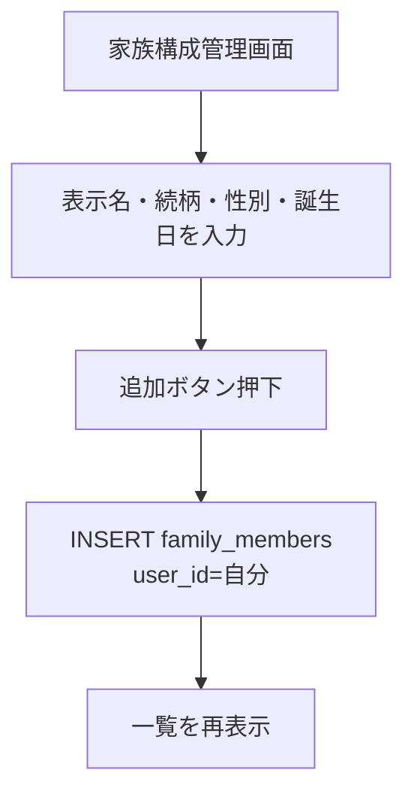
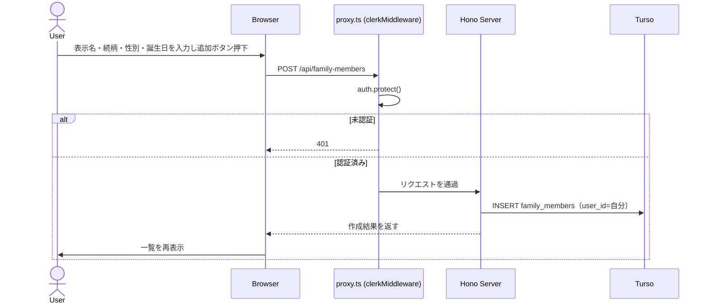
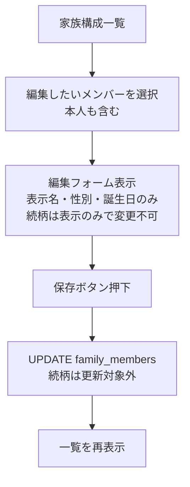
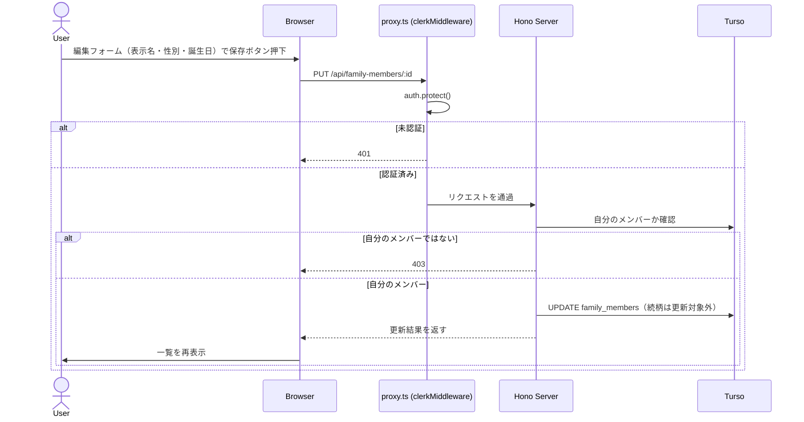
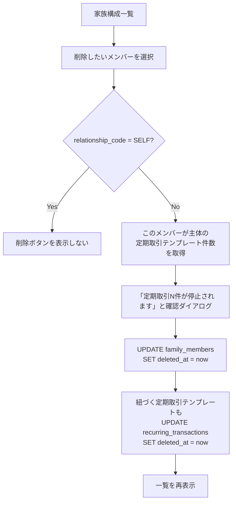
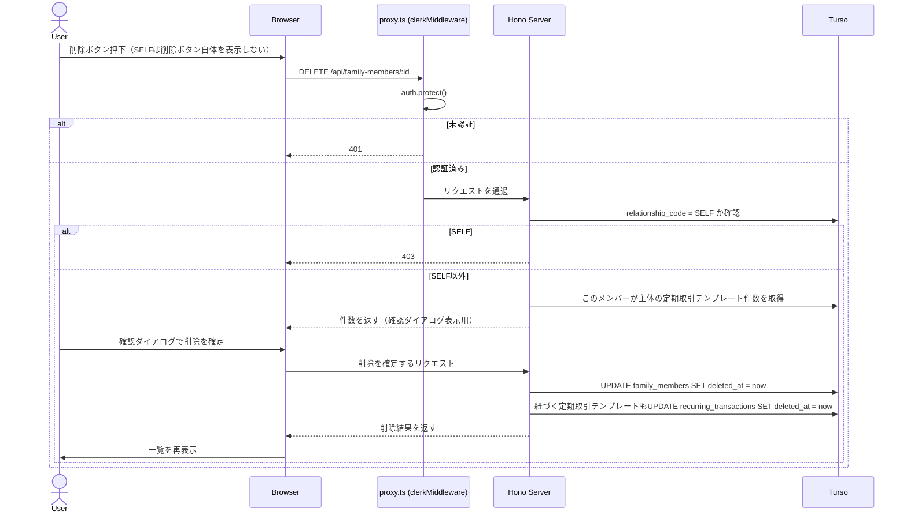
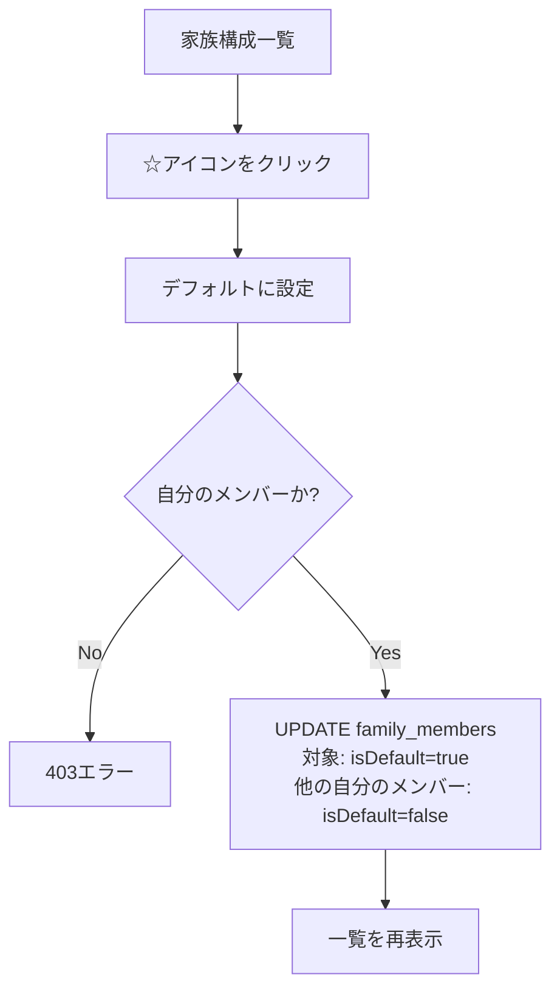
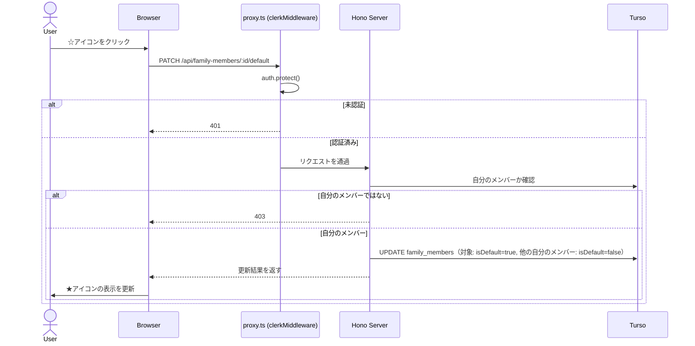

# 家族構成管理

## 概要

取引記録時に「誰の取引か」を選択するための家族メンバーを管理する。「本人」（`relationship_code = RELATIONSHIP_CODE.SELF`）レコードはプロフィール設定時に自動作成されており（[profile-setup.md](./profile-setup.md)参照）。

**続柄（`relationship_code`）は新規作成時に指定し、以降は全メンバー共通で編集不可**とする（本人を特別扱いせず、統一ルールとする）。表示名・性別・誕生日は本人を含めた全メンバーが編集可能。本人レコードのみ削除不可（家族メンバー管理上、ユーザー自身の存在を表すレコードのため）。

### 本人（SELF）のみの追加編集項目: 居住地域

[プロフィール設定](./profile-setup.md)で登録した`users.regionCode`（居住地域）は、初回登録後に更新するAPIが存在しなかった（引っ越し等で変更する手段がない）。専用の設定画面は作らない方針（[アーキテクチャ](../../architecture/overview.md#app-レイアウト構成)参照）のため、**本人（`relationship_code = SELF`）の編集フォームにのみ、表示名・性別・誕生日と並べて居住地域の項目を追加**し、ここから更新できるようにする（配偶者・子等の編集フォームには表示しない。居住地域はユーザー単位の情報であり家族メンバー単位の情報ではないため）。

これにより単身の利用者にとっても、「家族構成管理」が実質的に「本人のプロフィール編集」を兼ねる場所になる。一覧の「本人」行・編集フォームに「ご自身の情報もここで編集できます」等の説明を添え、家族がいない場合でもこの画面を開く理由が伝わるようにする。

`PUT /api/family-members/:id`は、対象が`SELF`の場合のみリクエストボディに`regionCode`を受け付け、`family_members`の更新と同時に`users.regionCode`も更新する（1つのAPIで2テーブルを更新するため、トランザクションで実行する）。`SELF`以外の対象に`regionCode`が送られても無視する。

削除は論理削除（`deletedAt`。既存スキーマに実装済み）で行う。`family_members`は[カテゴリ管理](./categories.md)と同じ理由（取引履歴の参照整合性を保つため）で論理削除を採用している。

## デフォルトメンバー（`isDefault`）

[取引記録](./transactions.md)の追加フォームで、家族メンバー選択の初期値として使う。買い物の頻度が高い人を毎回選び直す手間を減らす一方、「たまに違う人」のケースで選び忘れる事故を完全には防げないため、追加フォーム側でも選択中のメンバーを目立つように表示する運用とする（詳細は[transactions.md](./transactions.md)参照）。

- ユーザーごとに必ず1人だけ`isDefault = true`になる（新しいメンバーをデフォルトに指定すると、それまでのデフォルトは自動で`false`になる）
- 初期値はプロフィール設定時に作成される「本人」レコード
- デフォルトに指定されているメンバーが論理削除された場合、自動的に「本人」をデフォルトに戻す（本人は削除不可のため、フォールバック先として安全）

現状の`packages/db/src/schema/familyMembers.ts`には`isDefault`カラムが存在しないため、実装時にマイグレーションで追加する（[tasks/family-members.md](../../tasks/features/family-members.md)参照）。

## 一覧の並び順

「本人」（`relationship_code = SELF`）を常に先頭に固定表示し、以降は続柄（`RELATIONSHIP_CODE`）の順（配偶者→子→親→その他）で表示する。同じ続柄が複数いる場合は作成日時（`createdAt`）の昇順とする。

ユーザーによる並び替え・ソート切り替え機能は持たない（家族構成は人数が少ない想定のため）。

## バリデーション

| 項目 | 規則 |
|---|---|
| 表示名 | 必須・最大50文字 |
| 続柄（`RELATIONSHIP_CODE`） | 必須。配偶者・子・親・その他はいずれも人数上限なし。**新規作成時のみ指定可、編集APIのリクエストスキーマには含めない**（一度設定したら変更不可） |
| 性別（`GENDER_CODE`） | 必須 |
| 誕生日 | 必須（日付） |
| 居住地域（`regionCode`） | SELFの編集時のみ任意項目として受け付ける（REGION_MAPのコード値・[overview.md](../overview.md#コード値定義)参照）。SELF以外では受け付けない |

人数・名前の重複チェックは行わない（同姓同名の家族が存在しても問題ないため）。

## 権限ルール

| 操作 | 本人（`SELF`） | 配偶者・子・親・その他 |
|---|---|---|
| 参照 | 可（一覧表示） | 可 |
| 追加 | 不可（プロフィール設定時に自動作成済み） | 可 |
| 編集（表示名・性別・誕生日） | 可 | 可 |
| 編集（続柄） | 不可（全メンバー共通で不可） | 不可（全メンバー共通で不可） |
| 削除（論理削除） | 不可 | 可 |

## 業務フロー: 家族メンバー追加

## 業務フロー: 家族メンバー編集

## 業務フロー: 家族メンバー削除

このメンバーが主体になっている[定期取引](./recurring-transactions.md)テンプレートがある場合、削除と同時にそのテンプレートも自動停止する（[カテゴリ管理](./categories.md#業務フロー-カテゴリ削除)の削除と同じ方針）。削除前に件数を表示する確認ダイアログを出す。

## 業務フロー: デフォルトメンバー変更

一覧の各行に☆/★（スター）アイコンを表示し、クリックでそのメンバーをデフォルトに切り替える（編集フォームを開く必要はなく、一覧画面のみで完結する）。現在のデフォルトメンバーは★（塗りつぶし）、他は☆（枠線のみ）で表示する。

アイコンのみだと意味が伝わりにくいため、以下のいずれかで意味を明示する。
- アイコンにhover時のツールチップ（例:「デフォルトメンバーに設定」「デフォルトメンバーです」）を付ける
- 一覧の見出し付近に凡例（例:「★ = 取引記録時の初期選択」）を表示する

## 削除済みメンバーの扱い

論理削除されたメンバーは、新規取引記録時の「家族メンバー選択」候補からは除外される。一方で、過去に登録された取引（`transactions.family_member_id`が参照）では引き続き元の表示名で表示される（[カテゴリ管理](./categories.md#概要)の論理削除と同じ考え方）。

## APIエンドポイント

| メソッド | パス | 説明 |
|---|---|---|
| GET | `/api/family-members` | 家族メンバー一覧取得（デフォルトでは`deletedAt`がNULLのもののみ） |
| POST | `/api/family-members` | 家族メンバー新規作成 |
| PUT | `/api/family-members/:id` | 家族メンバー編集（リクエストスキーマに`relationship_code`は含めない。本人も編集可。対象が`SELF`の場合のみ`regionCode`を受け付け、`users.regionCode`もトランザクションで更新する） |
| PATCH | `/api/family-members/:id/default` | デフォルトメンバーに設定（自分の他のメンバーの`isDefault`は自動でfalseに） |
| DELETE | `/api/family-members/:id` | 家族メンバー論理削除（`relationship_code = SELF`は403） |
