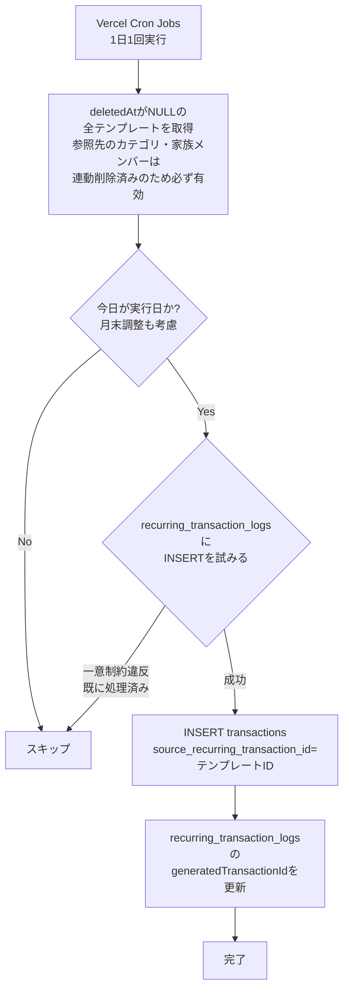
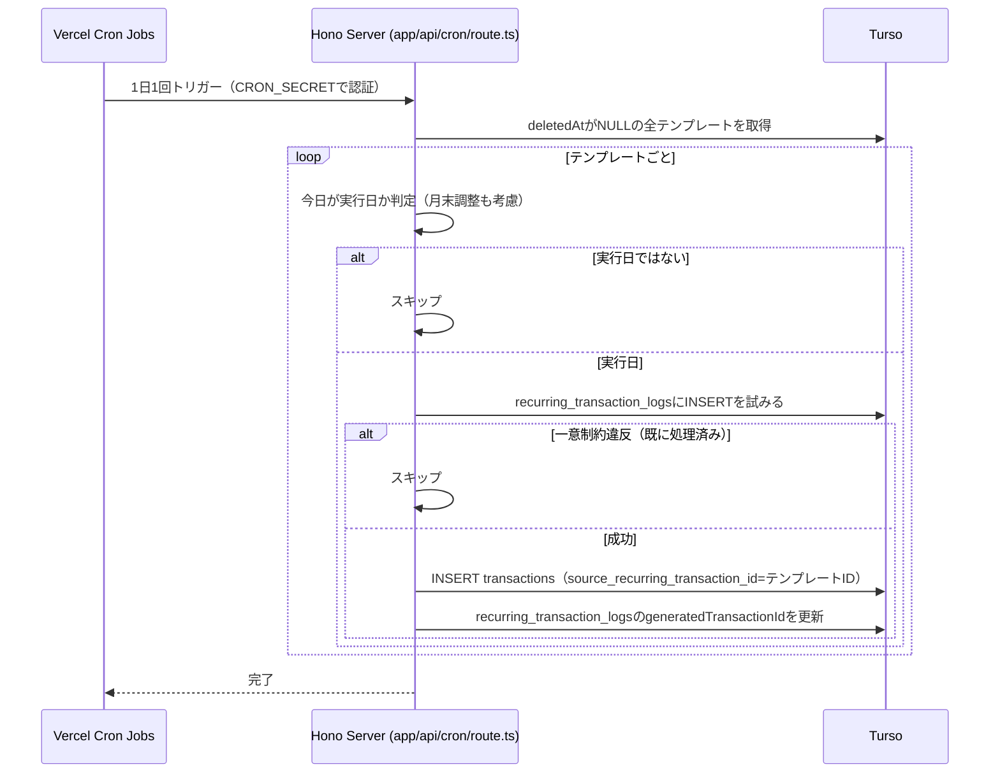
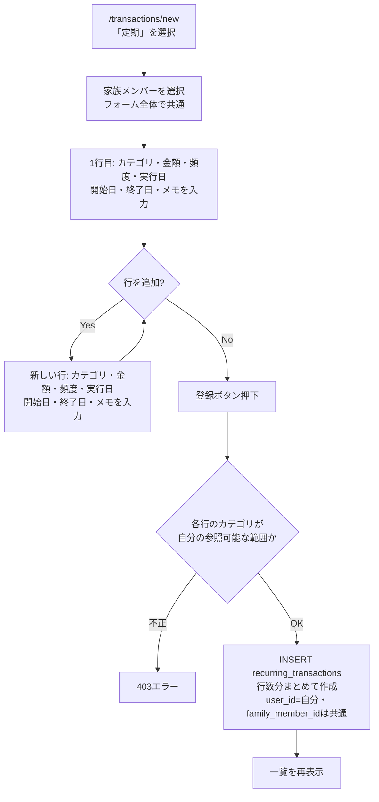
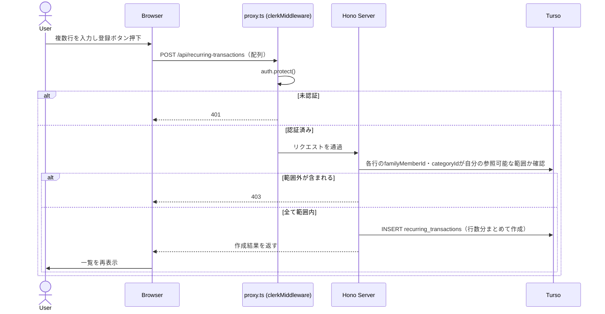
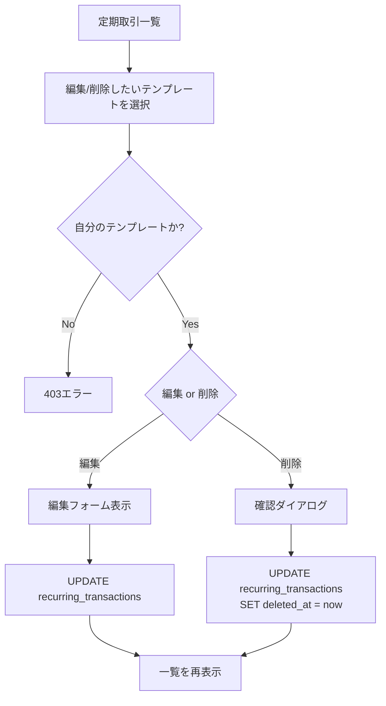
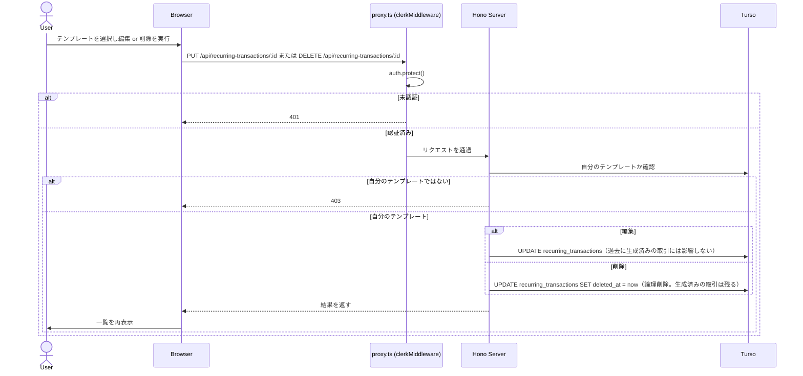
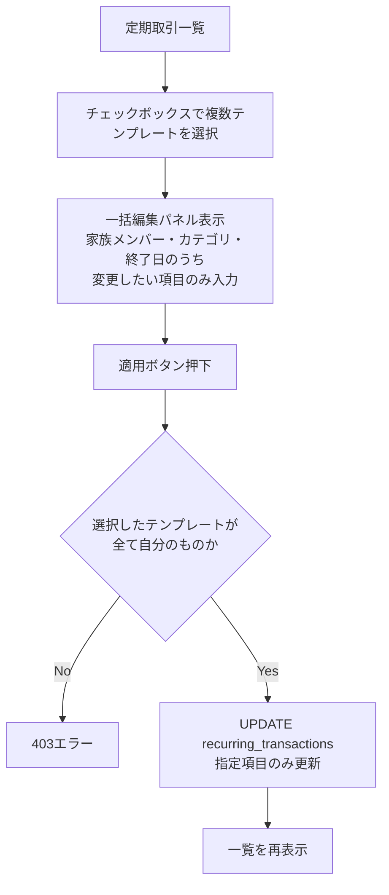
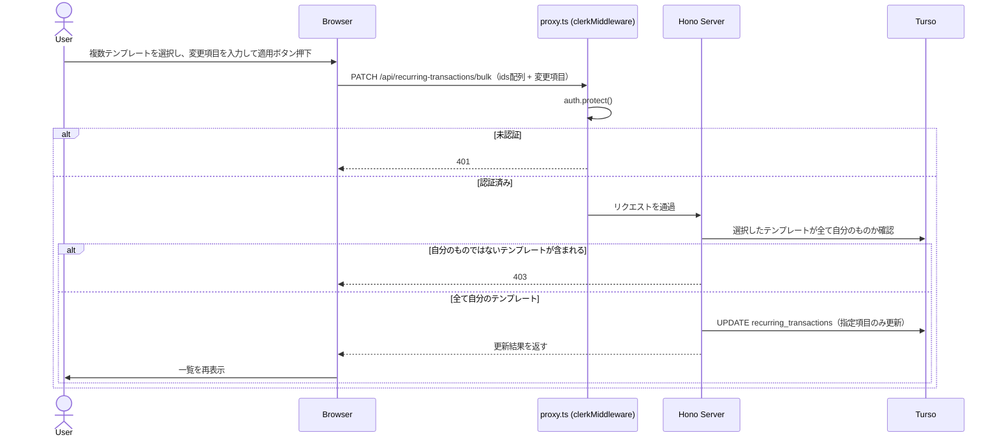

# 定期取引

## 概要

給料・家賃・保険料など、毎月/毎年決まったタイミングで発生する収入・支出を、テンプレートとして登録しておくと自動的に[取引記録](./transactions.md)が生成される機能。

画面構成は[取引記録](./transactions.md#画面構成-取引記録と定期取引の関係)を参照。一覧は`/transactions/recurring`タブ、登録は`/transactions/new`内で「定期」を選択した時に表示されるフォームを使う（取引記録とは別の独立したフォーム・送信先）。

## アーキテクチャ: テンプレート + Vercel Cron Jobsによる自動生成

- 新規テーブル `recurring_transactions` にテンプレートを保存する（家族メンバー・カテゴリ・金額・頻度・実行日・メモ・終了日）
- [Vercel Cron Jobs](https://vercel.com/docs/cron-jobs)で1日1回 `app/api/cron/route.ts` を実行し、「今日が実行日のテンプレート」を判定して`transactions`を生成する
- 生成された`transactions`には、どのテンプレートから生成されたかを記録する `sourceRecurringTransactionId`（nullable）を持たせる（表示・トレーサビリティ用）
- 生成後の`transactions`は通常の取引と同じ扱いになり、個別に編集・削除できる。**テンプレートを編集しても、過去に生成済みの取引は変更されない**（未来の生成分にのみ反映される）

### 冪等性の確保: `recurring_transaction_logs`（処理済みログ）

「同じテンプレート×同じ日付の`transactions`が既に存在するか」を`transactions`テーブルだけで判定すると、**ユーザーが生成済みの取引を削除した場合に再生成されてしまう**（例: サブスク解約後、生成された今月分を削除したのに、翌日のCronが「未処理」と誤判定して再生成する）。これを防ぐため、生成処理の記録を`transactions`の生存とは独立した台帳テーブルで管理する。

| カラム                   | 説明                                                                                 |
| ------------------------ | ------------------------------------------------------------------------------------ |
| `recurringTransactionId` | テンプレートID                                                                       |
| `scheduledDate`          | その回の発生日                                                                       |
| `generatedTransactionId` | 生成した`transactions`のID（nullable。ユーザーが後で削除しても、このログ自体は残す） |
| `createdAt`              | 処理日時                                                                             |

`(recurringTransactionId, scheduledDate)`に一意制約を設け、Cronが二重実行されてもDB制約レベルで重複処理を防ぐ。Cronの処理順序は「①このログテーブルにINSERTを試みる（一意制約違反なら既に処理済みとしてスキップ）→②成功したら`transactions`をINSERTし、`generatedTransactionId`を更新する」。

## テンプレートのフィールド

| 項目                             | 規則                                                                                                              |
| -------------------------------- | ----------------------------------------------------------------------------------------------------------------- |
| 家族メンバー（`familyMemberId`） | 必須。自分の`family_members`から選択                                                                              |
| カテゴリ（`categoryId`）         | 必須。システムデフォルト or 自分のカテゴリから選択                                                                |
| 金額（`amount`）                 | 必須・正の整数                                                                                                    |
| 頻度（`FREQUENCY_TYPE`）         | 必須。`MONTHLY`（毎月） or `YEARLY`（毎年）の2種類                                                                |
| 実行日                           | 毎月: 日（1〜31）。毎年: 月+日。**指定日がその月に存在しない場合は月末日に調整**（例: 31日指定 → 2月は28日/29日） |
| 開始日                           | 必須。この日以降の発生分から生成する                                                                              |
| 終了日                           | 任意。未設定の場合は無期限に繰り返す                                                                              |
| メモ                             | 任意・最大255文字                                                                                                 |

## 登録フォームの構造（複数行入力）

[取引記録](./transactions.md#追加フォームの構造単発複数行入力)と同様、1回の入力セッションで複数のテンプレートをまとめて登録できる（例: 家賃・電気代・ガス代・水道代をまとめて設定）。

| 項目                                                        | スコープ                                                                                                            |
| ----------------------------------------------------------- | ------------------------------------------------------------------------------------------------------------------- |
| 家族メンバー                                                | フォーム全体で共通（1人）。取引記録の追加フォームと同じ仕様（デフォルトメンバーが初期選択・「（デフォルト）」注記） |
| カテゴリ・金額・頻度・実行日（月/日）・開始日・終了日・メモ | 行ごと（テンプレートごとに頻度や実行日が異なるため、取引日のような「直前の行を引き継ぐ」デフォルトは設けない）      |

カテゴリ選択は[取引記録と同じインライン新規追加](./transactions.md#カテゴリの新規追加インライン)に対応する。

「行を追加」でテンプレート行を増やし、最後に1回の送信で行数分の`recurring_transactions`レコードをまとめて作成する（`POST /api/recurring-transactions`は配列を受け取るバッチ作成とする）。

**空状態**: テンプレートが1件も登録されていない場合、「定期取引はまだ登録されていません」と表示し、`/transactions/new`（「定期」選択状態）への「定期取引を登録」ボタンを併設する（[取引一覧の空状態](./transactions.md#一覧表示フィルター)と同じ考え方）。

## 一覧での一括編集

複数のテンプレートをチェックして、家族メンバー・カテゴリ・終了日をまとめて変更できる（例: 担当者の変更、今年度末で複数のサブスクをまとめて終了させる）。頻度・実行日・金額はテンプレート固有の値のため一括編集の対象外とする（[取引記録](./transactions.md#業務フロー-一括編集誤登録の修正)で金額・メモを対象外とした考え方と同じ）。

## 削除（論理削除）

`transactions.source_recurring_transaction_id`がテンプレートを参照するため、[カテゴリ管理](./categories.md)・[家族構成管理](./family-members.md)と同じ理由で論理削除を採用する。削除（停止）後は新規生成が止まるが、過去に生成済みの取引はそのまま残る。

### カテゴリ・家族メンバー削除との連動（自動停止）

参照している[カテゴリ](./categories.md#業務フロー-カテゴリ削除)または[家族メンバー](./family-members.md#業務フロー-家族メンバー削除)が削除されると、そのテンプレートも連動して自動的に論理削除（停止）される（削除側の画面で確認ダイアログに件数が表示される）。

これにより、**Cronが生成時に「参照先が削除されていないか」を個別にチェックする必要がない**。`deletedAt`がNULLのテンプレートだけを取得すれば、参照先が必ず有効な状態になっていることが保証される。

### 生成時の通知について

定期取引が自動生成された際、プッシュ通知やアプリ内バッジなどの通知は今回は行わない。取引一覧・ダッシュボードを見れば生成されたことが分かるため。

## 業務フロー: 自動生成（Cron）

## 業務フロー: テンプレート追加

## 業務フロー: テンプレート編集・削除（1件）

## 業務フロー: 一括編集（家族メンバー・カテゴリ・終了日）

## APIエンドポイント

| メソッド | パス                               | 説明                                                                                                                     |
| -------- | ---------------------------------- | ------------------------------------------------------------------------------------------------------------------------ |
| GET      | `/api/recurring-transactions`      | テンプレート一覧取得                                                                                                     |
| POST     | `/api/recurring-transactions`      | テンプレート新規作成（配列を受け取り、複数行をまとめて作成するバッチ作成）                                               |
| PUT      | `/api/recurring-transactions/:id`  | テンプレート編集（自分のテンプレートのみ）                                                                               |
| PATCH    | `/api/recurring-transactions/bulk` | 複数テンプレートの一括編集（`ids`配列 + 家族メンバー・カテゴリ・終了日のうち変更したい項目のみ。自分のテンプレートのみ） |
| DELETE   | `/api/recurring-transactions/:id`  | テンプレート論理削除（自分のテンプレートのみ）                                                                           |
