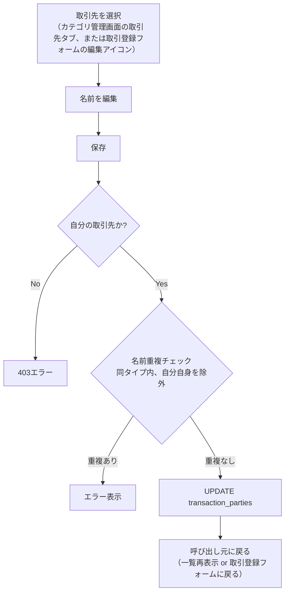
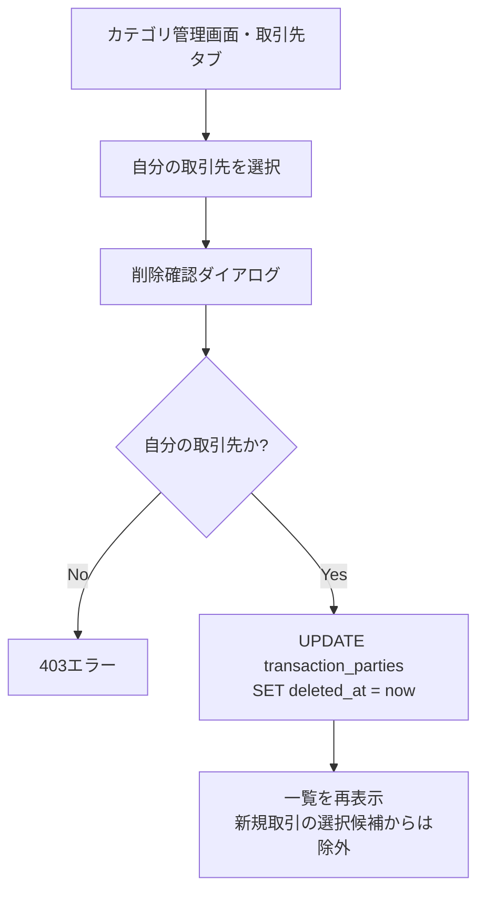

# 取引先

## 概要

取引（収入・支出）の「店舗・取引相手」を記録するための補助的なマスタ。[カテゴリ](./categories.md)が「支出・収入の種類」を表すのに対し、取引先は「どこで・誰と取引したか」を表す、別軸の分類として独立させる。

「購入元」という名前にしなかったのは、支出（購入）だけでなく収入（給与の支払元等）にも使える中立的な概念にするため。`categories`と同じく`typeCode`（支出用/収入用）を持たせ、取引のカテゴリが支出用ならその取引先一覧も支出用に絞られる。

カテゴリと違って以下の特徴を持つ。**カテゴリより重要度・利用頻度が低い補助情報**という位置づけのため、機能を最小限に絞っている。

- システムデフォルト（`userId IS NULL`の共通プリセット）は持たない。完全にユーザーが作成したものだけ
- 親子構造（`parentId`）を持たない。常にフラットな1階層のリスト
- アイコン・背景色を持たない（`name`のみ）
- 一覧画面のフィルター・ダッシュボードのグラフ集計の対象外（[将来検討](#将来検討スコープ外)参照）

**削除は論理削除（`deletedAt`）で行う**（[カテゴリ](./categories.md)・[家族構成管理](./family-members.md)と同じパターン）。物理削除すると`transactions.party_id`が参照する行が消え、過去の取引の取引先表示が壊れるため。

## データ構造

```
transaction_parties: id, userId, typeCode, name, deletedAt, createdAt
```

- `userId`: 必須（NOT NULL）。常に自分が作成したものだけが存在する
- `typeCode`: 必須。`CATEGORY_TYPE`と同じ値セット（支出/収入）を使う
- `name`: 必須・最大50文字

## バリデーション

| 項目                 | 規則                                                                                                                     |
| -------------------- | ------------------------------------------------------------------------------------------------------------------------ |
| 名前                 | 必須・最大50文字                                                                                                         |
| タイプ（`typeCode`） | `CATEGORY_TYPE`（支出/収入）のいずれか・必須                                                                             |
| 名前の重複           | 同一ユーザー・同一タイプ内で重複不可（前後の空白を除去し、大文字小文字を区別しない比較。編集時は自分自身を除外して判定） |

カテゴリと異なり、支店名・店舗名までの粒度（例:「イオン三鷹店」「イオン武蔵境店」を別の取引先として登録する）は許容する。表記揺れを統合する名寄せ・部分一致検索は今回のスコープ外（[将来検討](#将来検討スコープ外)参照）。

## 権限ルール

自分が作成した取引先のみ参照・編集・削除できる（システムデフォルトという概念自体が存在しないため、カテゴリのような「デフォルトは編集不可」という分岐はない）。

## 取引登録フォームとの連携

取引登録フォーム（[取引記録](./transactions.md#追加フォームの構造単発複数行入力)）の各行に「取引先」項目を設ける。**任意項目**（`partyId`はnullable）。

### 選択肢の絞り込み

`transactions`テーブル自体は支出/収入の区別を持たず、**選択した`カテゴリ`の`typeCode`**で判定する（[取引記録の仕様](./transactions.md#バリデーション)参照）。取引先の選択肢も、その行で選択中のカテゴリの`typeCode`に応じて絞り込む（支出カテゴリ選択中は支出用取引先のみ表示）。

行のカテゴリを後から別タイプに変更し、すでに選択していた取引先が型不一致になった場合は、**取引先の選択を自動でクリアする**。取引先コンボボックスの候補は常に選択中カテゴリの`typeCode`でフィルタされているため、これは「選択中の値が新しい候補リストに存在しなくなった結果、選択が外れる」という見た目上の自然な挙動であり、別途トースト等で明示的に通知することは行わない。

### 新規作成（インライン・遅延作成）

[カテゴリの新規追加（インライン）](./transactions.md#カテゴリの新規追加インライン遅延作成)と同じ考え方で、取引先の選択肢の末尾に「+ 新しい取引先を追加」を置く。クリックするとコンボボックス直下にポップオーバー（小さな入力フォーム、名前のみ）が開く。ただし、**クリックした時点ではDBに作成しない**。名前を入力したら、その場では行の取引先として一時的に選択状態にするだけで、実際の`INSERT`は**取引登録フォーム全体の送信時に、取引本体と同一のDBトランザクション内で**行う。

理由: 入力した瞬間に作成すると、ユーザーがフォームの送信自体をキャンセルした場合に「どの取引にも紐づかない取引先」だけが残ってしまう（孤立レコード）。送信時に作成すれば、存在する取引先は必ず使われた取引と同時に生まれる。

この方式は[プロフィール設定](./profile-setup.md)の「`users`と`family_members`本人レコードを同一トランザクションで同時作成する」パターンと同じ考え方である。

`POST /api/transactions`のリクエストボディは、各行の取引先を次のいずれかの形で受け取る。

- 既存の取引先を選択: `{ partyId: number }`
- 新規取引先を入力: `{ partyName: string }`（`typeCode`はその行のカテゴリから決まるため別途指定不要）
- 取引先を選択しない: `partyId`・`partyName`いずれも省略（`partyId`は`NULL`のまま）

サーバー側は`partyName`が来た行について、同一トランザクション内で重複チェック（[バリデーション](#バリデーション)参照）→ 既存があれば再利用、なければ`INSERT transaction_parties`→ そのIDを`transactions.party_id`に設定する。

なお、[カテゴリの新規追加（インライン）](./transactions.md#カテゴリの新規追加インライン)も同じ考え方に合わせて変更する。従来の「クリックすると小さなモーダルで名前・タイプを入力して即座に`POST /api/categories`を呼ぶ」という即時作成の挙動を、**取引登録フォームの送信時に取引先と同様に遅延作成する**よう改める（詳細は[取引記録の仕様](./transactions.md#カテゴリの新規追加インライン)側に記載）。

### 既存の編集（即時反映）

新規作成とは異なり、**既存の取引先・カテゴリの編集は取引登録フォームの送信を待たず即時反映する**。これは「これから作る新しいデータ」ではなく「すでに存在する共有データの編集」であり、取引登録という一時的な操作とは独立した別の関心事だからである。

- **カテゴリ**: 選択中のカテゴリの横に編集アイコンを置き、タップで[カテゴリ管理画面](./categories.md)と同じ編集Dialog（名前・アイコン・色）を開く。保存すると即座に`PUT /api/categories/:id`が呼ばれてDBに反映され、Dialogが閉じると取引登録フォームに戻る（フォームの他の入力内容は失われない）
- **取引先**: 選択中の取引先の横に編集アイコンを置き、タップで名前のみを編集する簡易UI（取引先はアイコン・色を持たないため、カテゴリのようなフルDialogではなく単一テキスト入力で十分）を開く。保存すると即座に`PUT /api/transaction-parties/:id`が呼ばれる

いずれも編集対象は「自分が作成したもの」のみ（カテゴリのシステムデフォルトは編集不可という既存ルールのまま）。編集アイコンは**選択中の項目にのみ表示し、未選択時は非表示にする**（2026-06-23決定、[取引記録の仕様](./transactions.md#既存カテゴリ取引先の編集インライン即時反映)と統一）。

### 一括編集

取引一覧画面の[一括編集](./transactions.md#業務フロー-一括編集誤登録の修正)（取引日・カテゴリ・家族メンバー）に、取引先（`partyId`）も対象として追加する。金額・メモ（[詳細に改名](./transactions.md#バリデーション)）は個々の取引固有の値のため対象外のまま変わらない。

## 削除

論理削除（`deletedAt`）。削除後は新規取引の選択候補から除外されるが、過去の取引・一覧表示では引き続き元の名前で表示される（カテゴリと同じ考え方）。

カテゴリと異なり親子構造を持たないため、「子を持つため削除できない」という制約は存在しない。

## 一覧の並び順

作成日時（`createdAt`）の昇順で表示する。取引先はシステムデフォルトを持たないため、カテゴリのような「デフォルト→自分のもの」という区別は不要。

ユーザーによる並び替え・ソート切り替え機能は持たない（[将来検討](#将来検討スコープ外)参照）。

## 管理画面

専用のナビゲーション項目・専用画面は持たない。[カテゴリ管理画面](./categories.md)に「カテゴリ」「取引先」の2タブを追加し、その中の「取引先」タブで一覧・追加・名称変更・削除（論理削除）を行う。下部固定ナビゲーションの表示ラベルは「カテゴリ管理」のまま変更しない（取引先はカテゴリに比べて重要度が低い補助情報のため）。

取引登録フォーム内では、[前述](#既存の編集即時反映)の通り「追加」「名称変更」のみ可能で、**削除はできない**（誤操作防止のため、削除は専用の管理画面に限定する）。

## 将来検討（スコープ外）

以下は今回のスコープに含めない。利用実績が増えてニーズが見えてから検討する。

- **AIレシート読み取り機能との連携**: レシートから店舗名を抽出し、既存の取引先と自動マッチング（または新規候補として提示）する機能。表記揺れ（「イオン」と「イオン三鷹店」を同一店舗とみなすか等）のマッチング精度が論点になるため、別フェーズで検討する。現時点ではレシート読み取り時も取引先欄は空欄のままとし、ユーザーが手動で選択・入力する
- **取引一覧のフィルター**: カテゴリ・家族メンバーと同様の絞り込み機能
- **ダッシュボードでの取引先別集計・グラフ表示**
- **表記揺れの名寄せ・部分一致検索**（「イオン」で検索して「イオン三鷹店」「イオン武蔵境店」もヒットするような機能）
- **一覧のソート切り替え**: 名前順等への並び替え機能。件数が少ない想定のため現時点では[固定の並び順](#一覧の並び順)のみとする

## 業務フロー: 取引先の名称変更（管理画面・取引登録フォーム共通）



## 業務フロー: 取引先の削除（管理画面のみ）



## APIエンドポイント

| メソッド | パス                           | 説明                                                                                                                                                                                                    |
| -------- | ------------------------------ | ------------------------------------------------------------------------------------------------------------------------------------------------------------------------------------------------------- |
| GET      | `/api/transaction-parties`     | 取引先一覧取得（`typeCode`クエリでフィルタ可。デフォルトでは`deletedAt`がNULLのもののみ。カテゴリ管理画面の取引先タブ、および取引登録フォームのコンボボックスで使用）                                   |
| POST     | `/api/transaction-parties`     | 取引先新規作成（カテゴリ管理画面・取引先タブからの追加用。取引登録フォーム経由の新規作成は[前述](#新規作成インライン遅延作成)の通り`POST /api/transactions`内で行うため、このエンドポイントは呼ばない） |
| PUT      | `/api/transaction-parties/:id` | 取引先の名称変更（自分の取引先のみ）。取引登録フォームの簡易編集UI・カテゴリ管理画面の取引先タブの両方から呼ばれる                                                                                      |
| DELETE   | `/api/transaction-parties/:id` | 取引先論理削除（自分の取引先のみ。カテゴリ管理画面の取引先タブからのみ呼ばれる）                                                                                                                        |

[取引記録](./transactions.md#apiエンドポイント)の`POST /api/transactions`・`PATCH /api/transactions/bulk`も、本機能に合わせて変更される（詳細は[取引記録の仕様](./transactions.md)を参照）。
