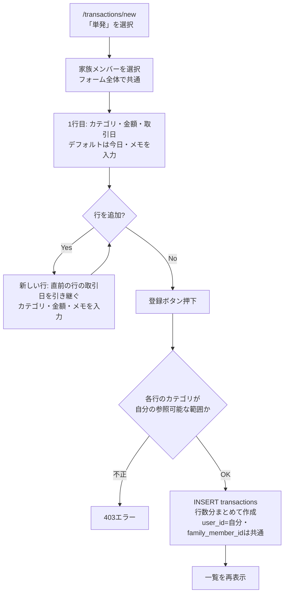
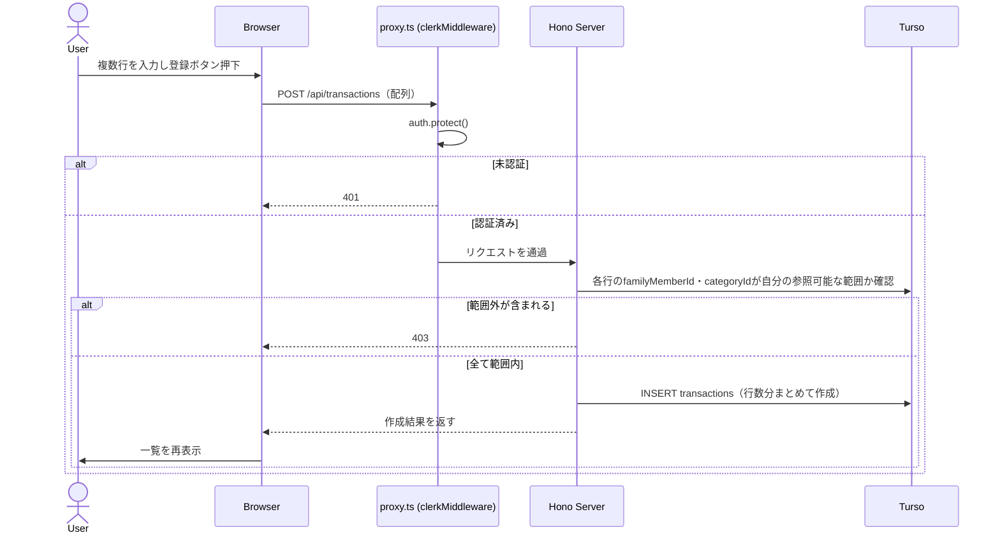
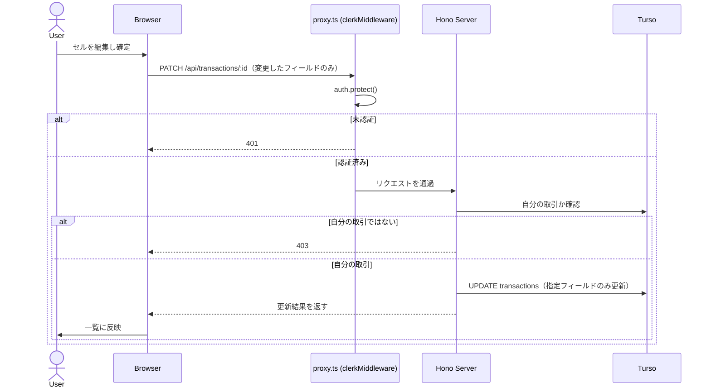
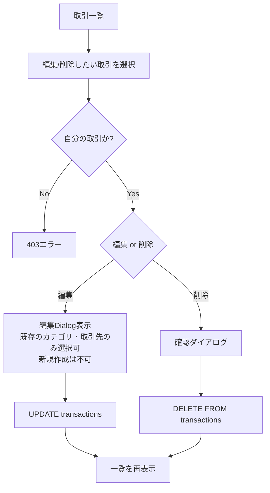
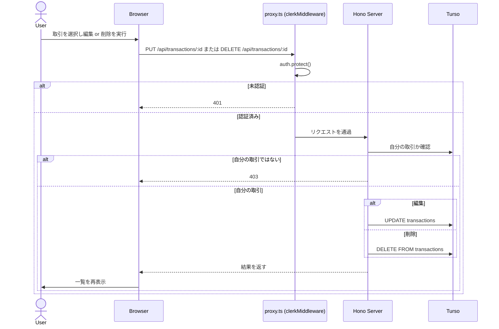
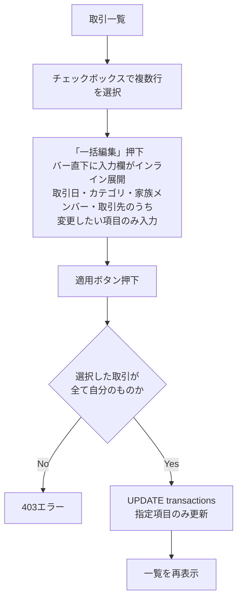
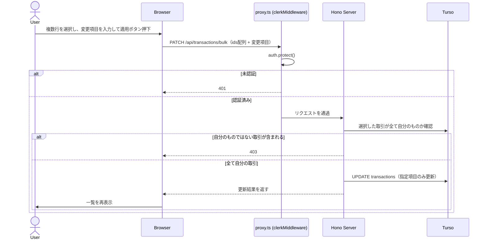
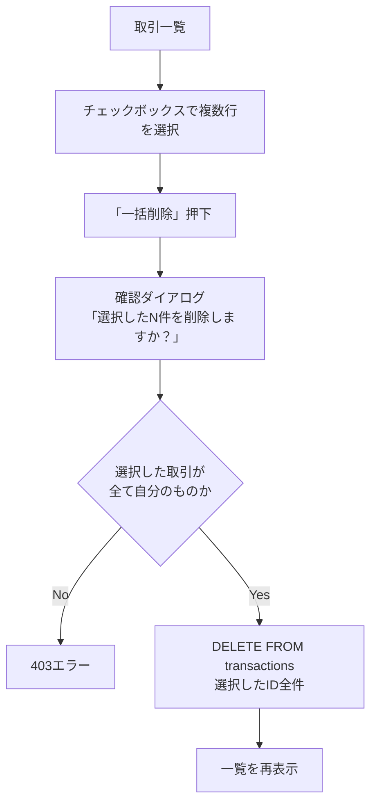
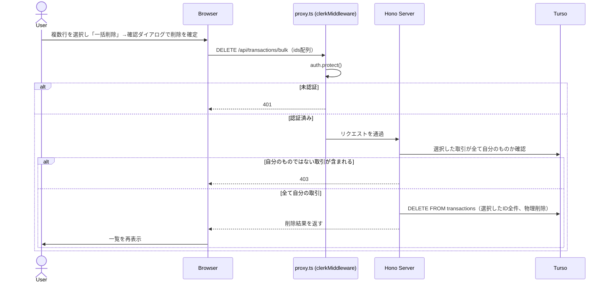

# 取引記録

## 概要

収入・支出を記録する。1回の入力セッションで**複数の商品（行）をまとめて登録**できる（レシート1枚に複数カテゴリの商品が載っているケースに対応）。AIレシート読み取りによる自動入力は別機能（[AI機能](./ai.md)）で詳細を定義し、ここでは手動入力・一覧表示・編集・削除を扱う。

`transactions`は他のテーブルから参照されない（子テーブルを持たない）ため、削除は**物理削除**とする（[カテゴリ管理](./categories.md)・[家族構成管理](./family-members.md)の論理削除とは異なり、参照整合性の懸念がないため）。

[定期取引](./recurring-transactions.md)から自動生成された取引は、`sourceRecurringTransactionId`（nullable）でテンプレートを参照する。生成後は通常の取引と同じ扱いで、個別に編集・削除できる（テンプレート側を編集・削除しても、生成済みの取引には影響しない）。

## 画面構成: 「取引記録」と「定期取引」の関係

[定期取引](./recurring-transactions.md)は別機能だが、ユーザーにとっては「お金の記録」という同じ関心事のため、ナビゲーション上は1つの画面群としてまとめる（カテゴリ管理・家族構成管理のような設定系の画面とは別の位置づけ）。

- **一覧**: `(app)/transactions`に「一覧」「定期取引」のタブを設ける（`/transactions`・`/transactions/recurring`）。それぞれ別のテーブル・別の一覧UIを表示する
- **登録**: `/transactions/new`に統一する。画面内にラジオボタン（またはタブ）で「単発」「定期」を切り替えるUIを置き、選んだ方のフォームを表示する。**フォームは完全に別物として実装し、それぞれが自分専用の送信ボタン・送信先APIを持つ**（「単発」を表示中の送信ボタンは`POST /api/transactions`のみを呼び、「定期」表示中の送信ボタンは`POST /api/recurring-transactions`のみを呼ぶ）。1つの送信ボタンが現在のモードを判定して送信先を分岐するような共有ロジックは作らない（実装が複雑になり、誤って両方に登録されるような事故のリスクもあるため）
  - **画面表示文言**: タブ・ラジオボタンの表示テキストは「通常」「定期」とする（2026-06-23決定）。「単発」という言葉は画面上では使わない。内部のモード区分名・API呼称（このドキュメント内の「単発」の表記、`POST /api/transactions`等）はそのまま維持し、表示文言とは分離して扱う

## 追加フォームの構造（単発・複数行入力）

| 項目 | スコープ | 入力方法 |
|---|---|---|
| 家族メンバー | フォーム全体で共通（1人） | ラジオボタン。初期選択は[デフォルトメンバー](./family-members.md#デフォルトメンバーisdefault)。選択中のメンバーをフォーム上部に大きく表示し、選び忘れに気づきやすくする。なぜその人が初期選択されているか分かるよう、デフォルトメンバーが選ばれている間は名前の横に「（デフォルト）」と注記する（他のメンバーに切り替えると注記は消える） |
| 行の選択（チェックボックス） | 行ごと（デフォルト全行チェック済み） | [一括設定](#一括設定全行への反映)の対象行を絞り込むためのチェックボックス。行見出し部分に全選択チェックボックスも置く（押下で全解除/全選択。デフォルトが全行チェック済みのため主な用途は全解除） |
| 取引日 | 行ごとに変更可能 | 新しい行を追加すると**直前の行と同じ日付を引き継ぐ**（最初の行のみデフォルトは今日） |
| カテゴリ | 行ごと | - |
| 取引先 | 行ごと（任意） | [取引先機能](./transaction-parties.md#取引登録フォームとの連携)を参照 |
| 金額 | 行ごと | - |
| 詳細 | 行ごと（任意） | 旧称「メモ」（[改名の経緯](#詳細列旧メモについて)参照） |

「行を追加」で商品行を増やし、最後に1回の送信で行数分の`transactions`レコードをまとめて作成する（`POST /api/transactions`は配列を受け取るバッチ作成とする）。

「直前の行を引き継ぐ」デフォルトにより、同じレシート（同じ日付）の商品を続けて入力する場合は日付を毎回入力し直す必要がなく、別の日のレシートに移る時だけ1回変更すれば以降の行に引き継がれる。

### 一括設定（全行への反映）

フォーム上部に、取引日・カテゴリ・取引先の3項目（各任意）を入力する「一括設定」フォームを置く。「反映」ボタン押下時、**チェックされている行のみ**、入力した項目の値で上書きする（未入力の項目は変更しない）。一部の行だけ別の値にしたい場合は、その行のチェックを外してから「反映」を押す。

一括設定フォームのカテゴリ・取引先欄は、行ごとのコンボボックスと**同一のコンポーネント**を使う（既存の選択肢に加え、末尾の「+ 新しいカテゴリ/取引先を追加」も同様に使える）。これにより、まだ存在しない新しいカテゴリ・取引先を複数行にまとめて適用したい場合も、一括設定フォーム側で1回新規入力するだけで済む。

行ごとのコンボボックスと完全に同一コンポーネントのため、**値を選択した状態では[既存カテゴリ・取引先の編集（インライン・即時反映）](#既存カテゴリ取引先の編集インライン即時反映)の鉛筆アイコンも同様に表示・利用できる**（2026-06-23決定）。

「直前の行の取引日を引き継ぐ」という行単位のデフォルト動作とは独立した、任意のタイミングで使える補助機能。

### 詳細列（旧メモ）について

従来の`memo`カラム・項目名を**`description`（詳細）に改名する**。「メモ」という名前は用途が曖昧で、AIレシート読み取り時はここに商品名が入る（[AI機能](./ai.md#1-レシート読み取り自動入力receipt_scan)参照）ため、商品名を意識した名前（例:`productName`）にする案もあったが、収入取引（例:「給与（6月分）」）や非購入の支出には「商品名」という言葉が当てはまらないため、支出・収入どちらにも使える中立的な名前として`description`を採用した。カラムの責務自体（任意の自由記述・最大255文字）は変えない。

### カテゴリの新規追加（インライン・遅延作成）

カテゴリの選択肢の末尾に「+ 新しいカテゴリを追加」を置く。クリックするとコンボボックス直下にポップオーバー（小さな入力フォーム）が開き、名前・タイプ（支出/収入）を入力するが、**この時点ではDBに作成しない**。入力した内容はその場で行のカテゴリとして一時的に選択状態にするだけで、実際の`INSERT`は**フォーム全体の送信時に、その行の取引と同一のDBトランザクション内で**行う。

理由: 入力した瞬間に`POST /api/categories`を呼んで作成すると、ユーザーがフォームの送信自体をキャンセルした場合に「どの取引にも紐づかないカテゴリ」だけが残ってしまう（孤立レコード）。送信時に作成すれば、存在するカテゴリは必ず使われた取引と同時に生まれる（[取引先の新規作成](./transaction-parties.md#新規作成インライン遅延作成)と同じ考え方）。

`POST /api/transactions`のリクエストボディは、各行のカテゴリを次のいずれかの形で受け取る。

- 既存のカテゴリを選択: `{ categoryId: number }`
- 新規カテゴリを入力: `{ categoryName: string, categoryTypeCode: number, categoryIcon?: string, categoryColor?: string }`（アイコン・色は[キュレーションされた候補](./categories.md#カテゴリアイコン背景色)から選ばなければ未指定可。未指定時はデフォルトアイコン・色が自動設定される）

サーバー側は`categoryName`が来た行について、同一トランザクション内で重複チェック（[カテゴリのバリデーション](./categories.md#バリデーション)参照）→ `INSERT categories`（`userId`=自分）→ そのIDを`transactions.category_id`に設定する。

行は配列の順序通りに1件ずつ処理し、重複チェックは**都度その時点のDB状態**を参照する。これにより、[一括設定](#一括設定全行への反映)で複数行が同じ新規カテゴリ名（まだDBに存在しない名前）を送ってきた場合も、最初の行で`INSERT`されたカテゴリを2件目以降の行が重複チェックで検出して再利用し、同名のカテゴリが複数作成されることはない（取引先の新規作成も同様）。

同じ仕組みを[定期取引の登録フォーム](./recurring-transactions.md#登録フォームの構造複数行入力)でも使う。

### 既存カテゴリ・取引先の編集（インライン・即時反映）

新規作成とは異なり、選択中の既存のカテゴリ・取引先を編集する場合は、フォームの送信を待たず**即時にDBへ反映する**。これは「これから作る新しいデータ」ではなく「すでに存在する共有データの編集」であり、取引登録という一時的な操作とは独立した別の関心事だからである。

- **カテゴリ**: 選択中のカテゴリの横に編集アイコンを置き、タップで[カテゴリ管理画面](./categories.md)と同じ編集Dialog（名前・アイコン・色）を開く。保存すると即座に`PUT /api/categories/:id`が呼ばれてDBに反映され、Dialogが閉じるとフォームに戻る（入力中の他の行の内容は失われない）
- **取引先**: [取引先の仕様](./transaction-parties.md#既存の編集即時反映)を参照

編集アイコンは**選択中の項目にのみ表示し、未選択時は非表示にする**（2026-06-23決定）。新規作成の入口はコンボボックス内の「+ 新しいカテゴリ/取引先を追加」のみに統一し、鉛筆アイコンとの二重導線を避ける。

## バリデーション

| 項目 | 規則 |
|---|---|
| 家族メンバー（`familyMemberId`） | 必須。自分の`family_members`から選択（論理削除済みは新規選択候補から除外） |
| カテゴリ（`categoryId`） | 必須。システムデフォルト or 自分のカテゴリから選択（論理削除済みは新規選択候補から除外）。新規作成時は[前述](#カテゴリの新規追加インライン遅延作成)の通り取引登録時に同時作成 |
| 取引先（`partyId`） | 任意。[取引先のバリデーション](./transaction-parties.md#バリデーション)を参照。選択中のカテゴリの`typeCode`と一致する取引先のみ選択可能 |
| 金額（`amount`） | 必須・正の整数。支出/収入の区別は保存せず、カテゴリの`typeCode`で判定する |
| 取引日（`transactionDate`） | 必須・日付。過去・未来とも入力制限なし |
| 詳細（`description`、旧`memo`） | 任意・最大255文字 |

編集時は、現在選択されている家族メンバー・カテゴリ・取引先が論理削除済みであっても、選択肢としてそのまま表示する（既存の選択を維持するため）。

## 権限ルール

自分が作成した取引のみ参照・編集・削除できる（`WHERE id = :id AND user_id = auth.userId`）。`familyMemberId`・`categoryId`も、それぞれ自分が参照可能な範囲（家族構成管理・カテゴリ管理の権限ルールと同様）に含まれるかをサーバー側で検証する。

## 一覧表示・フィルター

| フィルター | 説明 |
|---|---|
| 期間（月単位） | 対象月の取引のみ表示（デフォルトは当月） |
| カテゴリ | 指定したカテゴリの取引のみ表示 |
| 家族メンバー | 指定した家族メンバーの取引のみ表示 |

複数フィルターは組み合わせ可能（AND条件）。月次の合計・カテゴリ別グラフなどの集計は[ダッシュボード](./dashboard.md)で扱う。

一覧の各行にはチェックボックスを設け、テーブルヘッダーにも全選択チェックボックスを置く（押下で表示中の全行を選択/解除）。1件以上選択すると、一覧上部に「N件選択中」バーが表示され、「一括編集」「一括削除」「選択解除」のボタンを持つ。「一括編集」を押すとバーの直下に入力欄がインライン展開される（[一括編集](#業務フロー-一括編集誤登録の修正)参照）。「一括削除」を押すと確認ダイアログを表示してから削除する（[一括削除](#業務フロー-一括削除)参照）。

**空状態**: 選択中のフィルターに該当する取引が1件もない場合、「この月の取引はまだありません」と表示し、`/transactions/new`への「取引を追加」ボタンを併設する（[ダッシュボードの空状態](./dashboard.md#3-カテゴリ別グラフ円グラフ)と同じ考え方）。

## 業務フロー: 取引追加（複数行）





## 業務フロー: 取引編集・削除（1件）

編集は[カテゴリ編集・家族メンバー編集](./categories.md#業務フロー-カテゴリ編集)と同じくDialogで行う（一覧から離脱しない。別ページには分けない）。フィールドは取引日・カテゴリ・取引先・家族メンバー・金額・詳細。**新規カテゴリ・新規取引先のインライン作成（[遅延作成](#カテゴリの新規追加インライン遅延作成)）はこのDialogでは不可**で、既存の選択肢からのみ選ぶ（新規に追加したい場合は先にカテゴリ管理画面で作成する）。一方、選択中のカテゴリ・取引先をその場で編集するアイコン（[既存カテゴリ・取引先の編集（インライン・即時反映）](#既存カテゴリ取引先の編集インライン即時反映)）は登録フォームと同様に残す。

このDialog編集に加えて、[インライン修正（セル単位）](#業務フロー-取引のインライン修正セル単位)も併存する。複数項目をまとめて直したい場合はDialog、1項目だけ素早く直したい場合はインライン修正、という使い分けを想定する。

## 業務フロー: 取引のインライン修正（セル単位）

一覧の行をクリック（またはセルをダブルクリック）すると、そのセル（取引日・カテゴリ・取引先・家族メンバー・金額・詳細のいずれか1項目）が入力欄に変わる。確定すると、フォーム全体の送信を待たず**即座にそのフィールドのみを更新する**（2026-06-23決定）。

[業務フロー: 取引編集・削除（1件）](#業務フロー-取引編集削除1件)のDialog（フル更新、`PUT`）とは異なる軽量な編集手段として併存させる。カテゴリ・取引先のセルでは、選択中の値がある場合に限り[既存カテゴリ・取引先の編集（インライン・即時反映）](#既存カテゴリ取引先の編集インライン即時反映)の鉛筆アイコンも利用できる（新規作成は不可、Dialog編集と同じ制約）。

```mermaid
flowchart TD
  start[取引一覧] --> click[行のセルをクリック]
  click --> ownerCheck{自分の取引か?}
  ownerCheck -- No --> forbidden[403エラー]
  ownerCheck -- Yes --> edit[セルが入力欄に変わる\n値を変更]
  edit --> confirm[確定\nEnter or フォーカスアウト]
  confirm --> update[UPDATE transactions\n該当フィールドのみ更新]
  update --> list[一覧に反映]
```







## 業務フロー: 一括編集（誤登録の修正）

複数行をまとめて間違えた場合（例: 日付を間違えて複数件登録してしまった）に、一覧画面で対象行をチェックして取引日・カテゴリ・家族メンバー・取引先をまとめて修正する。金額・詳細（旧メモ）は取引ごとに固有の値のため一括編集の対象外とする（誤操作で複数取引の金額を一括上書きするリスクを避けるため）。

選択中バーの「一括編集」ボタンを押すと、バーの直下に取引日・カテゴリ・家族メンバー・取引先の入力欄がインライン展開する（[一覧表示・フィルター](#一覧表示フィルター)参照。一覧画面の対象行を表示したまま入力できるよう、別画面・モーダルには遷移しない）。





## 業務フロー: 一括削除

複数の取引をまとめて削除したい場合（例: 誤って同じ内容を複数回登録してしまった）に、一覧画面で対象行をチェックし、選択中バーの「一括削除」ボタンを押す。1件削除（[業務フロー: 取引編集・削除（1件）](#業務フロー-取引編集削除1件)）と同様、削除前に確認ダイアログ（AlertDialog）を表示する。

確認ダイアログには件数だけでなく、対象取引の簡易リスト（日付・カテゴリ・金額。例:「2026/6/20　食費　−¥1,200」）を**最大3件まで**表示し、4件以上選択時はその下に「...他N件」と表示する。件数のみの表示では選択内容を取り違えていないか確認しづらいため、削除という取り消せない操作に対して十分な確認材料を示す。





## AIレシート読み取りとの連携

取引追加フォーム（単発）に「レシートから読み取る」ボタンを設ける。レシートの明細ごとに複数行を一括下書きし、カテゴリも提案する（ユーザーは内容を確認・修正してから登録）。詳細は[AI機能](./ai.md#1-レシート読み取り自動入力receipt_scan)を参照。

## APIエンドポイント

| メソッド | パス | 説明 |
|---|---|---|
| GET | `/api/transactions` | 取引一覧取得（`yearMonth`・`categoryId`・`familyMemberId`クエリでフィルタ可） |
| POST | `/api/transactions` | 取引新規作成（配列を受け取り、複数行をまとめて作成するバッチ作成）。各行の`categoryId`/`categoryName`+`categoryTypeCode`、`partyId`/`partyName`のいずれかを受け取り、新規名称が来た場合は取引本体と同一トランザクション内でカテゴリ・取引先も同時作成する（[カテゴリの新規追加](#カテゴリの新規追加インライン遅延作成)・[取引先の新規作成](./transaction-parties.md#新規作成インライン遅延作成)参照） |
| PUT | `/api/transactions/:id` | 取引編集（フル更新、編集Dialog用。自分の取引のみ） |
| PATCH | `/api/transactions/:id` | 取引の部分更新（[インライン修正（セル単位）](#業務フロー-取引のインライン修正セル単位)用。変更したフィールドのみ送る。自分の取引のみ） |
| PATCH | `/api/transactions/bulk` | 複数取引の一括編集（`ids`配列 + 取引日・カテゴリ・家族メンバー・取引先のうち変更したい項目のみ。自分の取引のみ） |
| DELETE | `/api/transactions/:id` | 取引物理削除（自分の取引のみ） |
| DELETE | `/api/transactions/bulk` | 複数取引の一括物理削除（`ids`配列。自分の取引のみ。[業務フロー: 一括削除](#業務フロー-一括削除)参照） |
